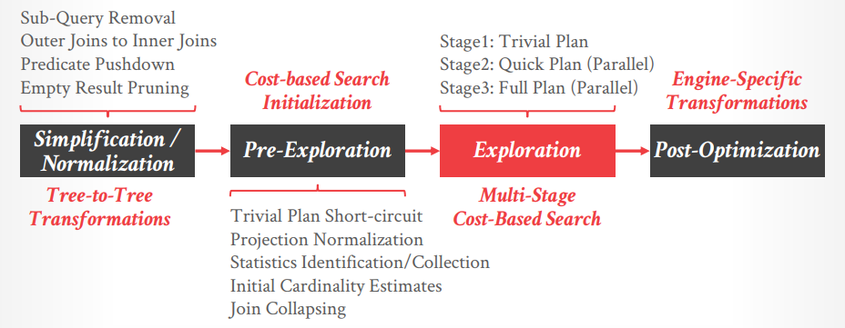
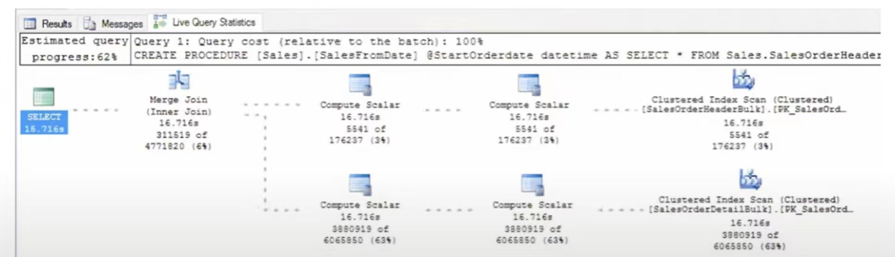

# The Cascades Framework for Query Optimization at Microsoft (Talk)

[Link](https://db.cs.cmu.edu/events/quarantine-db-talk-2020-microsoft-sql-server/)

## The Cascades Framework Overview

1. Algebraic representation of logical/physical query fragments
2. **Composable rules**
   - exploration
   - implementation
   - enforcers
3. Integrated and uniform optimization

## Simplified Optimization Pipeline

1. **Parsing**
2. **Algebrization**
3. **Simplification/Normalization**
   - subqeury removal
   - outer to inner joins
   - pushing filters
   - CUBE reduction
   - etc...
4. **Pre-exploration**
   1. project normalization: pushing down projects
   2. autostats: **detect/build** column stats for cost estimation
   3. initial CE: initial cost estimation of the initial tree
   4. join collapsing
   5. trivial plan: **generate a trivial plan for "simple" query** (e.g. single-table with index available, a small subset of queries, but frequently used by users), no futher optimization requird
5. **Exploration (Cascades)**
   Essentially **applying a subset of rules over a subset of conditions in each stage (increasingly expanded)**. Not like other systems that apply join-reorder stage, predicate pushing down stage, etc.
   1. TP plan
   2. quick plan / parallel
   3. full plan / parallel
6. **Post-optimization**
   - common sub-expression spools
   - unsorted scans
   - scalar evaluation placement



## Rules & Properties

- Join reordering
- Outer joins
- Subqueries
- ...400+ rules

> Every little thing that we want to do we try to cast it as a problem of:
>
> - **what property should we require**
> - **what approach should we derive**
> - **what rules will satisfy this propery**

例如以下查询示例：

```SQL
SELECT sum(l_extendedprice) / 7.0 AS avg_yearly
  FROM lineitem JOIN part ON p_partkey = l_partkey
  WHERE p_brand = 'Brand#12'
    AND l_quantity < (SELECT 0.2 * avg(l_quantity) FROM lineitem WHERE l_partkey = p_partkey)
```

假定我们已经构建了物化视图（`SCHEMABINDING`表示物化视图绑定了所依赖的表的schema，不能在物化视图不更新的情况下，修改依赖表的schema）并于前述的查询有相关：

```SQL
CREATE VIEW V WITH SCHEMABINDING AS
  SELECT l_partkey, sum(l_quantity) sc, count_big(*) cb
    FROM dbo.lineitem
    GROUP BY l_partkey
```

- 在`WHERE`条件中的**子查询会被转换为join**（下图中的*Subqueries Rule*），因此这次查询涉及到3表连接
- 三表连接，因此触发了**连接顺序的优化**（下图中的*Join Reordering Rule*）
- 聚合结果也会触发优化（下图中*Aggregation Rule*）
- 在子查询转换为join后，能够**与物化视图相匹配**（下图中的*Materialized Views Rule*）而不再需要临时产生中间结果用于后续连接
- 上层的连接会将**连接条件下推**，在物化视图上采用基于bitmap的Filter从而能够快速筛选出所需的数据，即`WHERE l_partkey = p_partkey`，避免不需要的数据向上传递
- Cascades框架**logical property**下有一类称为**constraint property**，可以追踪例如相等列这种条件是否满足，例如连接条件`l_partkey = p_partkey`，即**所有问题都被处理为properties的选择、满足问题**

```text
                   Aggregation Rule    Join Reordering Rule
                           v                 v
[Compute Scalar]      [Hash Match]      [Hash Match]          [Hash Match]                    [Columnstore Index Scan]
[              ] <--- [Aggregate ] <--- [Inner Join] <------- [Inner Join] <----------------- [    [part].[CCIP]     ]                 Subqueries Rule
[   cost: 0%   ]      [ cost: 0% ]      [ cost: 5% ] <---+    [ cost: 3% ] <-------------+    [       cost: 3%       ]              Materialized Views Rule
                                                         |                               |                                                    v
                                                         |    [Columnstore Index Scan]   |    [Compute Scalar]      [ Filter ]      [Clustered Index Scan]
                                                         +--- [  [lineitem].[CCIL]   ]   +--- [              ] <--- [ bitmap ] <--- [     [V].[idx]      ]
                                                              [      cost: 78%       ]        [   cost: 0%   ]      [cost: 0%]      [     cost: 12%      ]
```

## Statistics

- **Taxonomy**
  - single-column 'MaxDiff' histograms: 最广泛使用
  - multi-column density information
  - average column lengths
  - tries
  - HLL / heavy hitter sketches (DW / partitioned tables): 需要考虑到不同分区在merge/split时相应的histogram的处理
- **Data Sources**
  - base table (including computed columns)
  - filtered indexes
  - materialized views
- **Create/Update Mechanics**
  - Creation: manual, implicit, automatic
  - Update: manual, automatic with mod counts 当更新多少次基本数据之后就会触发重新计算statistics，从而尽可能保持统计信息的偏差小
  - Block-level Sampling: optional cross-validation

## Cardianlity Estimation

- **Algebra of histograms**
  - **propagation** of statistics through operators
  - from arithmetic (e.g. `WHERE a+2>5`) to aggregation (e.g. `HAVING SUM(a)>10`)
- **Estimation**
  如何估计`WHERE a=10 AND b=12`？例如最简单的采用`H(a)&H(b)`，或者是multi-column density信息`MCD(a,b)`，亦或是假定有相关性`H(a | b=12)`
  - QOE, quality of estimation to **rank alternatives**
  - **holistic calculators** for estimating query fragments
  - model assumption overridable via **hints** (e.g. `ASSUME_JOIN_PREDICATE_DEPENDS_ON_FILTERS`)
- **Other Topic**
  - auto-parameterization and parameter sniffing
  - CE feedback / learned cardinalities (微软已经有一些**基于机器学习的cost estimation framework**在生产环境中使用)
  - Memory grants based on cardinality estimation

## Costing

代价实际上并不是一个简单的值，而是一个**关于输出数据数量的函数**，x坐标为数据量，y坐标为代价，即**Cost-Cardinality line**（目前简单建模为线性函数，不同物理计划的cost lines可能存在交叉，当所需输出数据数量不一样时可能最优执行方案完全相反），并且分为三条实际的cost函数线条：

- **initial cost**: **第一次执行**被评估成本的查询模块时的代价
- **rebind cost**: 同一个查询模块但**绑定了不同的输入参数**的代价
- **rewind cost**: 同一个查询模块采用相同输入参数的代价，即**重复执行**

考虑以下简单查询：

```SQL
SELECT TOP ? *
  FROM orders o JOIN customers c
  ON o.customer_id = c.customer_id
```

对于想要不同数量的前几条结果，可能会有不同的最优执行计划

- 若通过**hash join**来实现，则显然对于代价函数来说，输出一条结果的代价和输出多条结果的代价相差不大，因为**两者都需要完全执行hash join**的流程
- 假如所需的数量不多，那么也可以通过**nested loops join**来实现，当满足所需要的结果时就可以立即终止，即虽然NLJ的cost function终点比HJ的cost function终点高，但是只要`?`足够小，那么NLJ的cost就可以取到比HJ的cost小，**cost lines存在交点**

## Optimization Performance

- Plan caches
- Trivial plans
- Optimization stages and timeouts: subset of transformation rules enabled in each stage
  **timeouts并不是物理上的时间界限，而是逻辑上的优化开销**，即例如已经施加了超过N个rules就被视为timeouts，这些阶段就是逐渐的优化器耗时与最终执行耗时之间的权衡
- Memo seeding: e.g. nary-join heuristic reordering
  join较多时不可能枚举所有顺序并展开进行计算，通常基于join collapsing、heuristic等处理已经有了一些可能较优的连接方案，在这些start points基础上在进行有限的展开搜索，**全量展开搜索和启发式有限范围的搜索也是权衡**
- Various approaches to gradual optimization: e.g. temperature-based

## Supportability

query optimizer输入：

- table, join, query level hints
- plan hints
- plan guides

query optimizer输出：

- graphical showplan / live query statistics
- execution traces with live plans
- DMVs

**Live query statistics**实时展示一条查询在执行过程中各个物理算子的统计信息



## Common Sub-Expressions

共同子表达式在SQL中也非常常见，例如下述查询的`cte`：

```SQL
WITH cte(fval, dval) AS (SELECT fval, dval FROM F JOIN D ON fdkey = dkey)
  SELECT fval FROM cte WHERE fval > 5
  UNION ALL
  SELECT dval FROM cte WHERE dval < 6
```

- 直接将共同**子表达式在查询中展开**，并按常规查询进行优化，此时一侧被优化成index seek

```text
[Concatenation]           [Index Seek NonClustered]
[             ] <-------- [       [F].[idxF]      ]
[  cost: 3%   ] <---+     [       cost: 15%       ]
                    |
                    |     [Hash Match]           [Clustered Index Scan]
                    +---- [Inner Join] <-------- [      [D].[idxD]    ]
                          [ cost: 32%] <---+     [      cost: 0%      ]
                                           |
                                           |     [Table Scan Heap]
                                           +---- [      [F]      ]
                                                 [   cost: 50%   ]
```

- 子表达式只会执行一次join，注意查询的`fval > 5`和`dval < 6`也会因为`UNION ALL`的条件被下推到连接过程中，随后上层都读取这一次的结果table spool

```text
[Concatenation]           [ Filter ]      [ Table Spool ]      [Hash Match]           [Clustered Index Scan]
[             ] <-------- [        ] <--- [    eager    ] <--- [Inner Join] <-------- [      [D].[idxD]    ]
[  cost: 1%   ] <---+     [cost: 6%]      [  cost: 0%   ]      [ cost: 67%] <---+     [      cost: 0%      ]
                    |                                                           |
                    |     [ Filter ]      [ Table Spool ]                       |     [Table Scan Heap]
                    +---- [        ] <--- [    eager    ]                       +---- [      [F]      ]
                          [cost: 6%]      [  cost: 44%  ]                             [   cost: 50%   ]
```

针对共同子表达式的处理流程：

1. Identify CTEs
2. Topological Sort SpoolUnits
3. Simplification
4. Exploration
5. PostOptimization

## Testing

> Testing query optimization is hard

- Correctness
- Performance
- scorecards: memory, error, plan sizes, etc

## Other

通常添加一条新的transformation rule并不困难，只要本身的转换是逻辑上成立的，那么正确性也容易得到保证，而真正可能导致问题的是：

- **与其他rules的干涉**，由于timeout是根据施加的rule数量来定的，新加rules就可能直接/间接影响到timeout、stages、plan quality
- 可能会**blow up search space**
