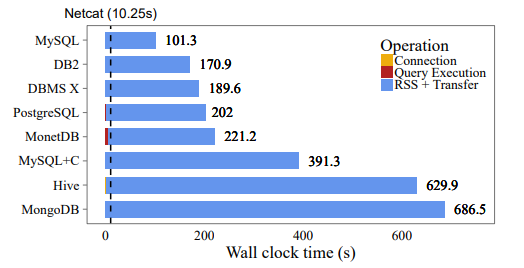
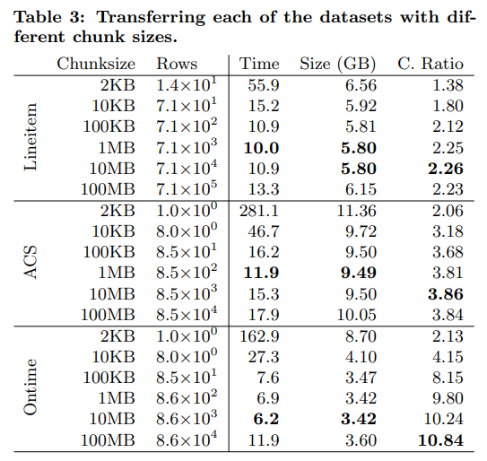

# [VLDB 2017] Don’t Hold My Data Hostage - A Case For Client Protocol Redesign

## Introduction

- **RSS**: Result Set Serialization

## Protocol Design Space

- **Row/Column-wise**
  采用row-wise的协议对传统的ODBC/JDBC兼容更好，而column-wise的协议则更有助于传输更大的结果集，更有利于压缩传输

  采用column-wise的问题在于假如需要访问中间的数据则需要client缓存整个结果集的全部数据，才有全部的列，这往往很难做到，因此类似[PAX的存储layout](03.Storage_Models_Data_Layout.md#hybrid-storage-model-pax)，采用**分块、块内column-wise的vector-oriented协议最佳**
- **Chunk Size**
  采用分块、块内column-wise的协议下，每块的大小在约1MB左右较优，对于块内的任意数据也仅需缓存整个块即可，对client来说可行

  

- **Data Compression**
  数据压缩可以减少网络传输的时间，但压缩/解压需要耗费CPU时间，因此压缩与否也是基于网络、CPU等硬件资源的权衡，压缩也分为通用压缩算法和针对特定情况（例如column-wise）的压缩算法，[见此](05.Database_Compression.md)
- **Column-specific Compression**
  针对column的压缩算法，例如Run-Length Encoding等
- **Data Serialization**
  二进制、文本序列化协议
- **String Handling**
  - **Null-Termination**
  - **Length-Prefixing**: 需要额外的空间存储长度，但优点在于可以通过长度直接跳过不感兴趣的数据段，同时也不会有像定长字符串一样存在padding浪费
  - **Fixed Width with padding**
