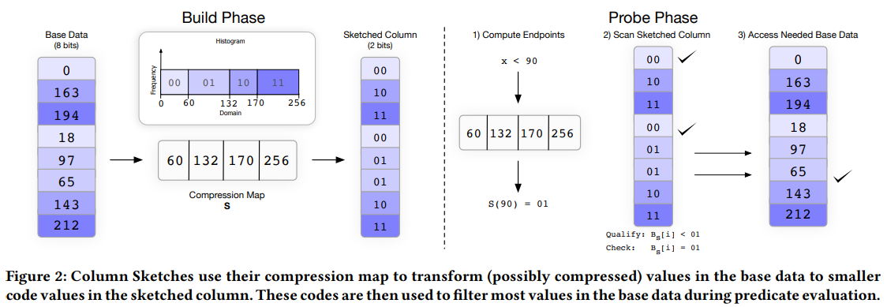
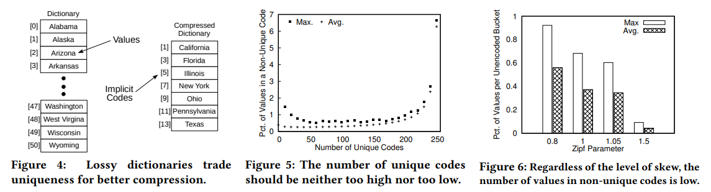
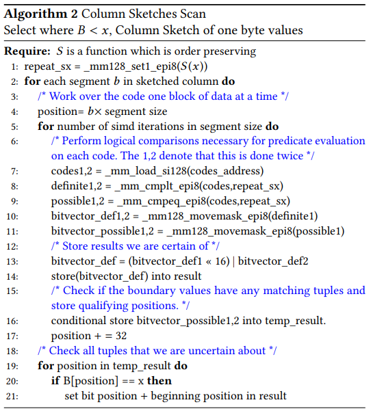
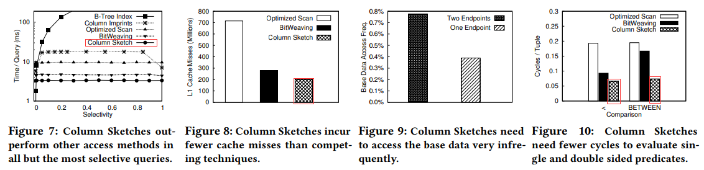
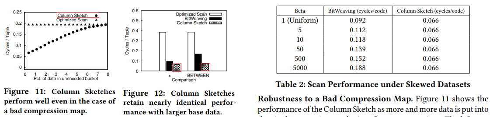
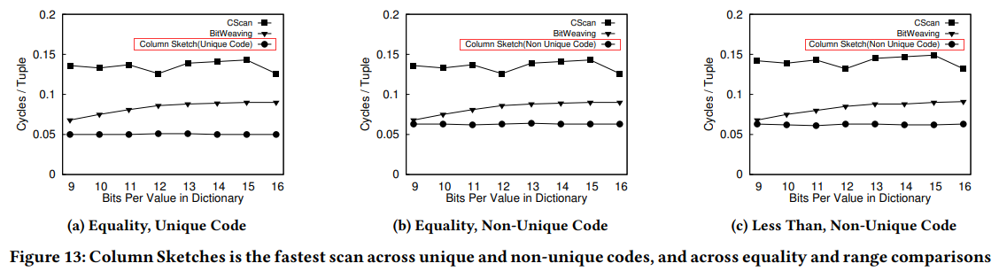

# [SIGMOD 2018] Column Sketches: A Scan Accelerator for Rapid and Robust Predicate Evaluation

## Introduction

- **Modern Data Access Methods**
  在OLAP中一条查询语句通常需要索引参与或全表扫描，从而**查询算子、谓词求值的性能**至关重要，直接影响整个系统的性能，但是常见的索引算法，例如B树、Zone Maps和BitWeaving都无法提供相对基础扫描外显著的性能优化
- **Traditional Indexes**
  数据库领域的传统索引即B树通常对于**较低selectivity**的查询（也可以认为是近似点查询）有较好的效果，一旦选择度提高，结果集增大，基于B树的索引性能急剧下降，另外由于列存储本身的特性、B树自身的特性包括叶节点非填满、按值排序而不是按行顺序等都进一步劣化了B树索引在OLAP系统上的性能表现，通常`selectivity <= 1%`的采用B树才有意义
- **Lightweight Indices**
  轻量级的索引核心在于**采用少量元信息来表达大块数据整体的统计特征**，用于扫描时跳过不符合谓词的大段数据，从而提升性能，最著名的一种就是Zone Maps，存储每一段数据的少量元信息，例如`min/max`，从而可以在一些查询中快速跳过不符合要求的数据段，但缺点也非常明显，一旦查询的谓词并没有与元信息存储的特征相关、或是数据没有聚集特征（例如`min/max`没有指导意义）时，立即退化成了普通的扫描
- **Early Prunning Methods**
  将**数据进一步切片，并且同样修改谓词判断为多个子判断**来分别评估，例如判断是否满足`==100`被分割为先整组判断高位`==0`，随后仅对某些满足高位条件的再逐行判断低位`==100`，这种方式可以批量跳过一些不满足要求的数据块，但是缺点在于对数据分布情况比较敏感，例如假如所有数据都是较小的，高位`==0`总是满足，这种优化也会立即退化成普通扫描
- **Rapid and Robust Indexing via Column Sketches**
  本文作者提出的一种对选择度、数据分布、数据聚集均不敏感的索引算法，基本流程在于首先逐个值进行有损压缩以构建基**础数据的概述sketch**，随后首先对sketch进行谓词判断，满足的再对真正的数据进行谓词判断：
  - Lossy Compression
    逐个值对数据进行**有损压缩**（这种方式对于追加的数据就可以轻松更新而不需要完整重建），从而构建一个基本数据sketch，
  - Technical Distinctions
    Column Sketches对值的处理是按表的行顺序逐个的，从而与普通扫描的顺序相同，从而对于其他加速扫描的手段例如SIMD、多核、共享扫描等都同样适用，构建出来的sketch也是内存上连续存储的数据，不需要跳转等

## Column Sketches Overview

- **Supported Base Data Format**
  对基本数据的唯一要求就是满足给定位置`i`和基准属性`B`，可以获得该位置的数值`B[i]`，显然Column Sketches算法支持row-based/NSM、column-group/PAX或columner/DSM模型，对于数值类型、字典编码的类型，基准属性就是一组定宽值，而对于未编码可变长的字符串，就需要一次间接层（例如先进行字典编码）
- **Column Sketch Format**
  - compression map: 定义了基准数据到sketched column值的映射关系
  - sketched column：储存了映射转换后的基准数据列
- **Byte Alignment**
  算法本身支持任意code size，但是对于非对齐的数据会有较大的性能损失

## Constructing Compression Maps

### Compression Map Objectives

- **对频繁出现的值，赋予其独有的编码 Assign frequently seen values their own unique code.**
  当处理一个查询类似有`B < x`这种谓词时，Column Sketch算法就需要通过`S(x)`检查其真实值是否满足，那么当频繁出现的值有独特的编码（即`S^-1(S(x)) = x`），算法就可以直接获得查询的谓词结果，而不必频繁的查表
- **对非独有的编码，每个编码所管理的值数量接近 Assign non-unique codes similar numbers of values.**
  这就是数据均匀分区的要求，从而避免当出现特定数据倾斜时算法性能变差
- **需要时保留顺序 Preserve order when necessary.**
  主要是针对范围查询的优化，保留了顺序的compression map可以很好的应对范围查询
- **对于基本数据中未出现的数据不必再编码 Handle unseen values in the domain without re-encoding.**
  通常再编码（需要修改所有sketched column的值）应该是非常少见且按需的操作，当有从未见过的新值出现时，通常不应该修改已经编码的sketched column，而是调整compression map
  
  例如对于有顺序的图，`i <-> "gale", i+1 <-> "gate"`，此时假如新数据出现`game`，则应该修改为`i+1 <-> "game"`，从而原先`>= gate`的数据依然满足`>= game`且编码`i+1`不需要修改；而对于无序的图，所有新出现的数据都可以纳入非独有编码来管理

### Bounding Base Data Accesses

> The theorem and corollary prove that we can create mappings that **limit the amount of values** in the base data assigned to any non unique code. This directly implies that we can **limit the amount of times** we need to access the base data.

### Numerical Compression Maps

- **Lossless Numerical Compression**
  无损的压缩方式比如frame-of-reference FOR, prefix suppression, relative value + offset
- **Constructing Numerical Compression Maps**
  最简单的做法就是根据数据设定区间，如上图例子中的做法
- **Handling Frequent Values**
  由于频繁出现的值给与独特的编码有很大的好处，因此可以分析频繁出现的值，例如`0, 1, 2, 2, 2, 5, 6`可以尝试`[0, 1], [2], [3, 6]`，但是需要注意的是为了避免出现需要再编码的情况，**任意独特编码不能连续**，否则的话当出现两个独特编码中间值时就必须再编码，具体算法过程见原文
- **Estimating the Base Data Distribution**

### Categorical Compression Maps

- **Categorical Data and Dictionary Encoding**
  "类型"数据往往没有顺序的要求，并且少数几个类型代表了绝大多数的情况，采用字典形式编码是最直接的，例如美国有50个州，则采用 $\lceil log_{2}{n} \rceil$ 就可以得到最多需要的位来表达所有数据的可能性
- **Lossy Dictionaries**
  有损压缩方式与数字的区间做法类似，就是将少见的数据可能性直接合并到其他编码里，例如同样是50个州，采用更少并考虑字典序的`1 - California, 3 - Florida, ..., 11 - Pennsylvania, 13 - Texas`，仅出现这些频繁的州，从而减小了整个图的大小，而未出现的州就作为非频繁数据共享`2, 4, 6, ... 12`这些中间编码
- **Unordered Categorical Data**
  对于无顺序要求的数据，通常依照三个基本原则：
  - 频繁的数据分配独特的编码，理由同上
  - 总共的独特编码数量，取决于具体的场景、工作负载等，往往需要测试才能得到较好的值
  - 非独特编码所代表的数据数量，通常越均匀对性能越好
- **Analysis of Design Choices**
- **Ordered Categorical Data**

## Predicate Evaluation Over Column Sketches

采用了Intel AVX指令加速计算，算法具体流程解释见原文

## Performance Modeling

`TODO`

## System Integration and Memory Overhead

`TODO`

## Experimental Analysis

