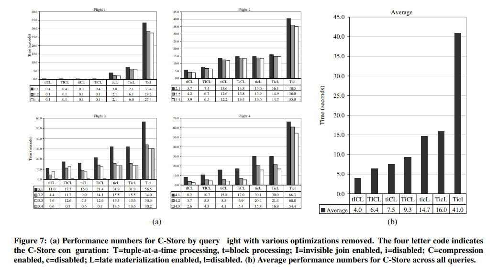

# [SIGMOD 2008] Column-Stores vs. Row-Stores: How Different Are They Really?

## Introduction

> Are these performance gains due to something fundamental about the way column-oriented DBMSs are **internally architected**, or would such gains also be possible in a conventional system that used a **more column-oriented** physical
design?

在精细的设计和测试下，采用了包括：

- 垂直分区，将表数据分成一组只有两列（key，attribute）的表集合，从而在查询时**只会访问到所需的列**
- **所有查询都是能够采用索引的**，在每个表上都够建索引，所以数据库甚至能够完全不访问底层行数据就足以响应查询
- 构建一组**物化视图**，从而测试中每个查询所涉及的列数据都一定有一个物化视图来提供结果

但这种优化下，**行存储的性能依然远逊于列存储**

> Which of the many column-database **specific optimizations** proposed in the literature are most responsible for the significant performance advantage of column-stores over row-stores on warehouse workloads?

其他研究和本文提出了以下列存储所采用的优化：

- **延迟物化 Late materialization**：在查询计划中，列数据被读取后会尽可能晚的与其他列数据一起参与组成行，提供了约3倍提升（实际上**延迟解压缩只会导致复杂度提升和性能下降，实际系统中并没有采用这种"优化"的**，并且C-Store的商业版Vertica删除了这种设计）
- **块式迭代 Block iteration**：一个列的多行数据会作为整块数据一起访问，而不是[Volcano式](https://github.com/JasonYuchen/notes/blob/master/cmu15.445/12.Query_Execution_I.md#1-%E8%BF%AD%E4%BB%A3%E5%BC%8F-iterator-model)的单行单次迭代，当与延迟物化组合使用时也被称为**向量化处理 vectorized query processing**，提供了约1.5倍提升
- **列压缩 Column-specific compression**：不同数据类型的列可以采用不同的压缩手段，例如run-length encoding RLE并且支持在压缩数据上直接执行操作，提供了**数量级**的性能提升
- **隐连接 Invisible joins**：提供了约1.5倍提升

## Background and Prior Work

`SKIP`

## Star Schema Benchmark

`SKIP`

## Row-Oriented Execution

如何在商用行存储数据库上实现列式的设计：

- **Vertical Partitioning**
- **Index-only Plans**
- **Materialized Views**

## Column-Oriented Execution

### Compression

由于列存储的数据比行存储的数据远易于压缩，**列存储同一列有相同的数据类型，从而压缩率高且在访问时的数据局部性更好**，假如某一列启用了排序，则有更高的压缩率（相同、近似数据会连续出现，从而可以引入run-length encoding），最终使得数据库**单次访问磁盘可以读取到更多的数据**，注意不同压缩算法的解压缩性能（消耗CPU时间）和压缩率（影响磁盘读写次数消耗IO时间）是一种权衡

另外由于列存储的数据压缩后使得算子有可能可以一次性操作多行数据，例如启用了排序后一组列值`1 1 1 2 2`可以表达为`3x1 2x2`从而更加节约CPU逐行处理五个数据所需要的时间（通常只能根据一列排序，其他列需要调整相应的顺序，或者可以采用**冗余表数据多份拷贝来允许多列排序**）

### Late Materialization

通常列存储中，同一个实体（行存储中的一行记录）的不同属性往往分散在磁盘的不同位置，而常见的SQL访问或者是ODBC等连接所需要的是一行记录的完整数据，因此最终需要一次**join-like materialization**来构造相应的行数据，也称为**元组构造 tuple construction**

简易的实现就是在读取了列数据后直接构造元组，随后在内存中均采用元组进行查询的操作（连接、聚合、选择等），这种方式也称为**积极物化 early materialization**

另一种选择就是在内存中依然采用列的形式组织数据，并且施加查询操作，需要给每一列的数据都**额外附加一个位置索引**用于记录每个数据属于哪一个元组（根据实现可以是数组、位图等），后续出现谓词过滤等操作时不会丢失元组所属关系，这种方式就称为**延迟物化 late materialization**，其优点包括：

- **避免多余的元组被物化**，类似于**算子下推 predicate pushdown**的原理，有一些元组可能最终不会出现在结果中，延迟物化可以避免冗余的物化操作
- 若数据是压缩的，则在构造元组时就必须解压缩，并且后续操作时就不能直接在压缩数据上操作，因此**延迟物化可以尽可能利用压缩数据**
- 操作压缩的列数据时对**缓存友好**，而积极构造元组后处理数据会导致缓存行填充了不必要的其他列数据
- 延迟物化，在内存中依然操作压缩的列数据块，有**利于block iteration**加速查询处理

### Block Iteration

采用整块迭代，能够**尽可能减少单次迭代的额外开销**，例如1行数据调用1次计算函数对比10行数据就调用1次计算函数，且函数调用本身可能开销不可忽视（例如C++虚函数调用），同时在列存储中整块数据都是所需要的列数据，而不需要像行存储一样需要首先从行数据中抽取出所需的列数据

假如该行数据是定长的，例如数据类型是`uint64_t`，那么一整块数据每数据的位置都直接可以计算偏移值得到，可以更加充分利用现代CPU的向量化指令、循环流水线等

### Invisible Join

`TODO`

## Experiments

这里仅摘了前述四种优化的作用效果图

