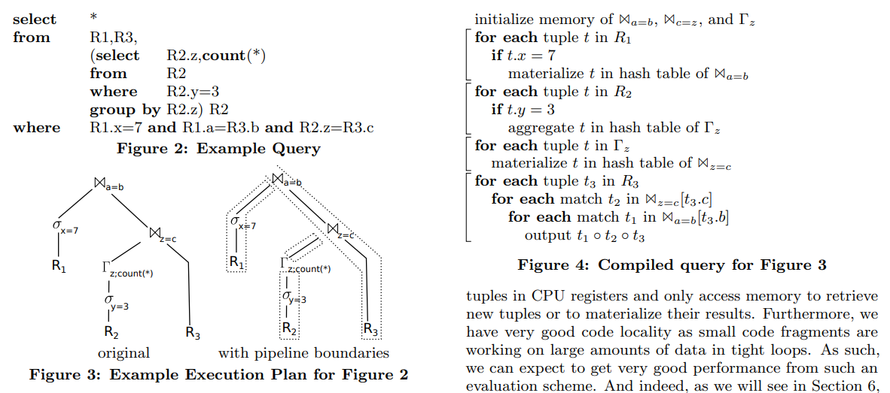
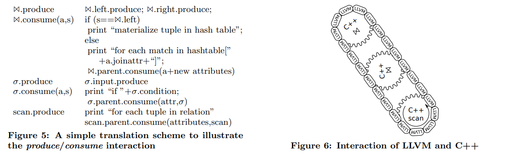
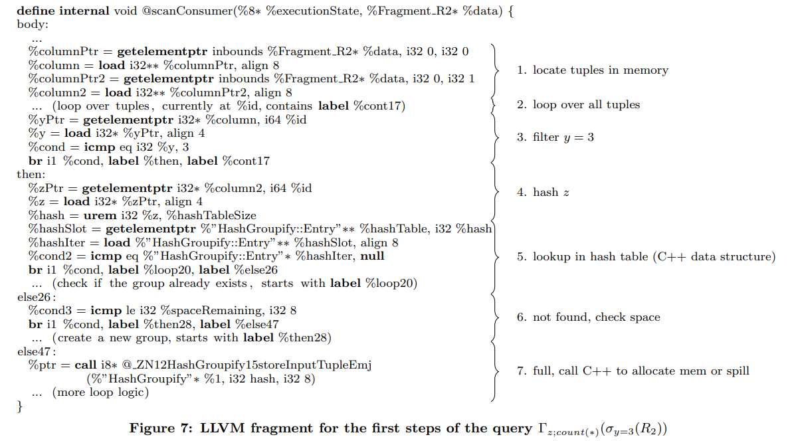

# [VLDB 2011] Efficiently Compiling Efficient Query Plans for Modern Hardware

## Introduction

大多数传统DBMS会将给定的查询转换为一个物理关系代数计划，随后采用volcano类的迭代式执行引擎对关系代数表达式求值，每个算子在被调用`next()`时持续产生结果，这种方式除了容易组合任意复杂的算子构成计划外，有一些明显的缺点：

- tuple-at-a-time的迭代式计算引擎对大量的数据不友好，每一条数据都对应每个算子的一次`next()`调用，最后一次查询可能会有百万次的调用
- `next()`通常是以虚函数/函数指针的方式实现的，从而会有**调用虚函数的开销**，包括无法内联inline、不利于分支预测等
- **代码局部性差**，大量的间接函数调用和跳转，并且更多的**簿记开销**，例如一个scan operator，每次调用只产生一条数据，且自身必须记录当前扫描位置

本文中作者提出了一种查询执行策略，包含以下三个重要的方面来显著加速了查询的执行：

- **data-centric processing**，以数据为中心而不是算子为中心，尽可能长时间的将数据放在CPU寄存器中处理，忽略算子的边界（跨算子传递数据）
- 算子并不是pull-based拉取数据（即上层算子调用下层算子的`next()`），而是**push-based推送数据**（即下层算子调用上层算子的`consume()`）
- 查询采用**LLVM + JIT编译成机器码**执行，而不是解释执行

## Related Work

`TODO`

## The Query Compiler

### Query Processing Architecture

传统的iterator模型不利于将数据始终保存在CPU寄存器中，每一次算子`next()`调用总是会进行寄存器数据调整；虽然block-oriented执行模型显著减少了函数之间的传递，但是由于一批数据的大小往往也足以超出寄存器的空间，从而打破了尽可能将数据放置在寄存器中的设计

上述的pull-based的模型始终无法避免数据反复复制/移动打破pipeline（定义为**数据始终存放在寄存器中进行计算**的一个阶段）的情况，而采用push-based的模型则可以很好的维护寄存器状态，**将查询计划按pipeline breaker进行切分**，从而在每个pipeline内利用push-based的方法可以极大的优化执行性能：

1. 从`R1`中扫描数据施加filter并构建散列表
2. 从`R2`中扫描数据施加filter并构建聚合值散列表
3. 基于聚合值散列表再重新构建出连接所需的散列表
4. 扫描`R3`并直接探测前述构建的散列表生成最终的连接结果

上述四个环节每个环节本身就是pipeline，在自身内可以始终确保数据都在寄存器中得到处理（除了从内存中读取新数据和向内存写回结果），并且显然每个环节都是一个非常紧凑的循环过程，完成尽可能多的操作和处理，从而非常有利于现代CPU架构

### Compiling Algebraic Expressions

每个算子概念上都提供两个函数，`produce()`和`consume(attributes, source)`从而就可以用于代码生成，调用子算子的`produce`就可以生成该算子的计算结果，随后将结果推送给父算子的`consume`，例如上述连接例子的执行流程为：

1. $\Join_{a=b}.produce$
2. $\sigma_{x=7}.produce$
3. $R_{1}.produce$ 该算子为叶节点算子，从而足够**自身产生数据，后续进入数据推送流程**
4. $\sigma_{x=7}.consume(attributes, R_1)$
5. $\Join_{a=b}(attributes, \sigma_{x=7})$ 连接获得了左子算子的数据，存储在散列表中，并开始要求右子算子提供数据
6. $\Join_{c=z}.produce$ 后续同理直到**数据被逐算子处理并向上推送**

## Code Generation

采用**LLVM和C++混合**编写的模式，高效的数据处理代码由LLVM生成，复杂的逻辑控制和内存交互则由C++负责，从而良好的平衡了性能和代码复杂性

## Advanced Parallelization Techniques

传统的block-oriented模型虽然引入了较多的数据复制，但一次处理更多的数据也使得大量采用SIMD进行加速变得可能，而在本文的框架下，data-centric的架构使得数据尽可能成批量的放在寄存器中，同样可以**使用SIMD进行加速处理**

另一方面，随着CPU核心数的显著增多，对**数据进行分区并由多个核心并行加速执行**也是主流的优化手段之一，数据在分区并行处理后再通过特别的合并操作来合并结果，在本文的框架下数据处理以pipeline breaker为界，天然的支持每一个pipeline内部只处理一部分数据，**仅需根据情况在pipeline breaker处将上游结果合并即可**

## Evaluation

`TODO`
