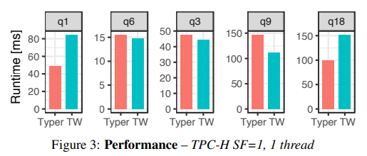

# [VLDB 2018] Everything You Always Wanted to Know About Compiled and Vectorized Queries But Were Afraid to Ask

## Introduction

现代DBMS的查询引擎通常采用**vectorization**（由VectorWise开创）或者是**data-centric code generation**（由HyPer开创）这两者之一

- **Vectorization**: **pull-based**，参考[MonetDB](MonetDB.md)，采用类似Volcano迭代式的执行引擎，但每个`next()`会返回一批数据，并且采用针对具体类型的高效率向量化算法来成批处理数据，减少频繁调用`next()`导致的开销，同时也减少了调用次数
- **Data-centric code generation**: **push-based**，参考[Hyper](Morsel.md)，每个算子都提供`produce()`和`consume()`接口，整个查询最后会模糊算子的边界，而是以pipeline的形式来处理数据，每个pipeline内部都是紧凑的循环，并且会被编译成更高效的native code执行

本文在尽可能相同的条件下系统性的比较了这两种选择，两者都非常高效，但各有优缺点：

- Data-centric code generation（文中的Typer系统）在**计算密集**的查询中更有优势
- Vectorization（文中的Tectorwise系统）在**掩盖cache miss latency**上更出色，常见于涉及hash join等算子的查询

**实际上这两种做法并不互斥，可以在一个系统中混合使用**

## Vectorized vs. Compiled Queries

### Vectorizing Algorithm

对于Typer来说，**算子可以是任意的开发者认为合适的实现，可以处理一行数据中多个类型的列**，并会被编译成更高效的生成代码，如下第一种方式，所有谓词都可以在循环内直接求值

```cpp
/// Both predicates checked at once
vec<int> sel_eq_row(vec<string> col, vec<int> tir)
  vec<int> res;
  for(int i=0; i<col.size(); i++) // for colors and tires
    if(col[i] == "green" && tir[i] == 4) // compare both
      res.append(i) // add to final result
  return res
```

对于Tectorwise来说，由于**向量化算法只能处理相同类型的一列内的数据**，因此当对一行数据有多个谓词需要判断时，就必须对每一列都扫描并执行一遍，这里通常也会引入SIMD等优化技术来尽可能提高每个"primitive"的性能

```cpp
/// Each predicate checked in one primitive
vec<int> sel_eq_string(vec<string> col, string o)
  vec<int> res;
  for(int i=0; i<col.size(); i++) // for colors
    if(col[i] == o) // compare color
      res.append(i) // remember position
  return res

vec<int> sel_eq_int(vec<int> tir, int o, vec<int> s)
  vec<int> res;
  for(i : s) // for remembered position
    if(tir[i] == o) // compare tires
      res.append(i) // add to final result
  return res
```

### Vectorized Hash Join and Group By

对于Typer来说，直接采用所有数据构造散列表，随后在紧凑循环中完成连接即可

```cpp
/// Generated hash join
query(...)
  // build hash table
  for(i = 0; i < S.size(); i++)
    ht.insert(<S.att1[i], S.att2[i]>, S.att3[i])
  // probe hash table
  for(i = 0; i < R.size(); i++)
    int k1 = R.att1[i]
    string* k2 = R.att2[i]
    int hash = hash(k1, k2)
    for(Entry* e = ht.find(hash); e; e = e->next)
      if(e->key1 == k1 && e->key2 == *k2)
        ... // code of parent operator
```

对于Tectorwise来说，需要首先构造散列表，随后采用`probeHash_`这个primitive来完成批量探测，同样需要采用`compareKeys_`来完成批量比较，并根据结果最后使用`buildGather_`来批量整合完成连接的数据

```cpp
/// Vectorized hash join
class HashJoin
  Primitives probeHash_, compareKeys_, buildGather_;
  ...
int HashJoin::next()
  ... // consume build side and create hash table
  int n = probe->next()// get tuples from probe side
  // *Interpretation*: compute hashes
  vec<int> hashes = probeHash_.eval(n)
  // find hash candidate matches for hashes
  vec<Entry*> candidates = ht.findCandidates(hashes)
  // matches: int references a position in hashes
  vec<Entry*, int> matches = {}
  // check candidates to find matches
  while(candidates.size() > 0)
    // *Interpretation*
    vec<bool> isEqual = compareKeys_.eval(n, candidates)
    hits, candidates = extractHits(isEqual, candidates)
    matches += hits
  // *Interpretation*: gather from hash table into
  // buffers for next operator
  buildGather_.eval(matches)
  return matches.size()
```

## Methodology

测试中Typer和Tectorwise采用了相同的算法和数据结构以及测试查询，在对比时也不考虑查询的parsing、optimization、code generation、compilation时间

- **Query Processing Algorithms**
  本文实现了`scan`，`select`，`project`，`join`，`group by`这五种算子用于测试对比，具体实现细节参考原文
- **Workload**
  - Q1: fixed-point arithmetic, (4 groups) aggregation
  - Q6: selective filters
  - Q3: join (build: 147 K entries, probe: 3.2 M entries)
  - Q9: join (build: 320 K entries, probe: 1.5 M entries)
  - Q18: high-cardinality aggregation (1.5 M groups)
  - 其他Q都包含占据主导的join部分，因此结果类似于Q3和Q9

## Micro-Architectural Analysis

- **Single-Threaded Performance**

  

  - Tectorwise使用了更多的指令，并且通常有更高的L1 cache miss，而Q1是定点数计算和足以放入缓存的聚合操作，因此Typer表现更好
  - Typer生成代码后往往对**计算密集、中间结果足以放入缓存**的查询非常友好
  - 在涉及散列的Q3/Q9中，Tectorwise向量化的操作在处理散列和连接时，由于过程只是简单的[循环向量化探测散列表](08.Vectorized_Execution.md#hash-tables)，因此CPU更容易实现**speculative & out-of-order execution**，从而能够更好的隐藏cache miss latency，而Typer的散列连接过程中有较复杂的循环逻辑，对分支预测失败更脆弱，且不像Tectorwise一样容易深度预测和乱序执行，往往需要耗费了较多的CPU周期在等待cache miss情况下读取内存的操作
  - 需要特别注意的是**IPC更高意味着CPU的利用率更高，但并不一定综合性能更好**，因为有可能更多的指令在做无用功

- **Interpretation and Instruction Cache**
  通常compiled query只需要执行更少的指令，而传统类似volcano迭代式的vectorized引擎依然需要面临更多解释执行的额外开销，但这种开销被批量化处理vector-as-a-time以及向量指令给抵消了相当大一部分，并且现代CPU的L1 cache已经足够大通常能够装下查询所需要的所有热点代码，因此instruction miss也不是OLAP的瓶颈
- **Vector Size**
  显然过小/过大的vector size都不合适，通常在1k~10k的情况下会有较好的综合性能
- **vs. VectorWise/Hyper**
  直接与生产系统对比（通常生产系统还会包含很多检查，例如浮点溢出等，性能会劣于本文的简单实现）

  |   | Hyper | VectorWise | Typer | TectorWise |
  |-: |-:     |-:          |-:     |-:          |
  |Q1 |53     |71          |**44** |85          |
  |Q6 |**10** |21          |15     |15          |
  |Q3 |48     |50          |47     |**44**      |
  |Q9 |124    |154         |126    |**111**     |
  |Q18|224    |159         |**90** |154         |

## Data-Parallel Execution (SIMD)

通常在**vectorized引擎中引入SIMD非常自然**，而在data-centric code中比较困难（compiled query较为复杂）

- **Data-Parallel Selection**: 参考[Vectorized Selection/Scans](08.Vectorized_Execution.md#selection-scans)
- **Data-Parallel Hash Table Probing**: 参考[Vectorized Hash Join](08.Vectorized_Execution.md#hash-tables)
- **Compiler Auto-Vectorization**: 参考[Vectorization](08.Vectorized_Execution.md#implementation)

*单纯的Hashing环节改用SIMD可以有2.3x的提升，但是在实际的整个查询中，由于materialization、memory latency等各种其他因素的影响，最终只有1.1x的提升*


## Intra-Query Parallelization

- **Exchange vs. Morsel-Driven Parallelism**
  最开始的VectorWise采用了[exchange](06.Query_Execution.md#intra-query-parallelism)来支持查询内并发，而HyPer则采用了[morsel-driven pipelines](Morsel.md#morsel-driven-execution)，而随着现在摩尔定律的失效、CPU发展方向转向多核化，**采用exchange算子的多核扩展性不佳**
- **Multi-Threaded Execution**
- **Out-Of-Memory Experiments**
  通常现实系统数据往往难以完全放入内存，因此当数据量无法完全放置在内存中时：

  |   | Typer(ms) | TW(ms) | Ratio |
  |:- | -:        | -:     | -:    |
  |Q1 | 923       | 1184   | 0.78  |
  |Q6 | 808       | 773    | 1.05  |
  |Q3 | 1405      | 1313   | 1.07  |
  |Q9 | 3268      | 2827   | 1.16  |
  |Q18| 2747      | 2795   | 0.98  |

## Hardware

`SKIP`

## Other Factors

在良好的实现和使用之下，vectorization和compilation两种模型并**没有大到足以影响技术选择的性能差异**，此时也可以考虑两种模型在以下其他方面的不同

- **OLTP and Multi-Language Support**
  在OLTP负载下，向量化的场景几乎没有，但是查询依然可以被compiled从而来获得显著提升，因此在需要兼顾OLTP的HTAP系统中，通常会优先选择compilation

  另一方面compilation可以支持前端用户用不同的语言来实现查询、UDF等，随后后端执行相同的处理流，因此在用户角度会方便很多
- **Compilation Time**
  对于复杂的查询（往往OLAP的查询比OLTP复杂得多）编译时间往往会显著增加，现实系统中往往会权衡是否需要启用complied query，例如HyPer的[Adaptive Compilation](09.Query_Compilation_Code_Generation.md#hyper)
- **Profiling and Debuggability**
  Vectorization引擎下很容易进行profiling和debugging
- **Adaptivity**
  在查询的执行过程中，不同算子的求值顺序能够自适应的运行时调整也是一个优化的方式，因为在查询优化器（无论是cost-based还是heuristic-based）输出的计划存在较大误差时，**运行时进行算子执行顺序调整可以补偿优化器estimation error导致的惩罚**，而compilation引擎难以在运行时调整，但解释执行的vectorization引擎则可以很容易实现

  > The combination of **fine-grained profiling** and **adaptivity** allows VectorWise to make various **micro-adaptive decisions**

- **Implementation Issues**

**通常vectorization搭配`WHERE`条件的compilation能较好平衡性能和实现难度**

## Beyond Basic Vectorization And Data-Centric Code Generation

- **Hybrid Models**
  HyPer的**scan算子**实际上重度使用了C++模板搭配vectorization，从而在运行过程中不需要生成任何代码，而其他算子则是运行中生成代码，从算子的角度来说，HyPer也可以视为采用了混合模型

  通常data-centric code generation的模型会**倾向于融合所有算子**，将查询分割为数个pipeline，从而尽可能在pipeline内减少中间结果的读写，保持高缓存命中率和数据局部性来实现高性能；而前述[例子](#micro-architectural-analysis)中可以发现牵涉到散列等操作时**缓存未命中会由于memory stall带来较大的性能惩罚**，因此Pelton引入了**relaxed operator fusion**模型，在code generation时主动注入一些materialization boundaries，利用批量化的时机加入SIMD和prefetching来提升综合性能，但难点就在于如何确定**合理的materialization boundaries的位置和数量**
- **Other Query Processing Models**

  | Pioneering System | Pipelining | Execution | Year |
  | :-                | :-         | :-        | :-   |
  | System R          | pull       | interp    | 1974 |
  | PushPull          | push       | interp    | 2001 |
  | MonetDB           | n/a        | vector    | 1996 |
  | VectorWise        | pull       | vector    | 2005 |
  | Virtuoso          | push       | vector    | 2013 |
  | Hique             | n/a        | compil    | 2010 |
  | HyPer             | push       | compil    | 2011 |
  | Hekaton           | pull       | compil    | 2014 |
