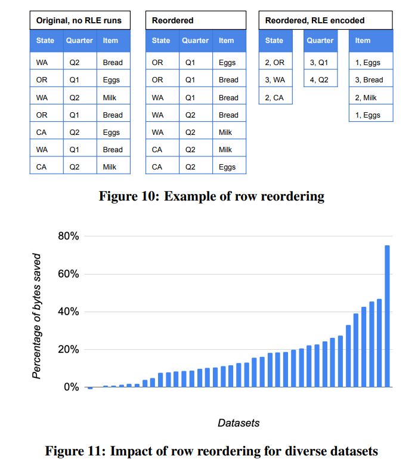

# [VLDB 2020] Dremel - A Decade of Interactive SQL Analysis at Web Scale

## Embracing SQL

早期Google认为SQL扩展性不佳

> The conventional wisdom at Google was **"SQL doesn’t scale"**, and with a few exceptions, Google had moved away from SQL almost completely.

在后来的演化中，SQL又成为了核心功能

> **SQL finally became pervasive** at Google, across widely used systems such as Dremel, F1, and Spanner, and other niche systems.

类似的**NoSQL走向NewSQL**的演进在过去十年里不断发生

## Disaggregation

### Disaggregated storage

早期的Dremel采用shared-nothing架构，每个节点独立拥有CPU、内存、磁盘，持有一部分数据，在快速变化的负载下这种架构面临着扩容/缩容能力不佳、可扩展性和性能受到约束的问题

Dremel走向**存算分离**，对[Google File System, GFS](../mit6.824/GFS.md)深度修改优化（后又迁移到了更优异的Colossus），将其作为了Dremel的存储层

### Disaggregated memory

原先Dremel完全不支持join，后续通过*shuffle*算子（受[MapReduce](../mit6.824/MapReduce.md)启发）实现了分布式连接的支持，由于采用计算节点的内存和磁盘存储中间结果会显著限制可扩展性，Dremel引入了**基于Colossus的shuffle infrastructure service**，改 该服务有独立的内存和磁盘系统，从而实现了内存的分离


### Observation

模块解耦已经是数据管理的主流趋势，将几种资源分别管理，从而达到更好的性价比、弹性：

- **Economies of scale**: 不同规模的系统都开始采用存算分离
- **Universality**: 大量的事务、分析型系统都采用了存算分离
- **Higher-level APIs**: 解耦后的资源系统可以提供更高层抽象的接口，例如存储系统不再只是阻塞的I/O API，而是包含了加密、鉴权、负载均衡、元数据服务等丰富功能的基础设施，同时一些系统还进一步提供了存储侧的filtering、aggregation功能（**算子下推 operator pushdown**）
- **Value-added repackaging**: 资源被包装成服务后能够提供更高的价值

## In Situ Data Analysis

传统的系统往往依赖ETL工具来实现不同设施之间的数据迁移、转换、分析，有高昂的代价和延迟，而in situ分析强调移除ETL过程的直接在数据存储上分析：

- 直接从多个数据源消费数据
- 移除传统基于ETL的数据从OLTP系统迁移到data warehouse的流程
- 允许不同的计算引擎在数据上进行处理分析

### Dremel's evolution to in situ analysis

- 早期Dremel的设计和传统的DBMS相同，需要显式的数据加载、数据必须有专用的格式
- 随着迁移到GFS上，Dremel开放了其**文件格式：自解释的列式存储**，由于其自解释、在文件内就有充分的元数据，使得大量的工具/SQL可以直接分析Dremel的数据文件，例如MapReduce任务可以直接读取/写入Dremel格式的文件，这些数据也可以被Dremel分析（即统一[storage layout](03.Storage_Models_Data_Layout.md)？）
- 在**共享的分布式文件系统上、采用自解释的数据格式**，使得大量周边工具、分析系统可以读取/写入Dremel文件，从而实现所谓的in situ analysis
- 后续演进上，一方面Dremel继续丰富其文件格式，使得CSV、JSON、Avro等格式的工具也可以与Dremel交互，另一方面Dremel也在添加其支持的存储后端，允许从Google Cloud Storage、Google Drive、BigTable等系统上读写文件

### Drawbacks of in situ analysis

- 用户未必想要亲自管理数据
- in situ的分析往往就意味着针对使用的数据难以获取一些统计信息（很多分析用户的数据是Dremel第一次处理），并且无法支持在独立的数据文件上执行DML更新删除或DDL变更schema等操作

这些缺点也推动了**BigQuery Managed Storage**存储系统的诞生，来允许云用户将数据直接交给Google托管

## Serverless Computing

### Serverless roots

- **Disaggregation**: 存算分离使得Dremel可以很轻易的按需扩容相应的资源（CPU、RAM、Storage）
- **Fault Tolerance and Restartability**: Dremel的查询执行层假定底层资源节点是不可靠的，因此其要求所有**子任务都必须是幂等、可重复执行的**，从而能够应对故障节点，同时任务分发层也支持相同的任务**分发多个副本以应对潜在的满节点**（类似[hedging request](../brpc/long_tail_latency.md)，MapReduce也有类似的设计），而Dremel也因此可以通过**取消\重新调度子任务来动态调整查询的资源占用**
- **Virtual Scheduling Units**: Dremel采用调度配额scheduling unit来量化查询的资源占用，从而掩盖底层物理机器的类型、CPU内存存储资源的差异

### Evolution of serverless architecture

在Dremel的演进过程中，以下新设计逐步成为Dremel的核心

- **Centralized Scheduling**: 中心化的调度层，基于整个集群的状态进行任务调度，从而达到更高的整体利用率和任务的隔离性

  

- **Shuffle Persistence Layer**: 类似MapReduce的shuffle操作，Dremel也在*Shuffle*过程中加入了持久化操作，从而让Shuffle成为了checkpoint节点，Dremel就可以利用checkpoint的特性，**允许在查询的多个阶段间暂停任务**（后续可以从checkpoint恢复执行），抢占worker用于其他查询，即**更细粒度的任务调度、挂起、恢复**
- **Flexible Execution DAGs**

  

- **Dynamic Query Execution**: 预先估计执行情况（基于estimates）非常困难，误差会导致原先的最优计划可能变为较差的计划，Dremel允许在**查询执行过程中根据真实数据情况、执行情况动态调整查询计划**，基于Shuffle持久化层，例如Dremel一开始选择hash join，首先对join两侧的表执行shuffle，假如发现其中一侧很快就结束了shuffling，则Dremel会选择直接取消另一侧的shuffle并转向使用broadcast join（因为一侧数据非常少，broadcasting该侧的代价很低）

## Columnar Storage for Nested Data


- **repetition, definition levels** (figure 6, e.g. Dremel, Parquet)
  - repetition level代表了重复的值是否是跟随前值连续，还是单独新开始（即判断所属于的repeated字段，若有变化见下例，其值指向了repeated有变化的属性），因此对于每一条新的数据总是0
  - definition level代表了到一个值的路径上（包括该值本身）有定义/数据的repeated/optional字段数量
  
  图中`Name.Language.Code`的最大repetition level为2，即其路径上最多有2个repeated字段：`Name`和`Language`；而其最大definition level为3，即其路径上最多有3个repeated/optional字段：`Name`、`Language`和`Country`
  
  以记录`r1`的`Language`为例：
  - 第一个数据`{en-us, us}`，其路径上`Name`和`Language`都有定义，因此`en-us d=2, us d=3`，而作为起始数据其`r=0`
  - 第二个数据`{en, NULL}`，同理其路径上有定义，但`Country`缺失，因此`en d=2, NULL d=2`，并且由于该数据依然**处于同一个`Name`下不同repeated `Language`中，因此变化的是第2个repeated字段**，`en r=2, NULL r=2`
  - 第三个数据`{NULL, NULL}`，其路径上`Language`缺失，因此`d=1`，由于其属于第二个`Name`，因此变化的是第1个repeated字段，`r=1`
  - 第四个数据`{en-gb, gb}`，同第一个数据，其`en-gb d=2, us d=3`，并且由于其属于第三个`Name`，因此变化的是第1个repeated字段，`r=1`
  - `r1`的数据结束，新的数据`r2`开始，因此其不存在的`Language`（但路径上`Name`有定义）对应的`{NULL, NULL}`均有`r=0, d=1`
- **lengths of repeated fields, boolean presence** (figure 7, e.g. ORC, Arrow)
  - length代表了在相同父节点内的重复值出现的次数
  - boolean preseonce代表了optional值是否存在

上述两种方式有明显的优缺点，对于**repetition/definition**方法来说，尽可能将其结构信息全都编码进了column内，从而可以直接访问感兴趣的字段而**不需要读取其祖先/前序节点的数据**，例如直接访问`Name.Language.Code`并根据`r/d`值就可以计算出该数据位于其所属记录的逻辑位置，但代价就是**冗余重复的信息**，每个节点都重复存储了公共祖先的结构信息，最终通常会产生比**length/presence**更大的数据文件，但**length/presence**的缺点在于单独的数据缺乏结构信息，因此必须读取祖先节点的数据才能完全解释，这就导致了**额外的I/O开销**

### Embedded evaluation

**算子下推**，采用**Capacitor** data access library内置filtering的方式加快处理：

- **Partition and predicate pruning**: 分块处理，在访问前基于块的statistics先求值谓词是否需要访问该块
- **Vectorization**: 基于数据块的向量化处理
- **Skip-indexes**: 现实负载中大量的查询selectivity都非常高，因此采用skip indexes来加速跳过不满足要求的数据，类似谓词下推和基于统计的过滤
- **Predicate reordering**: 优先执行高selectivity的谓词有助于快速筛选数据，基于statistics和estimates来调整谓词的求值顺序

### Row reordering

Capacitor会采用dictionary、run-length encoding等标准方式对数据进行压缩处理，而RLE对列数据是否有序非常敏感，因此Capacitor会尝试进行**重排序，将相关的数据尽可能连续存储**以提高RLE的表现，但求解最优顺序是NPC问题，Capacitor采用采样配合启发式算法来给出大致的较优顺序



### More complex schemas

Dremel不支持一些更为复杂的模型，例如JSON、XML这些没有严格schema，以及Protobuf还支持递归定义的消息类型，例如：

```pb
message Node {
  optional Payload value;
  repeated Node nodes;
}
```

## Interactive Query Latency Over Big Data

Dremel从以下角度优化了查询的延迟

- **Stand-by server pool**: 预分配的处理节点减少了资源分配、预热等的延迟，[Snowflake](Query_Engine_on_Disaggregated_Storage.md)也有类似的设计
- **Speculative execution**: 一次查询被分割成多个子任务，由所有执行节点处理，并且当遇到慢节点时可以主动调度重复的子任务到其他节点，从而尽可能避免一个慢节点影响整个查询
- **Multi-level execution trees**
- **Column-oriented schema representation**
- **Balancing CPU and IO with lightweight**
- **Approximate results**
- **Query latency tiers**: 避免短查询被长查询阻塞，调度层会进行公平调度
- **Reuse of file operations**: 重用文件系统读取的数据、更大的单个文件从而减少文件数量和元数据管理开销
- **Guaranteed capacity**
- **Adaptive query scaling**
