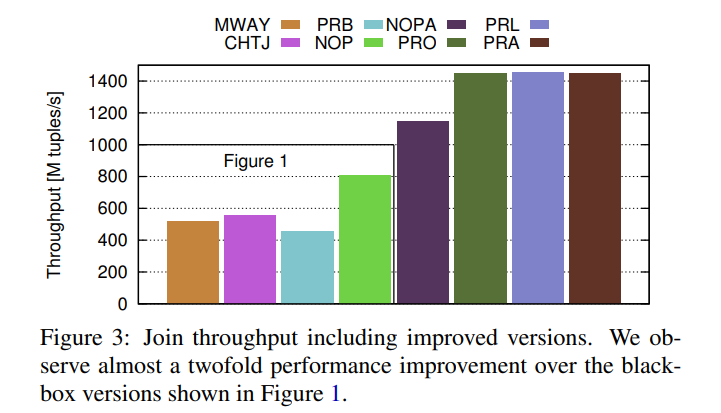
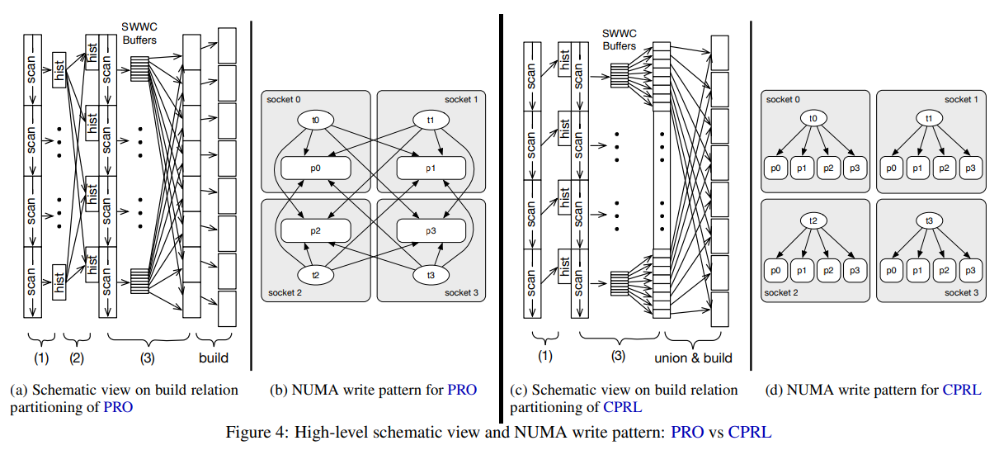
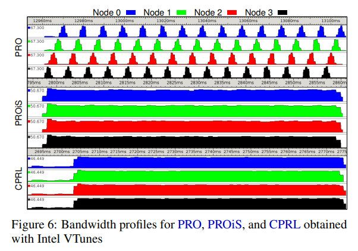
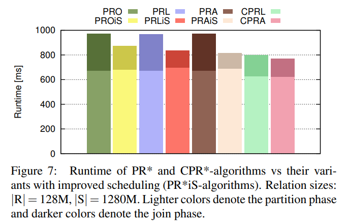
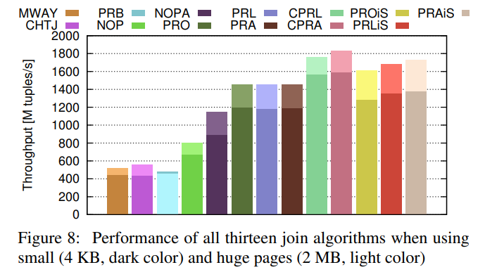
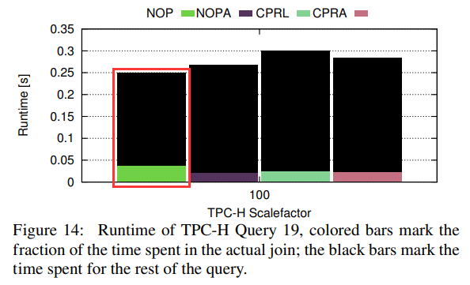

# [SIGMOD 2016] An Experimental Comparison of Thirteen Relational Equi-Joins in Main Memory

## Fundamental Representatives of Main-Memory Join Algorithms

- **Partition-based Hash Joins**
  将输入数据根据连接的属性分区为小的数据分区，从而两个参与连接的关系对应的分区数据也可以称为**co-partitions**，这种算法的核心在于小的**分区能够完全填入cache**，从而在构建、探测散列表时以小分区的形式进行，**提升缓存命中率**

  **PRB**: 传统的分区散列问题在于分区后不同的分区数据会随机分配在不同的内存页上，从而导致构建散列表时需要将tuples写入大量属于不同页的内存，导致大量**TLB cache miss**，从而极大的影响了内存写入速度，经典的PRB算法是一个two-pass parallel radix hash算法用于减轻TLB cache miss问题
- **No-Partition Hash Joins**
  不进行数据分区，直接构建单个全局散列表，通过multi-threading和out-of-order execution来掩盖cache miss的延迟，显然这种做法并不需要感知硬件缓存、TLB的状态

  **NOP**: 经典的NOP算法采用linear probing并且采用CAS实现无锁的构建散列表，每个线程都拿到均分的数据块来并发构建
- **Sort-Merge Joins**
  最传统古老的排序合并连接。将两个关系都进行排序，随后以归并的形式完成连接

  **MWAY**: 经典的多路排序归并连接，数据的分区过程与PRB类似，每个分区各自排序后归并连接，[参考](https://github.com/JasonYuchen/notes/blob/master/cmu15.445/11.Join_Algorithms.md#%E6%8E%92%E5%BA%8F%E5%BD%92%E5%B9%B6%E8%BF%9E%E6%8E%A5-sort-merge-join)

文中对比所用到的连接算法简述

- **PRB**: Two-pass parallel radix join with **software managed buffer** and **non-temporal streaming**
- **NOP**: No-partitioning hash join
- **CHTJ**: Concise hash table join
- **MWAY**: Multi-way sort merge join
- **NOPA**: NOP with an array as the hash table
- **PRO**: PRB with only one-pass
- **PRL**: PRO with linear probing instead of bucket chaining
- **PRA**: PRO with arrays as hash tables
- **CPRL**: Chunked PRL
- **CPRA**: Chunked PRA, i.e. CPRL with arrays as hash tables
- **PROiS**: PRO with improved scheduling, i.e. NUMA-aware load balancing/scheduling
- **PRLiS**: PRL with improved scheduling
- **PRAiS**: PRA with improved scheduling

## White Box Comparisons



### Optimizing Radix Partitioning

- **NUMA-Awareness**
  将内存从随机分配改为感知NUMA的分配，即均匀分配到所有NUMA节点上
- **Memory Allocation Locality**
  直接将物理页分配到相应的NUMA节点上，保证内存数据的局部性，并且在运行过程中不会触发page faults
- **Software Write-Combine Buffers**
  SWWCB也称为software managed buffers，用于缓存少量输出的tuples（通常**等于一个cache line的大小**）并一次性整个buffer写入到目的内存，通常buffer可以常驻在高速缓存种，并且以**批量的方式写入内存，避免per-tuple访存**的额外开销

  ```cpp
  for (auto tuple : relation) {
    auto partition = hash(tuple.key);
    auto pos = slots[partition] % TuplePerCacheline;
    slots[partition]++;
    buffer[partition].data[pos] = tuple;
    if (pos == TuplePerCacheline - 1) {
      auto dest = slots[partition] - TuplePerCacheline;
      write(buffer[partition].data, output[dest]);
    }
  }
  ```

- **Non-temporal streaming**
  允许数据**直接bypass所有caches直接写入内存DRAM**，通常join等场合已经处理过的数据**短期内不会再用到**，因此放入cache只会污染缓存影响其他常驻数据
- **Single-pass Partitioning**
  采用单次14bits的分区方案会有更好的综合性能

### Choice of Hash Method

- **Linear**
- **Chained**

## Optimizing Parallel Radix Join

### NUMA-aware Partitioning

PRO直接采用NUMA分区的方案可能会导致大量tuples需要被写入远端NUMA节点的分区，即**remote write**，如图(b)；而采用另一种方式可以很好的规避这种情况，即CPRL：

- 构建完local histogram后每个**NUMA节点独立的进行分区**，不再需要global histogram
- 需要连接的两个关系都每个NUMA节点独立分区完成后，每一对co-partition都独立进行连接，这**两个partition可能位于多个不同的NUMA节点**，如图(d)中`p0`位于四个NUMA节点
- 一对co-partition进行连接时，单个线程首先读取多个NUMA节点的子分区构建local hash table，随后再从多个NUMA节点读取连接的子分区完成探测和连接
- **PRO中partition阶段的大量small remote random writes被替换为CPRL中join阶段的少量large remote sequential read**



### NUMA-aware Scheduling

由于不同NUMA节点的local、remote访存带宽各有不同，在co-partitions进行连接时，尽可能提高CPU/RAM的利用率能够显著增大连接吞

PRO算法中由于参与连接的数据在基于NUMA分区后，会出现连续的co-partitions都处于同一个NUMA节点这种问题，从而在执行算法时出现单个NUMA节点RAM饱和的情况，如下图：

- 精细调整执行连接的co-partition顺序，**使得每个NUMA节点都能够并发**的进行连接，从而使得所有NUMA节点和相应的RAM利用率最大化
- CPRL算法中由于设计上很自然的使**所有co-partitions都会使用到不同的NUMA节点，因此在连接时天然的并发**，而第一阶段由于只是NUMA节点局部处理，因此内存使用率在开始的阶段非常低
- CPRL的large remote sequential read依然略微优于PROiS的small remote random writes





## Putting It All Together

- **Varying Page Sizes**
  通常采用大页内存降低TLB压力"几乎"总是有利于性能提升

  

- **Scalability in Dataset Size**

## Effects On Real Queries

- 即使是非常简单的查询，join开销往往也只占整个查询开销的很小一部分
- 优化join的性能对整个查询并不显著，甚至**有可能因为影响了查询其他部分的操作，反而使整个查询性能更差了**
  - 下图Q19的数据中，join key为primary dense key并且表数据是以有序的方式生成的，这种情况对于NOPA连接算法是最理想的负载
  - Q19中不仅仅需要完成连接，还在不同位置访问了其他的一些属性，例如谓词求值、聚合等，从而需要重建tuples，NOPA算法中参与连接的表并没有分区，因此相关的数据都紧凑的在一起，**数据局部性很好**
  - 访问non-join key属性这对于CPR*系列算法不利，后者只根据join key分区，对于其他属性依然需要根据row-ids去读取，而其他属性不参与分区、可能位于内存的任意位置，**数据局部性不良**



## Lessons Learned

- Don’t use CPR* algorithms on **small inputs**
- Clearly Specify all options used in experiments
- If in doubt, use a **partition-based algorithm for large scale joins**
- Use **huge pages**
- Use **Software-write combine buffer**
- Use the right number of **partition bits** for partition-based algorithms
- Use a **simple** algorithm when possible
- Be sure to make your algorithm **NUMA-aware**
- Be aware that **join runtime != query time**
