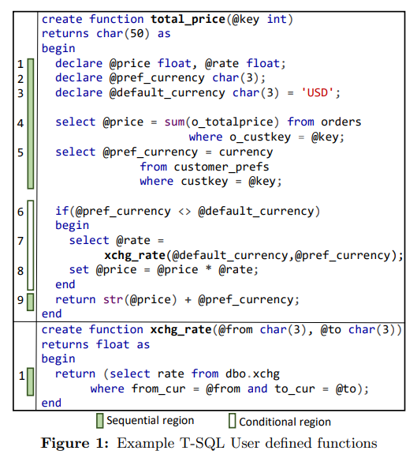
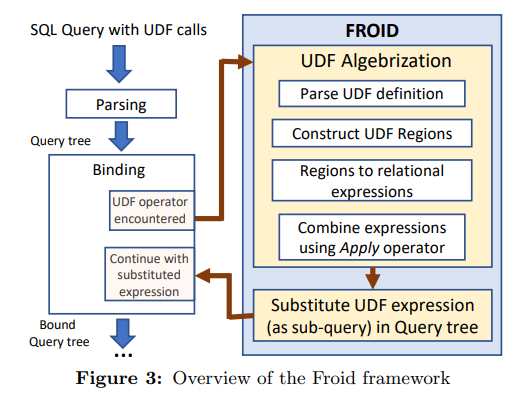
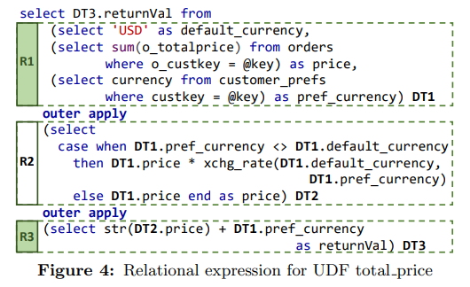
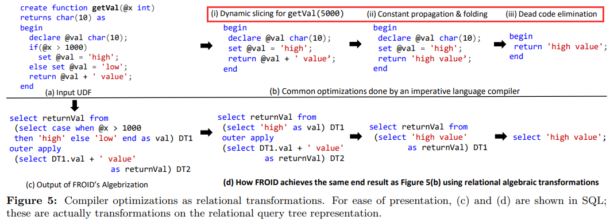
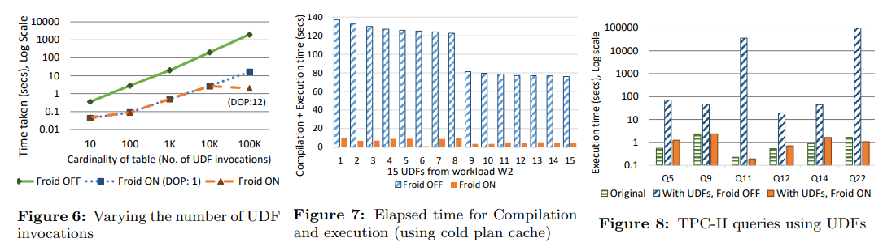

# [VLDB 2017] Froid: Optimization of Imperative Programs in a Relational Database

## Introduction

> **UDFs** encourage good programming practices and provide a powerful abstraction, and hence are very attractive to users. But the poor performance of UDFs due to naive execution strategies discourages their use.

本文提出了Froid优化框架，旨在保留UDF的抽象灵活性的基础上，优化UDF的执行性能

## Background



- 标量的UDF示例：`SELECT c_name, dbo.total_price(c_custkey) FROM customer;`
- SQL Server中UDF的计算过程：
  1. **Parsing, Binding, Normalization**
  2. **Cost-based Optimization**
  3. **Execution**
- 传统UDF计算过程的缺点
  - **Iterative Invocation**: 迭代式的将UDF用于每一行数据进行计算，这种方式会引入UDF引擎和SQL引擎上下文切换的代价
  - **Lack of Costing**: 查询优化器会将UDF代码视为黑盒操作，只有SQL操作会被优化器考虑，UDF操作会被视为低成本的操作，与实际情况偏差较大，从而导致优化器的优化偏差劣化整体性能
  - **Interpreted Execution**: UDF会被逐语句编译执行，缺乏跨语句的分析和优化，导致性能较差
  - **Limitation on Parallelism**: SQL Server无法在涉及UDF的查询语句中使用[intra-query parallelism](06.Query_Execution.md#intra-query-parallelism)

## The Froid Framework

核心思想在于将**UDF转换为语义相同的子查询sub query**

> If the entire body of an imperative UDF can be expressed as a single relational expression R, then any query that invokes this UDF can be **transformed into a query with R as a nested sub-query** in place of the UDF.



在查询binding过程中，加入遇到了一个UDF算子，控制流就转移到Froid进行**代数转化UDF Algebrization**，包括UDF解析、等价关系表达式替换，若过程中继续遇到嵌套的UDF算子，则递归执行上述过程，最后**完成替换的查询语法树只包含常规查询算子**，整体交给优化器进行优化

Froid支持替换的映射关系如下：

- `DECLATE, SET`: 变量声明和赋值
- `SELECT`: 包含多个变量赋值的SQL查询
- `IF/ELSE`: 任意嵌套的分支
- `RETURN`: 单/多返回语句
- `UDF`: 嵌套/递归UDF调用
- others: 其他关系算子例如`EXISTS, ISNULL`等

## UDF Algebrization

### Construction of Regions

在UDF中的每一条语句都会被解析，并且整个UDF会被分割为**不同层级的regions**，region即代码块，例如基本块、分支、循环等，region也可以包含其他region，整个UDF也被视为一个region，例如下图标记颜色的sequential region和conditional region：


### Relational Expressions for Regions

Froid首先对独立的**命令式语句imperative statements构造关系表达式relational expressions**，随后再将关系表达式合并成整个region的单一表达式，例如：

- 变量声明和赋值
  
  ```SQL
  set @default_currency = 'USD';
  
  /* translated to */

  SELECT 'USD' AS default_currency.
  ```

- 条件分支

  ```SQL
  if (@total > 1000)
    set @val = 'high';
  else
    set @val = 'low';

  /* translated to */

  SELECT(CASE WHEN total > 1000 THEN 'high' ELSE 'low' END) AS val.
  ```

- 返回语句
  返回代表了UDF执行的结束，一个UDF可能包含多个返回语句，Froid会将返回语句翻译为对特殊变量`returnVal`的赋值并紧跟一个无条件跳转（采用`APPLY`算子的probe和pass-through特征）到UDF结尾
- 函数调用
  Froid会保留该函数调用，并递归进入该UDF进行转换，相当于该**函数调用在Froid转换完时变成一个内联的子查询**（Froid会限制一些递归、深层次的转换，而是保留UDF原始的执行方式）
- 其他
  例如`EXISTS`等会被Froid相应的转换为查询算子

前述提到不同的region会被翻译为子查询，示例中的代码`total_price`会包含3个regions，而子查询之间会通过**派生表derived table representation**进行数据交互

每条UDF语句都有一个**读取集read-set**和**写入集write-set**，包含了该语句读取/写入的变量，从而一个region就包含了所有语句read-set的集合和write-set的集合，并且region转换后的关系表达式就需要将其的**write-set暴露给后续region的关系表达式**，因此其write-set就会用于确定该派生表的schema，如下：

| Region | Write-sets (Derived Table Schema) |
| :-     | :-                                |
| R1     | `DT1 (price float, rate float, default_currency char(3), pref_currency char(3))` |
| R2     | `DT2 (price float, rate float)`   |
| R3     | `DT3 (returnVal char(5))`         |

### Combining Expressions using APPLY

当同级别的region都被转换为关系表达式后，就会**采用`APPLY`算子将其整合到一个关系表达式**，供更高层次的region使用：



## Substitution and Optimization

当UDF被转换为子查询后，就会替换到原先查询的位置中，从而查询优化器就可以用所有优化的规则、成本的估算来对整个关系查询进行优化，前述UDF的缺点就可以被恰当处理：

- 可以选择**set-oriented的执行计划**，避免了逐tuple迭代执行
- **UDF内部的操作/昂贵查询都对优化器可见**，从而可以被评估成本
- **UDF不再是逐语句编译执行**的，而是整体就是一个查询
- 由于变为了子查询，因此**intra-query parallelism也可以被使用**

## Compiler Optimizations

- **Dynamic Slicing**
- **Constant Folding and Propagation**
- **Dead Code Elimination**



## Evaluation


