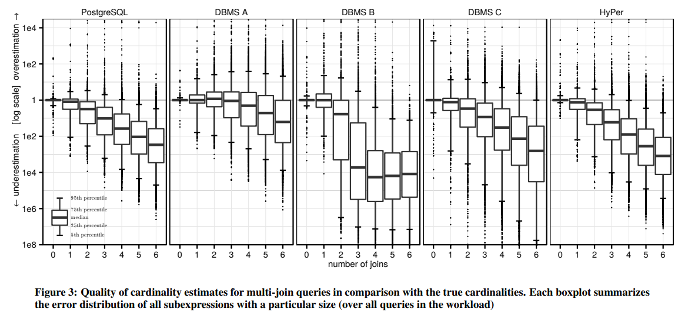
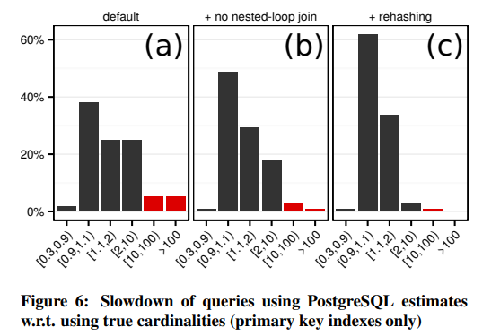
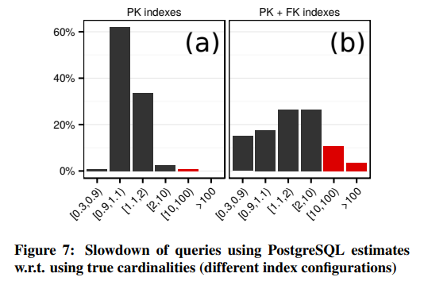
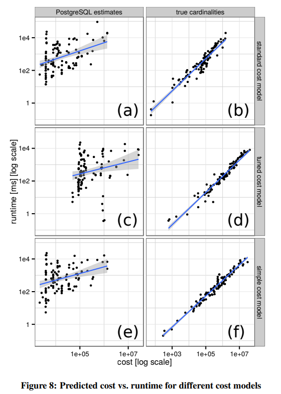
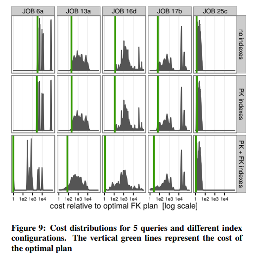
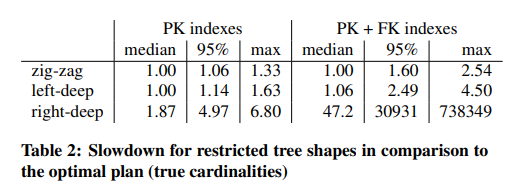
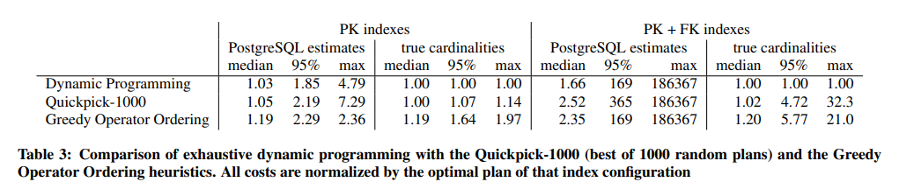

# [VLDB 2015] How Good Are Query Optimizers, Really?

## Introduction

- How good are **cardinality estimators** and when do bad estimates lead to slow queries?
- How important is an accurate **cost model** for the overall query optimization process?
- How large does the enumerated **plan space** need to be?

简单来说，

- **Good cardinality estimators远重要于cost model**
- **即使estimators不准确，高性能穷尽式的算法依然是值得的，bushy trees也不应被禁止**

## Cardinality Estimation

> Even exhaustive join order enumeration and a perfectly accurate cost model are worthless **unless the cardinality estimates are (roughly) correct.**



- 对于多个连接，大部分系统都会显著低估cardinality，且连接越多越显著
- 再好的优化器和cost model也依赖合理的estimates

## When Do Bad Cardinality Estimates Lead to Slow Queries?

错误估计并不一定会导致查询性能变差：

- 被错误估计的表达式相比于查询的其他部分，**影响有限**，因此错误估计也难影响整体性能
- 错误估计可能会与另外的错误估计导致的影响**相互抵消**，“负负得正”

### The Risk of Relying on Estimates

为了对比estimates对性能的影响，排除其他组件的干扰，作者将不同系统的estimates分别加载进PostgreSQL并执行查询，并且额外加载真实的cardinality来生成“最优”的执行方案作为基准（受cost model限制的最优方案），统计不同系统estimates会导致的**查询性能劣化**如下，即`耗时/基准耗时`：

|     |`<0.9`|`[0.9,1.1)`|`[1.1,2)`|`[2,10)`|`[10,100)`|`>100`|
|:-   |-:    |-:         |-:       |-:      |-:        |-:    |
|PGSQL|1.8%  |38%        |25%      |25%     |5.3%      |5.3%  |
|A    |2.7%  |54%        |21%      |14%     |0.9%      |7.1%  |
|B    |0.9%  |35%        |18%      |15%     |7.1%      |25%   |
|C    |1.8%  |38%        |35%      |13%     |7.1%      |5.3%  |
|HyPer|2.7%  |37%        |27%      |19%     |8.0%      |6.2%  |

- 极少部分查询在采用"最优"方案时反而性能变差，这就是cost model error导致的
- 系统A的estimates较好，有78%的查询都在`<2`范围内，而系统B只有53%在`<2`范围内
- 极少量的查询在采用不准确的estimates时会直接超时，即`>100`，部分是因为当PostgreSQL发现estimated cardinality极低时会**引入nested loop join（非index nested loop join），这是纯粹只看cost、风险极大的优化选择**
- 少部分的查询处于较慢区间，即`[10,100)`，这是因为涉及到了hash join，而PostgreSQL 9.4及以前会采用estimated cardinality来确定内存hash table的大小，**过低的估计值导致了hash table较小，引发了大量的散列冲突**，并形成低性能的long collision chains（9.5及以上的版本引入了rehash动态扩容散列表）



- **考虑estimate存在误差以及算法有渐进复杂度**，纯粹基于cost很容易导致极差的方案
- **选择更稳定的算法**，而不是偶尔提供很大优势的算法
- **运行时检测、调整算法参数**，例如散列表大小，应避免完全依赖cardinality estimates

### Good Plans Despite Bad Cardinalities

在上述例子中，一旦禁止了nested loop join和启用了rehashing后，无论给出的estimates好坏，最终都采用较不错的计划并获得了与“最有“方案可比的性能，即处于`[0.9,1.2)`区间：

- 在没有foreign key indexes的情况下，**所有表都必须全表扫描，从而显著弱化了调整join order的作用**，即使是一般的estimates也足以排除掉了大多数最差的join order（例如unselective join predicate）
- **内存中index nested loop join并不会比hash join要慢很多**，若非内存中join，即考虑数据和索引本身从磁盘读取，则和hash join的差距就会加大

### Complex Access Paths

前述只考虑了主键索引，当**引入外键索引后优化器的工作变得更加困难**（并不是加入外键索引使得性能变差）：



### Join-Crossing Correlations

> The estimation of intermediate result cardinalities in the presence of **correlated query predicates** is a frontier in query optimization research.

个人想法：

- 对于单表内的属性，比较容易挖掘相互之间的相关关系
- 构建schema时根据domain knowledge标注一些表之间的相关关系？
- 若人并不知情从而无法标注，但实际上数据隐含一定的相关关系？
- 如何在运行时，尤其是join发生时高效的挖掘不同表不同属性之间的关系？更类似数据挖掘/机器学习？

## Cost Models

### The PostgreSQL Cost Model

**PostgreSQL cost model面向磁盘数据，考虑了CPU和I/O的代价**，一个算子的代价定义为会访问的磁盘页数量（包括随机/顺序访问）和内存中需要处理的数据量的权重和，则一个查询的代价就是所有算子的代价和，而权重（也称为**cost variables**）则由优化器的设计者决定，反映了磁盘随机访问、磁盘顺序访问、CPU的相对代价大小

> Unfortunately, there is **no well-defined method** for determining ideal values for the cost variables.

**Tuning and calibrating cost model**已经是独立的研究领域，有非常多研究者在其中工作

个人想法：ScyllaDB/Seastar采用了[基于benchmark的磁盘I/O权重](../seastar/New_Disk_IO_Scheduler_For_RW.md)，但还需要考虑CPU之于磁盘的代价，以及其他并发任务的干扰

### Cost and Runtime

cost function最重要的目标就是预测cost和真实cost正相关，同样采用PostgreSQL的estimates和true cardinality来测试不同cost model的表现，如下图(a-b)：



### Tuning the Cost Model for Main Memory

默认情况下PostgreSQL cost model中认为处理tuple比从页中读取tuple要快400倍，但由于现在机器**往往配置了极大的RAM，读取缓存在内存中的tuples远快于默认假设**，作者调整了cost variables将差距缩小到8倍，并得到上图(c-d)，对比(b-d)可见有所效果，相关性提高了，但对比(c-d)，**cost model的提升效果被错误的estimates带来的惩罚掩盖了**

### Are Complex Cost Models Necessary?

PostgreSQL cost model非常复杂，考虑了极多因素，本文针对main-memory的情况给出非常简单的cost model如下，直接**忽视I/O代价，仅基于需要处理的tuples数量**（具体模型见原文），可以获得上图(e-f)，发现即使是**非常简易的cost model都能基于true cardinalities给出相当优秀的效果**

> Again, **cardinality estimation is much more crucial** than the cost model.

## Plan Space

### How Important Is the Join Order?

采用Quickpick来生成**随机的查询连接顺序**，对于随机的连接顺序基于三种不同的背景（no indexes、PK indexes、PK+FK indexes）计算出代价，并与最优方案（绿线）的代价对比



- 查询效果的**分布非常离散**，不同的查询也有不同的表现，不同的索引情况也有不同的表现
- 对于启用了外键索引的查询，最优方案显著强于另外两者索引配置
- **连接的顺序影响极大**，同配置同查询内，不同的连接顺序最终效果也可以有多个数量级的差异

### Are Bushy Trees Necessary

```text
[Left Deep Tree]   [Zig Zag Tree]   [Bushy Tree]

      JOIN             JOIN             JOIN
      /  \             /  \             /  \
    JOIN  D          JOIN  D         JOIN  JOIN
    /  \             /  \            /  \  /  \
  JOIN  C           C   JOIN        A   B  C   D
  /  \                  /  \
 A    B                A    B
```

采用true cardinalities来计算不同连接顺序的查询代价，并对比最优方案的代价（可能会包括Bushy Tree的方案）：



- ZigZag形式的连接在大多数情况下都能有相当不错的效果

### Are Heuristics Good Enough?

- Dynamic Programming会计算出最优方案，因此给定true cardinalities时其代价就是最低代价
- Quickpick-1000作为启发式引擎，会给出1000个随机方案中代价最低的方案，也可能会产生bushy trees
- Greedy Operator Ordering也是启发式引擎，他采取类似*最小生成树MST*的方式来生成连接顺序，即选取基础表，随后不断选择最低代价的连接来构建整个树，因此可能会产生bushy trees



- 即使输入不准确的estimates，**依然值得采用类似DP的方式穷举搜索空间**，其整体表现好于启发式引擎
- GOO和Quickpick-1000很难感知到索引，因此更适合索引少的情况（此时没有索引，整个空间里好的执行计划更多，更容易被启发式引擎搜索到）
- 穷举搜索空间并允许bushy tree也能给出较适度的性能提升，**即使estimates不准确，采用高效率的穷举搜索算法依然是值得的**
- 只有极少数的场合有必要寻求启发式引擎，以及禁止bushy trees
