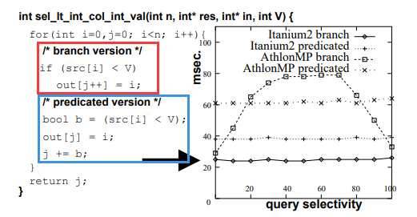
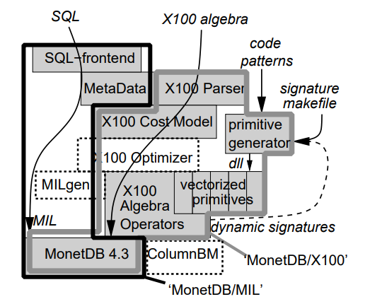

# [CIDR 2005] MonetDB/X100: Hyper-Pipelining Query Execution

## Introduction

传统的数据库执行引擎在现代（2005年）CPU上运行计算密集的任务（决策支持、OLAP、数据挖掘等）表现不佳，**计算密集型任务理论上应该能使CPU充分发挥最佳IPC效率，但实际上并不是如此**，最显著的原因之一就是广泛使用的**tuple-at-a-time的Volcano迭代式模型对超标量CPU不友好**

MonetDB/MIL采用了**column-at-a-time**的执行模型，因此不会受到上述限制，但是由于MonetDB/MIL会物化**full column materialization**整个列数据，导致处理时会产生非常大的内存数据，从而整个处理性能反而被内**存带宽**所限制，并进一步影响了CPU的效率，新的处理引擎X100的思路就是结合这两者的优点：**面向列的处理column-wise exection + Volcano-like迭代式的增量物化incremental materialization**

## How CPUs Work

由于摩尔定律，CPU的速度增长的极快（论文05年及之前的十年发展如下图1，而实际上在更近的现在单核性能和频率已经达到瓶颈，如下图2）


- **超长流水线 pipelining**: 将CPU要完成的工作更加细化，引入更多阶段，每个阶段的子任务更简化，深度流水线技术使得CPU频率更高，但引入了潜在的性能"陷阱"
  - **依赖**: 当一个指令需要依赖前序指令的结果时，该指令就必须暂停等待前序指令执行完成（或等待执行到依赖的结果能获得为止）后才能进入流水线，从而实际上降低了IPC
  - **分支预测失败**: 当出现`if-then-else`的分支情况时，CPU为了能够推动流水线的处理，必须预测结果分支，在预测的基础上继续推动流水线，一旦预测错误，就必须清空流水线丢弃错误执行的结果，因此超长流水线意味着分支预测失败的成本极高
- **超标量 super-scalar**: CPU可以同时执行多条相互独立的指令，即CPU有多条流水线，每个时钟周期CPU都可以将与其他流水线上指令无关的新指令推入当前流水线，从而超标量的CPU实际IPC甚至可以超过1

大部分编程语言并没有暴露CPU级别的控制细节，不需要显式指定指令是否是独立的，而在编译阶段，编译器的优化（对指令的排序优化等）就会产生非常显著的影响，例如**循环流水线 loop pipelining 优化**可以将存在数据依赖的操作（假定`G(A[x])`依赖`F(A[x])`的结果，并且`F()`需要两个时钟周期来计算）重排序来更好的适应流水线，重排后执行`G(A[0])`时提前两个周期开始的`F(A[0])`恰好结果就绪：

```text
F(A[0]), G(A[0]), F(A[1]), G(A[1]), ... , F(A[n]), G(A[n])
--into-->
F(A[0]), F(A[1]), F(A[2]), G(A[0]), G(A[1]), G(A[2]), F(A[3]), ...
```

一个简单的性能测试如下，计算`SELECT oid FROM table WHERE col < X`并通过X来控制结果选择度selectivity

- **branch version**: 采用分支来求值谓词，由于分支预测的失败率在选择度50的时候最高（50%预测失败）因此AthlonMP处理器此时性能最差，但由于编译器直接将代码优化成了硬件预测代码，从而Itanium2处理器性能始终最好
- **predicated version**: 改写成bool变量的方式来求值谓词，由于额外的计算使得整体性能比branch version要弱一些



另外**高速缓存**和**内存**也对整体性能有显著影响，高速缓存命中率影响了内存访存次数，内存访存就受到了内存带宽和延迟的影响，因此一下方式都能显著提升系统整体性能：

- **感知缓存cache-conscious**的数据结构: cache-aligned B-trees、PAX、DSM等
- **减少内存随机访问、提高缓存命中**的处理算法: radix-partitioned hash-join等

> It has been shown that query execution in commercial **DBMS systems get an IPC of only 0.7,** thus executing less than one instruction per cycle. In contrast, **scientific computation or multimedia processing does extract average IPCs of up to 2** out of modern CPUs.

个人认为，不要脑补优化：

**Profiling-Guided Optimization!**

**Profiling-Guided Optimization!**

**Profiling-Guided Optimization!**

## Microbenchmark: TPC-H Query 1

`TODO`

## X100: A Vectorized Query Processor

Monext/X100的架构和整体设计思路如下：



- **Disk**: 提供高效的顺序数据访问，为了最大化减轻磁盘带宽压力，底层数据文件采用**垂直分块vertically fragmented data layout**，部分情况下还会利用轻量的数据压缩
- **RAM**: 所有对RAM的访问都采用**显式的memoty-to-cache、cache-to-memory例程**（包含了大量平台相关的优化，例如SSE prefetching、汇编优化等），磁盘上的垂直分块（可能带有压缩）的数据也同样使用在内存中
- **Cache**: 采用Volcano-like迭代式向量化执行引擎，X100的**数据处理单位是较小的足以放入缓存的vertical chunks**，压缩/解压缩只会发生在memory-cache的传递过程中，X100算子是感知缓存的，**仅在高速缓存中会使用随机访问**
- **CPU**: 暴露给编译器的**向量化原语vectorized pirimitives用于处理tuple时是独立的**，即与前后其他tuples都无关，从而允许编译器能够生成**循环流水线loop-pipelined**优化的代码；另外为了进一步提升CPU吞吐量，X100的向量化原语**针对整个表示式子树expresssion sub-trees优化**，而不仅仅对单个函数

### Query Language

```text
Aggr(
  Project(
    Select(
      Table(lineitem),
      < (shipdate, date(’1998-09-03’))),
    [ discountprice = *( -( flt(’1.0’), discount), extendedprice) ]),
  [ returnflag ],
  [ sum_disc_price = sum(discountprice) ])
```


- 执行流程是**Volcano-like迭代式，迭代粒度是单个vector**（例如1000个值），`Scan`算子从存储层Monet BATs以**vector-at-a-time**的形式读取数据
- `Select`算子会构造出一个**选择向量selection-vector**，包含所有符合谓词的数据位置
- `Project`算子根据要求计算出最终聚合阶段所需要的数据，注意这里`discount`列和`extendedprice`列数据不会有任何修改，而是**配合`selection-vector`通过`map`原语只计算满足谓词的数据，并直接填充在自己的输入向量上作为结果**（因此这些向量相当于包含部分计算好的需要的数据，部分没有访问的数据），也因此`selection-vector`还会被继续用于下一个阶段`Aggr`来过滤出所需的数据
- `Aggr`阶段构造散列表存储聚合后每组的结果，并且配合`selection-vector`计算出每组数据的位置信息来读取计算数据并更新聚合结果

### Vectorized Primitives

X100向量化浮点相加的原语代码示例如下，其中`sel`是存在于所有向量化原语的`selection-vector`用于筛选数据，通常**直接存储输出结果在输入向量上而不是拷贝数据性能更好**，如下生成的代码非常有利于编译器进行循环流水线优化：

```C
map_plus_double_col_double_col(
  int n,
  double*__restrict__ res,
  double*__restrict__ col1, double*__restrict__ col2,
  int*__restrict__ sel)
{
  if (sel) {
    for(int j=0;j<n; j++) {
      int i = sel[j];
      res[i] = col1[i] + col2[i];
    }
  } else {
    for(int i=0;i<n; i++)
    res[i] = col1[i] + col2[i];
  }
}
```

略过代码生成的模板和实现细节，以及其他的一些特殊向量化原语

### Data Storage

MonetDB/X100将所有表数据都以vertically fragmented的形式存储（存储的各种形式和优缺点可以参考[Lecture 03](03.Storage_Models_Data_Layout.md)），存储形式及更新数据的流程如下图：


## TPC-H Experiments


