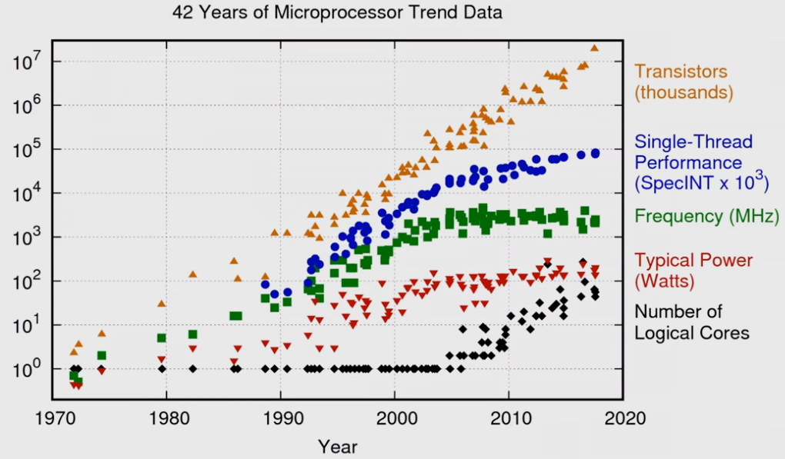
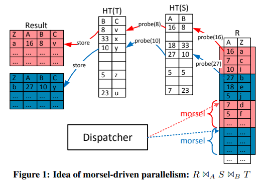
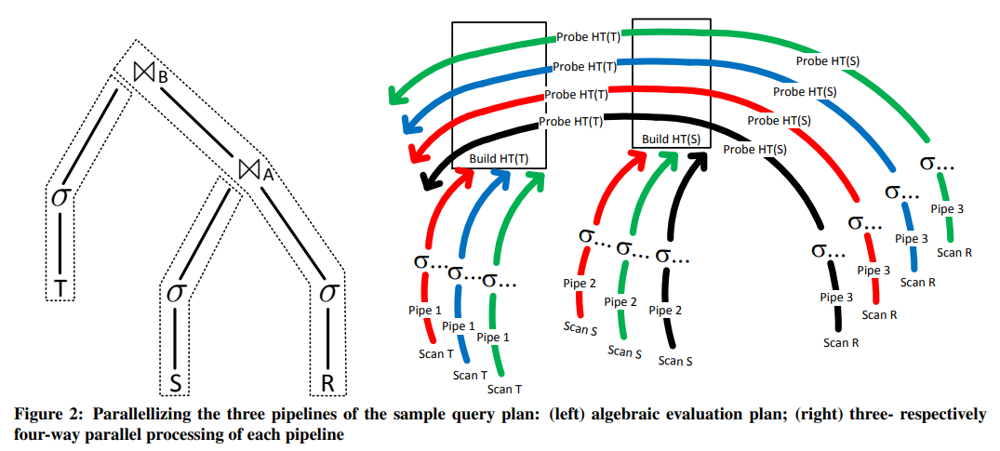
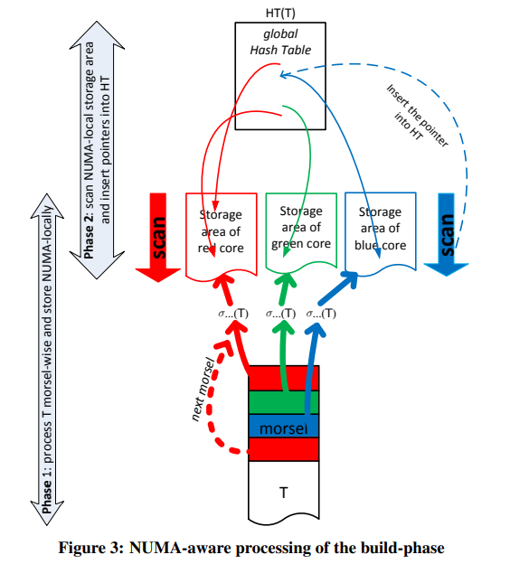
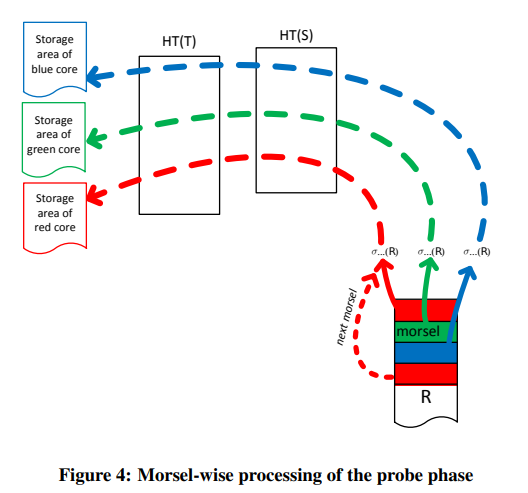
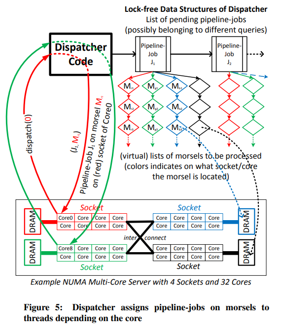
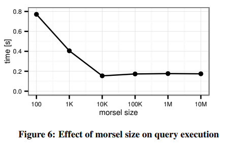
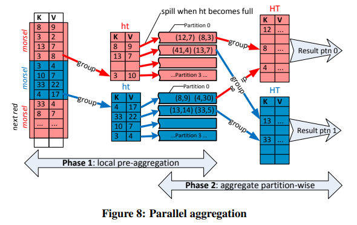
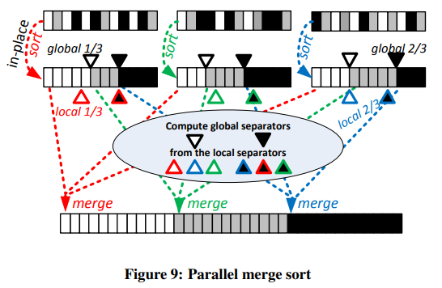
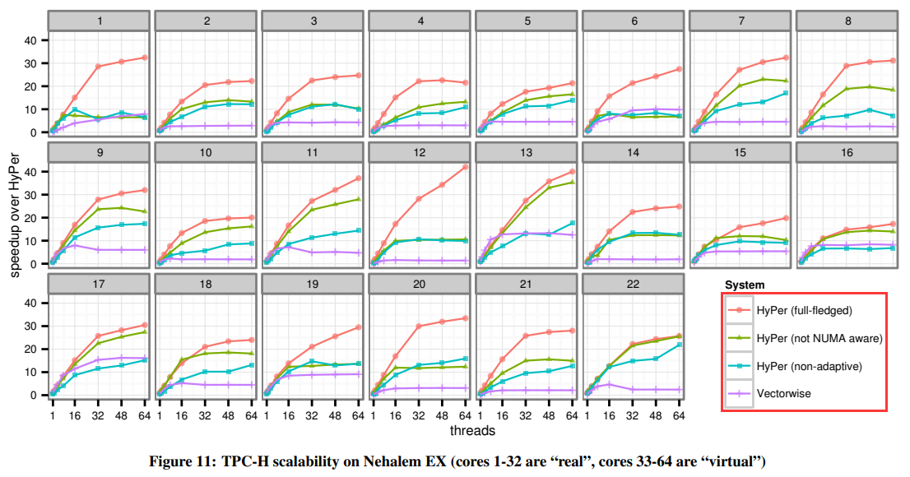

# [SIGMOD 2014] Morsel-Driven Parallelism: A NUMA-Aware Query Evaluation Framework for the Many-Core Age

## Introduction

现代CPU发展以多核、NUMA为主，单核主频和性能提升已经出现了明显的瓶颈，传统的并发查询方式已经不那么能充分利用现代CPU设计，[经典的基于Volcano模型的并发](06.Query_Execution.md#parallel-execution)通过`exchange`算子来实现，算子本身对并发是无感知的，这也被称为**plan-driven**，因为在查询计划确定时实际上并发度也跟随确定（即为每个线程生成一个query operator plan，随后通过`exchange`连接不同的线程）

本文中采取了**自适应的morsel-driven查询执行框架**，用于内存数据库HyPer，从而充分利用现代多核的并发，以及相应的NUMA特征，其基本思路如下：

- 并行通过在**每个线程上执行一条pipeline**（图中红色和蓝色代表两个pipelines）来实现
- 每个pipeline负责执行一个morsel数据块，数据在NUMA-local内存，且处理结果也写入NUMA-local内存
- dispatcher维护一个**固定数量的线程池**用于执行任务，从而避免资源over-subscription，每个线程都绑定在一个固定的核上，**考虑NUMA locality**，即[Seastar的Thread Per Core架构](../seastar/Shared_Nothing.md)
- 可以查询执行过程中**自适应动态调整每个morsel的数据量**，以及**调整同时执行的pipelines数量**

显然对于一个NUMA-aware的dispatcher，为了充分利用多核资源的同时且负载均衡，不仅仅需要考虑输入数据的morsels，也同样要拓展到共享结构（例如被多个operator共同访问的hash table等），需要最大化NUMA-local的访问，最少化NUMA-remote的访问：

- **Morsel-driven query execution**
- **Fast parallel algorithm**
- **NUMA-awareness**

## Morsel-Driven Execution

以`R join S join T`为例展示Morsel的执行过程，`R`为最大的表，因此优化器选择构建`S`的散列表`HT(S)`和`T`的散列表`HT(T)`，以扫描`R`输入来根据`HT(S), HT(T)`完成连接，从而可以**构建3条流水线**，显然这属于[push-based execution](06.Query_Execution.md#plan-processing-direction)：

1. 扫描、过滤、构建`HT(T)`
2. 扫描、过滤、构建`HT(S)`
3. 扫描、过滤`R`并探测`HT(T), HT(S)`完成连接输出结果

每条pipeline执行前，都会获得分配一块临时存储用于存储中间数据，随后若后续还有下一条pipeline需要继续执行处理，则**临时存储会被逻辑上重新分区为均匀的morsel数据块**，不重新分区很容易出现数据倾斜，每条pipeline的实际工作线程数不会超过硬件支持的最大线程数，从而最大程度利用并发性能以及减少数据同步开销

第三条pipeline必须在前两条pipelines执行后才能执行，在构建散列表时，每个线程都将数据写入该线程绑定的NUMA节点对应的NUMA-local内存中，这种设计使得在运行中完全可以弹性扩容缩容并行的任务数：

1. 首先扫描数据并在NUMA-local的内存中写入结果
2. 随后再依然由相应的线程扫描中间结果，并在全局散列表中插入指针构建`HT(T)`，这也是为了尽可能**保持后续pipeline的线程在探测散列表时也仅访问自己NUMA-local的内存**，而持有指针的**散列表广播到所有NUMA节点**的内存中

第三条pipeline开始时原理也相同，以morsel数据块的形式多个线程并发去NUMA-local的散列表中探测并完成连接，输出结果到NUMA-local的内存中以待后续处理

## Dispatcher: Scheduling Parallel Pipeline Tasks

由于工作线程是启动时直接根据硬件并发度生成的，并且会绑定到相应的CPU上来确保数据亲和性，因此运行过程中动态调整并发度主要是靠dispatcher调度来实现的，调度有三个主要目标：

- 保持**数据局部性**，尽可能分配NUMA-local的morsel数据块给相应的线程
- 考虑到具体查询的**弹性**
- **负载均衡**确保所有参与的线程都基本同时结束工作，从而避免单个过慢线程影响整个查询的延迟

### Elasticity

由于查询任务**调度的单位是morsel数据块**，因此弹性可以充分考虑到查询的优先级，当高优先级任务出现时，完成了当前morsel的线程就可以优先处理高优先级任务的morsel数据块，而不像传统的方式可能需要等前一个查询完全结束才能执行新的查询

> A priority-based scheduling component is under development but beyond the scope of this paper.

### Implementation Overview

- Dispatcher本身假如由单独一个线程来维护，则不可避免会出现（1）额外占用一个CPU（2）假如morsel足够小，频繁需要任务分配从而成为性能瓶颈，因此实际实现中**dispatcher只是一个无锁数据结构，由所有工作线程主动访问更新**（参考Seastar的[Disk IO Scheduler设计](../seastar/New_Disk_IO_Scheduler_For_RW.md)）
- 相似的，上述pipeline存在依赖的设计，也是通过类似的数据结构来维护，也可以认为是**被动状态机**，当某个查询上已经没有新的可执行任务时，**请求任务的线程就会去更新状态机从而发现新任务**或是发现查询已经执行完成可以响应
- 通常绝大多数情况下所有线程都在均匀的执行任务，很罕见时某些线程不再有新任务时，就会尝试去其他节点获取任务，即**work-stealing**
- morsel级别的任务调度同样也使得**任务取消canceling**变得简单，每个morsel在被处理前都会检查任务标记，被标记为取消的查询就不会再被继续执行，内存资源被回收，线程可以继续去执行其他查询任务

### Morsel Size

过小的morsel可能会导致调度开销上升，同时数据竞争的情况上升（在非常多线程、非常高频率的竞争下，即使是无锁数据结构也会有显著的性能劣化），因此需要有一个相对较大的morsel的尺寸

## Parallel Operator Details

`TODO`

### Hash Join

### Lock-Free Tagged Hash Table

### NUMA-Aware Table Partitioning

### Grouping / Aggregation

### Sorting

## Evaluation

