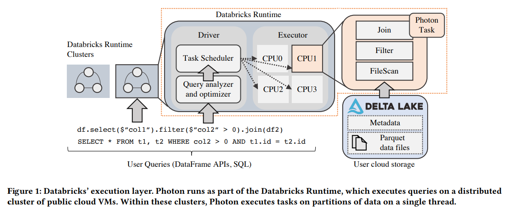
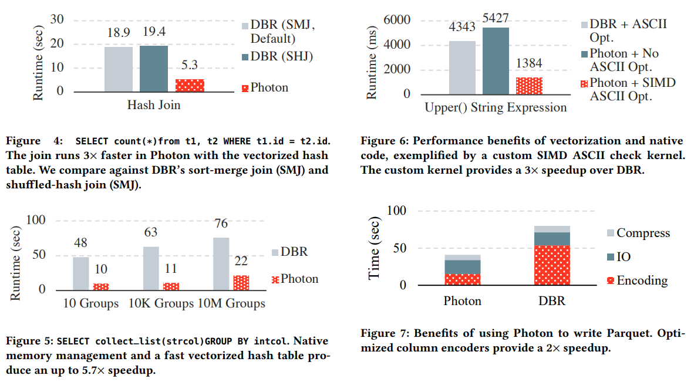
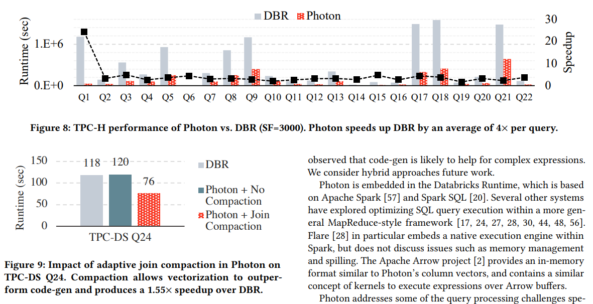

# [SIGMOD 2022] Photon: A Fast Query Engine for Lakehouse Systems

## Background

Photon的两大挑战/目标：

- **Supporting raw, uncurated data**
- **Supporting existing Spark APIs**

### Databricks' Lakehouse Architecture

- **Data Lake Storage**: 存算分离，用户可以选择底层数据存储服务，例如S3、GCS等，避免了customer data lock-in，而Databricks采用**connectors**来访问不同存储服务上的数据
- **Automatic Data Management**: 用户可以选择将数据迁移到Delta Lake上（开源的ACID table storage layer）
- **Elastic Execution Layer**: Photon作为执行层的核心处理线程，以单线程的方式执行一个分区的数据

  

### The Databricks Runtime

Databricks Runtime, DBR处理所有查询的执行，并且提供所有Apache Spark APIs，其本身作为一个multi-threaded shared-nothing的框架，每个线程调用Photon处理数据的分区

提交给DBR的任务称为**jobs**，每个job会细分为多个**stages**，每个stage代表了读取文件并处理最后吃啥呢很难过data exchange或result，stage还可以继续细分为**tasks**，每个task都执行相同的处理但对象是数据的不同分区

在DBR中stage是阻塞的，即下一个stage的开始必须等到上一个stage的完全结束，这种设计**允许容灾和自适应任务执行**：进入下一个stage前根据处理结果重新优化查询的执行，类似[Dremel的设计](Dremel.md#evolution-of-serverless-architecture)

## Execution Engine Design Decisions

Photon是C++实现的执行引擎，作为共享库由DBR链接并调用，一个SQL查询会被构建成算子树，每个算子实现`HasNext()/GetNext()`来从子节点获取批量数据

- JVM vs. **Native Execution**
  Databricks原先采用JVM-based DBR，遇到了**CPU性能瓶颈**，因素包括：
  - 底层的优化（NVMe SSD缓存、auto-optimized shuffle等）显著降低了IO延迟
  - Delta Lake提供的优化（data clustering、file pruning等）允许查询更激进的跳过不需要访问的数据，减少了IO等待时间
  - Lakehouse引入的新功能/负载对计算的要求更高（large strings、un-normalized data、unstructured nested data），加重了CPU负载
  - 提升JVM-based引擎需要深入了解JVM的工程师，以使得JIT能够更积极的发挥作用
  - Java相比于C++缺乏更多的底层控制能力（SIMD、memory pipelining等）
  - Java具有的GC使得线上查询的延迟出现更大的不可控
  
  在此基础上，**[CPU逐渐成为瓶颈](../seastar/Shared_Nothing.md)**，而基于JVM的DBR继续提升CPU性能有较大的困难，因此选择了采用C++实现Photon引擎

- **Interpreted Vectorization** vs. Code-Gen
  选择向量化的原因主要有：
  - **易于迭代开发和可扩展**，code-gen的方式难以构建和查错，在实现过程中Databricks发现为了查错在code-gen上投入的时间甚至远多于实现功能本身
  - **易于观测**，code-gen的方式通过移除函数调用、深度内联、流水线化来提升性能，但可观测性极差，难以通过metrics来监测计算耗时等
  - **易于应对变化的数据**，由于向量化引擎本身就是通过运行时虚函数调用处理批量数据来提升性能的，因此在面对变化的数据时通过虚函数可以自然实现运行时动态调整真正执行的处理流程，即下述的*Adaptive Execution*，而code-gen就必须在运行时re-compilation，设计复杂且额外耗时
  - **依然存在可定制性**，虽然在一些特定的场合（例如复杂的表达式树被common sub-expression elimination优化）由code-gen可以达到更好的性能，但是针对特别常见的这些特定场合来定制一些特殊的向量化算子，也可以达到相当高的性能

  总体来说选择interpreted vectorization快速**将绝大多数算子都通过向量化做到相当高性能，再配合少量复杂场景的定制优化**补足短板

- Row vs. **Column-Oriented Execution**
  在Photon中采用columnar而不是Spark SQL中的row-oriented，对分析型系统来说是自然的选择

- **Partial Rollout**
  Photon和Spark执行引擎共存，当出现Photon不支持的特性时就fallback到Spark引擎

## Vectorized Execution in Photon

向量化的思路可以参考[SIMD做法](./SIMD_Investments.md)和[MonetDB/X100](./MonetDB.md)

- **Batched Columnar Data Layout**
- **Vectorized Execution Kernels**
- **Filters and Conditionals**
- **Vectorized Hash Table**
- **Vector Memory Management**
- **Adaptive Execution**
  batch-level adaptivity，在运行过程中构建一批数据的metadata，据此来选择不同的execution kernel进行优化执行

## Integration with Databricks Runtime

前述*Partial Rollout*提到了Photon必须与Spark引擎共存，则需要特别注意与DBR的query planner和memory manager的集成

- **Converting Spark Plans to Photon Plans**
  通过在Spark SQL优化器Catalyst中额外加入转换规则来实现Photon plan的支持，将查询计划的节点**自底向上 bottom-up**挨个映射为Photon节点，当发现某个节点Photon不支持时，就首先插入一个**transition node**将photon的columnar数据转换为Spark引擎支持的row-oriented数据，随后保留节点由Spark引擎执行
- **Executing Photon Plans**
  DBR将Photon的plan加载进Protobuf消息，序列化后向下通过JNI传递给Photon，后者反序列化解析plan转换为Photon内部的计划，随后开始执行
  - **Adapter node** to read Scan data: Photon的叶节点算子总是adapter node，用于提供columnar数据
  - **Transition node** to pass Photon data to Spark：Photon的最终算子总师transition node，用于将columnar数据转换为row-oriented数据给Spark引擎
- **Unified Memory Management**
  由Spark memory manager来统一管理整个进程里Spark引擎和Photon引擎的内存，每个算子当需要内存时统一向manager申请，由manager来决定哪一个Spark/Photon算子释放内存/溢写内存数据到磁盘，从而整个进程对内存有统一的视图和管理
- **Managing On-heap vs. Off-heap Memory**
- **Ineraction with Orther SQL Features**
- **Ensuring Semantics Consistency**
  - Unit tests
  - End-to-end tests
  - Fuzz tests

## Experimental Evaluation

- What query shapes benefit the most from Photon?
- How does Photon perform end-to-end vs. our existing engine?
- What is the impact of tactical optimizations like adaptivity?

