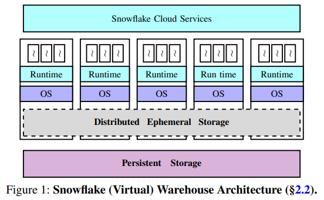
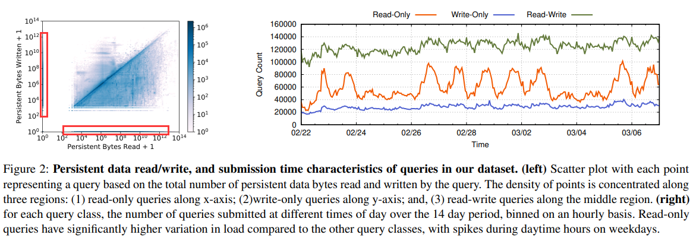
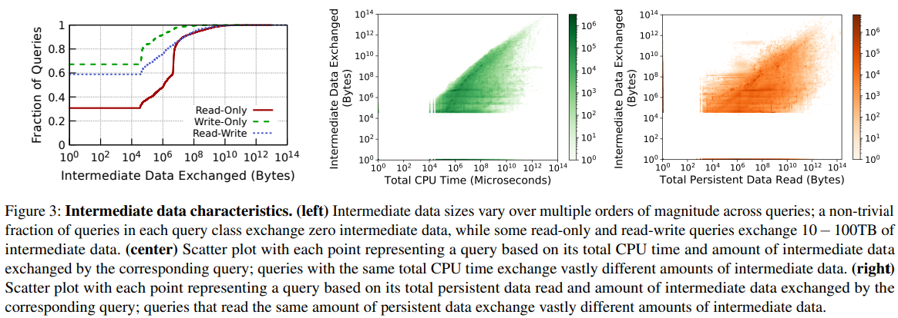
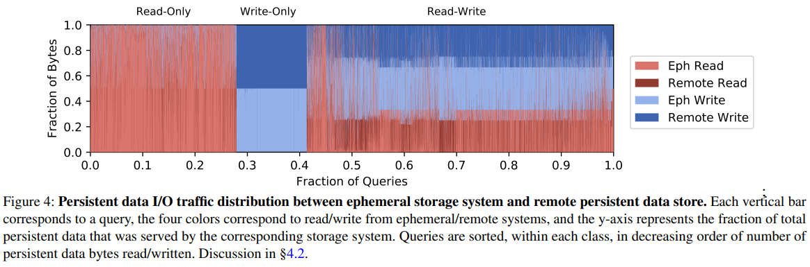
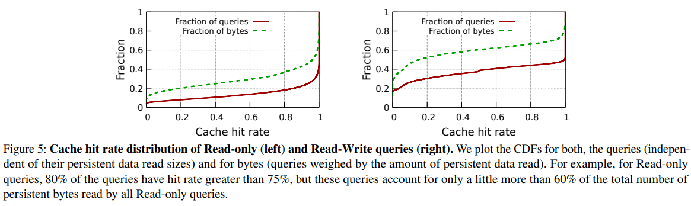
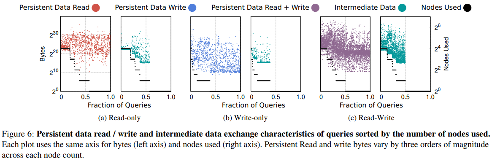
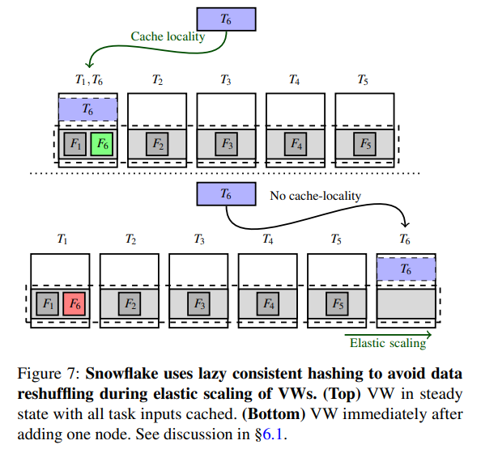
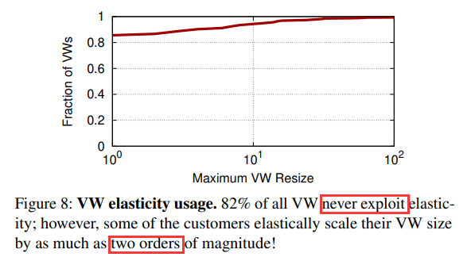
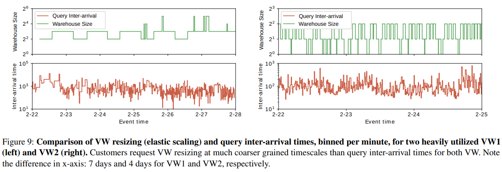
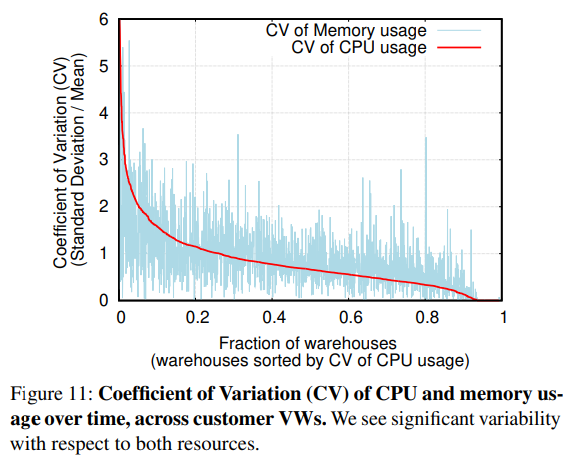

# [NSDI 2020] Building An Elastic Query Engine on Disaggregated Storage

## Introduction

数据仓储系统重广泛使用的**shared-nothing架构**能够良好的可扩展性（每个节点持有一部分分片数据）、任务隔离性和数据局部性，但这种架构同样也有明显的缺陷：

- **Hardware-workload Mismatch**: 工作负载和硬件资源难以做到最佳平衡，例如高带宽和高计算需求的硬件资源不同，而用户往往会运行各种混合的负载，导致硬件资源的利用率不高
- **Lack of Elasticity**: 这种系统通常会根据节点数量进行数据分片，从而一旦需要弹性扩容/缩容时，数据迁移代价极大，从而导致弹性较差

传统的数据仓库系统往往是提前知道访问模式、工作负载，并针对性的设计存储schema、节点数据分区等，从而获得最高的性能和资源利用率；但现在的场景愈来愈复杂，工作负载更加难以预测且多变，放大了传统方式的缺点

针对传统shared-nothing架构的缺陷，作者提出了新的弹性事务查询处理引擎**Snowflake**，其采纳了两个核心设计：

- 重新设计了存储系统用于管理中间数据**ephemeral/intermediate data**（例如joins时不同处理节点需要交换的数据）
  这种中间层的设计主要是为了解决中间数据若也采用持久化数据**persistent data**存储的两大缺陷：
  - 持久化数据存储在S3等云存储系统上无法提供可以接受的低延迟访问，和吞吐量
  - 中间数据作为临时数据，并不需要常规持久化数据的高可靠性和可用性
- 中间数据管理层不仅用于中间数据，同样也作为持久化数据的**直写式缓存write-through cache**，即数据更新时同时写入中间数据层和持久化层

基于Snowflake，后续还可以考虑如下几个研究/发展方向：

- **Decoupling of compute and ephemeral storage**: Snowflake做到了持久化层和计算层的分离，但是中间层和计算曾依然是紧耦合的
- **Deep storage hierarchy**: 常见的存储做法就是内存和磁盘两层，而现在更深的存储层次越来越常见，相应的用于管理多层存储的管理系统也不断演进
- **Pricing at sub-second timescales**: 随着多数云厂商的计费精度进入秒/亚秒级别，系统对弹性扩容/缩容的速度要求越来越高

Snowflake的查询计划、优化器、并发控制等数据库常见模块的设计可以参考另一篇论文：**[SIGMOD 2016] The snowflake elastic data warehouse**

## Design Overview

### Persistent and Intermediate data

- **Persistent data**: 用户数据，以表的形式存在数据库中，每个表可以被不同query并发读取
- **Intermediate data**: 由query operator生成的中间数据，通常由参与该query的节点来消费，通常更需要低延迟和高吞吐的访问
- **Metadata**: 例如对象目录、表到文件的映射、统计数据、事务日志等元信息

### End-to-end System Architecture

- **Centralized Control via Cloud Services**
  所有用户与云服务层CS交互，该层负责ACL，查询优化、调度、事务管理、并发控制等，CS本身支持多租户以及有相应的副本备份高可用和可扩展性设计
- **Elastic Compute via Virtual Warehouse Abstraction**
  虚拟数仓层VW实际上就是一组AWS EC2计算节点（Snowflake会维护预热的EC2池以避免频繁扩容缩容），用户提交的查询就由VW层来执行，并且根据用户的需要可以指定VW的算力（计算节点规模）
- **Elastic Local Ephemeral Storage**
  常见的S3等持久化存储无法提供查询处理所要求的低延迟高吞吐量数据访问，因此Snowflake设计实现了弹性中间数据层，该层的节点实际上与前述的VW层的EC2节点相匹配colated，从而在VW层扩容和缩容时，中间数据层也相应的扩容和缩容，但在此过程中**中间数据层的节点数据不会发生再分区repartitioning/reshuffling**

  每个VW实际上独占拥有自己的中间数据层，仅用于支持该VW上运行的查询
- **Elastic Remote Persistent Storage**
  Snowflake的数据均存储在远端持久化存储层，即AWS S3，**表会被水平分区后分割成大的不可变文件**（对应传统数据库的数据块blocks）存储到S3上，每个文件内多行记录会逐列存储到一起并被压缩（参考列存储），随后文件头会记录每个列数据块的起点位置，从而允许只读所需要的列（S3支持文件的部分读取）

  所有属于同一个用户的VWs有权限访问远端存储上的共享表数据，从而在跨VW交互时不需要拷贝表数据

### End-to-end Query Execution

CS层负责query解析、计划、优化并生成一些子任务，随后调度用户VW上的节点来执行这些任务，每个子任务都可以在中间数据层和远端持久化层执行读写操作，当某些节点的子任务失败时，CS层会重新调度VW里的其他节点再执行

## Dataset

Snowflake的每一层都会收集统计信息，CS层会收集每个VW的数据（节点数、实例类型、失败信息等）、收集每个查询的数据（不同阶段的耗时等），每个节点会收集中间数据层和持久化层的范围跟信息、收集节点资源使用情况（CPU、内存、带宽等）、收集压缩属性等，Snowflake公开了14天7千万查询的一些[统计数据集](https://github.com/resource-disaggregation/snowset)

- **Read-only queries**
  占比约28%，紧沿着x轴的数据代表了始终没有持久化数据的写入，因此是只读查询，其数据量范围可以相差9个数量级，通常代表了**ad-hoc、interactive OLAP**请求，往往结果集较小，从右侧十四天的查询数量中可以看出集中在工作日的白天
- **Write-only queries**
  占比约13%，紧沿着y轴的数据代表了始终没有持久化数据的读取，因此是只写查询，其数据量范围可以相差8个数量级，通常代表了**data ingestion**请求，将数据从其他系统导入Snowflake
- **Read-Write queries**
  占比约59%，大部分请求的读写数据量之比接近1，通常代表了**ETL流水线作业**（Estract-Transform-Load用于数据读取、处理转换、存储操作，在数仓中常见）

*这三类请求是大部分数仓系统的基本请求，因此并不会因为系统采用Snowflake还是Hadoop而有所变化*

## Ephemeral Storage System

### Storage Architecture, and Provisioning

中间数据层会同时采用内存和磁盘存储，**内存中会保存尽可能多的数据，当空间不足时才会溢写到本地SSD中，依然不足则会继续溢写到远端持久化存储**，并不采用纯内存的主要原因在于工作负载大小的高度变化，海量数据不一定能够精细的在内存中处理

从上图中可以看出，精准的资源供给非常困难，这是因为：

1. 节点实例数量有限，节点级别的CPU、内存、磁盘都是固定的，一起扩容/缩容往往会有浪费，不同查询的读写、中间存储层和持久化层的访问、CPU等**资源消耗都有显著的差异**，通常节点无法提供如此大差异的资源
2. 假如节点能够提供完全不同类型的资源（CPU型、内存型、IO型EC2实例），但也难以做到**查询运行前就精准预测**该查询的特征，来提前扩容预热相关的资源

### Persistent Data Caching

大部分中间数据的访问是**短时峰值、长期较低的模式**，从而允许了高性能的中间数据层对持久化数据的**statistical multiplexing**，即缓存可能会被频繁访问的持久化数据文件，但是中间数据层依然是优先存储中间数据的，有机会*opportunistically*才会缓存频繁访问的持久化数据

引入缓存系统就需要对一致性问题特别小心，Snowflake中并不是每个节点都允许缓存任意持久化数据文件，而是采用**一致性散列consistent hashing**的方式根据持久化数据文件名计算出允许缓存的节点，并采用**一种[延迟优化lazy](#lazy-consistent-hashing) consistent hashing optimization**来避免VW节点弹性扩容缩容时数据需要整体一次性迁移，所有节点采用LRU的方式来管理缓存文件的汰换，中间数据层对持久化数据文件的缓存是以**直写式缓存write-through cache**存在的

- 由于**write-through cache**的存在，因此对中间数据层的写入和持久化层的写入近似1:1
- 数仓系统大部分查询的**访问有显著的倾向性/局部性**，例如时序上的连续访问，**skewed file access distribution**和**temporal file access patterns**，因此即使中间层的空间仅相当于持久层的0.1%，也有相当出色的缓存命中率

在此基础上，依然有一些悬而未决的问题：

- 对**缓存大小、VW节点数**等影响命中率和整体性能的深入分析有待展开
- 前述提到中间数据层优先处理中间数据，其次才是缓存持久数据文件，**这两者的比例/动态调整**也值得深入研究
- 目前的缓存机制例如LRU策略显然只是为了两层存储层而设计，即内存和HDD/SSD，而包括但不限于Snowflake的云系统已经有了更深的存储层次，例如本地内存、本地磁盘和远端磁盘三层，因此更加高效的**对多级存储系统优化的缓存策略**值得研究

## Query (Task) Scheduling

- **Locality-aware task scheduling**
  持久化数据文件有机会会被缓存到VW中的某一个节点，因此调度任务时会根据数据的局部性，将任务调度至离数据更近的节点来执行，从图中可以看出，当采用的VW节点数增加时，中间数据层数据交换显著增加，而持久化层的数据读写与节点数基本无关

  

- **Work stealing**
  采用一致性散列的方式很容易造成部分分区过载，即部分节点的任务可能过多导致过载，此时根据任务预期完成时间来触发work stealing机制，获得任务的新节点会直接从持久化层读取数据，而不是从原节点读取缓存数据避免已经过载的节点还要服务缓存数据读取

上述策略可以尽可能让每个节点都获得任务，并且尽可能与缓存的数据文件colocated从而提高性能，但另一方面牵涉过多的计算节点反过来会导致中间数据通过网络交换的量会显著增加，这又是对性能不利的，**如何选择一个较优的参与计算节点数，平衡数据局部性和中间数据互换是非常困难的**

## Resource Elasticity

### Lazy Consistent Hashing

Snowflake在扩容/缩容时，并不会立即根据一致性散列的新结果重新分区所有缓存数据，而是允许节点**最终收敛**到新的一致性散列结果，例如下图的流程：

1. 起始阶段，VW一共5个节点缓存了6个持久化数据文件，根据局部性原则，任务1和6都会调度到节点1上执行
2. 某时刻，VW发生扩容，节点6加入系统，此时并不会立即重新分区将文件6迁移
3. 由于work stealing、同一个查询再一次被执行等原因，当任务6被调度到节点6上执行时，节点6就会从持久化层读取数据文件6
4. 此后节点1的数据文件1不会再被访问，并会因为LRU的策略最终被汰换

这种延迟迁移数据的做法避免了扩容时的数据迁移短时间内消耗过多资源影响所有任务的稳定性，能够在**依然执行查询任务时平滑扩容/缩容**

### Elasticity Characteristics

绝大部分用户并不会利用扩容，只有少数用户会利用扩容来动态调整VW的节点数，并且可能会非常激烈的进行扩容（节点数有两个数量级的变化），基于图中的观测，还可以考虑的提升有：

- 从inter-query的自动扩容更细粒度到intra-query的自动扩容，即使是一个查询内都有可能在不同的算子对不同的资源需求有显著的不同
- 提供serverless平台实现更高程度的自动扩容、弹性、细粒度收费等

## Multi-tenancy

Snowflake通过**VW抽象**来提供多租户隔离，每个VW操作一组隔离的节点，并且独立拥有一个中间数据层，原先云厂商的收费都是基于小时的，从而只要在小时内有用户使用了VW，就可以对该小时进行收费，此时维护一个预热的EC2计算节点池是高性价比的，通常总是会有用户在小时级别提交任务

随着主流云厂商都进入了基于秒收费的时代，则持续维护一个预热的EC2计算节点，但可能用户并没有持续提交任务，则性价比非常低，此时就更倾向于**所有用户共享VW/中间数据层**

### Resource Sharing

从图中可以看出Snowflake的用户提交任务天然是**短时峰值互不相关**的，因此所有用户共享资源则可以更好的提高资源的平均利用率，但是**难点在于用户之间的隔离**，提供与原先VW分离一样的性能，通常共享资源有更好的平均性能，但对具体的用户具体的请求则可能反而是劣化的
