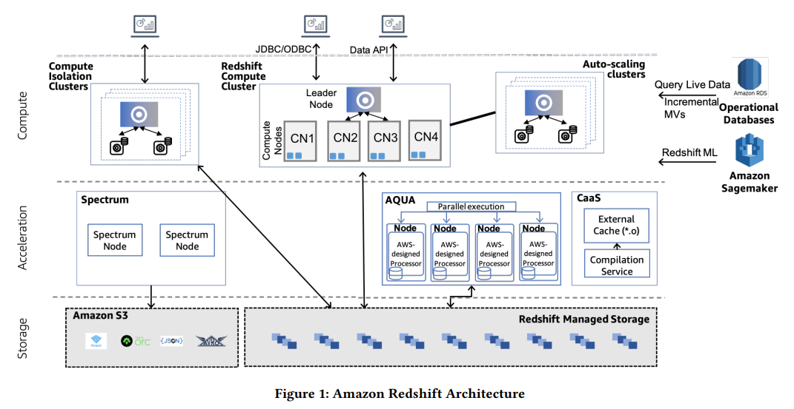
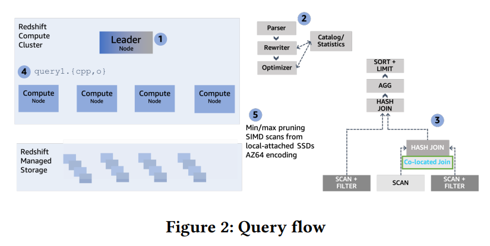
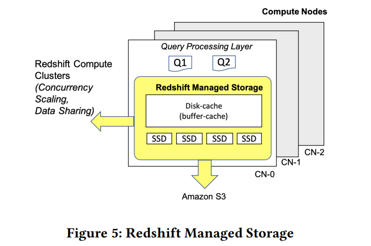
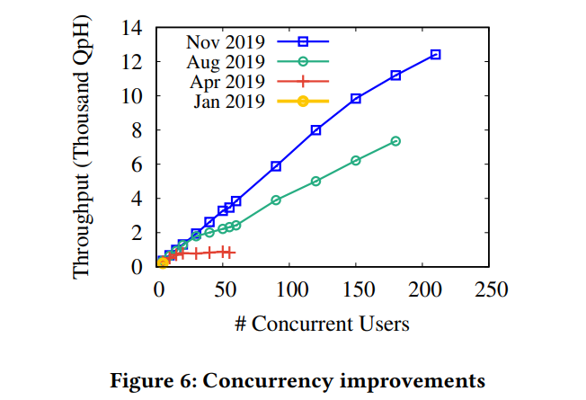
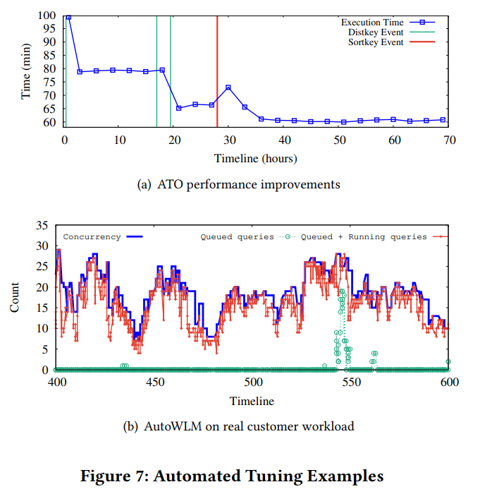
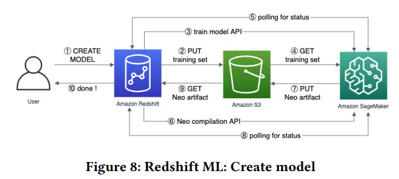

# [SIGMOD 2022] Amazon Redshift Re-invented

## Performance That Matters

### Overview

- Redshift集群包括**单个coordinator/leader**和**多个worker/compute**节点，数据存储于Redshift Managed Storage, RMS，底层为AWS S3，且会被compute节点的本地SSD缓存
- 表数据会被**多副本备份**到每个compute节点，或是**分区成多个buckets**并在所有compute节点上均匀分布，分区由Redshift根据负载自动推断完成，也可以由用户指定分区
- AQUA层采用**FPGA加速查询执行**
- **Compilation-as-a-Service**, CaaS层用于缓存优化过的代码生成片段optimized generated code for query fragments，从而被所有用户共享



Redshift上查询的执行过程如下：

1. leader节点收到查询请求
2. 基于Catalog，查询进行parse、rewrite、optimize
3. cost-based optimizer会考虑**cluster topology、数据在compute节点之间移动的代价**，来选择最优的计划，利用参与查询的表的数据分布来尽可能减少数据移动，例如若join key为equi-join且就是参与连接的distribution key，则优先选择可以避免数据移动的partition-by-partition local join, 即**colocated join**
4. 由workload management component, WLM来接受查询的执行阶段，一旦接受，优化过的方案就会被分割为独立的查询单元（**pipelines**），对每个单元生成高度优化的C++代码，编译并发送到compute节点
5. 从compute节点本地SSD缓存和RMS获取columnar数据，并开始执行
   - **push-based vectorized execution**
   - 若涉及到跨节点数据交互，生成的代码会进行pipeline形式的数据交换
   - 查询执行进程会在数据的每个子集上都运行相同的代码，即并行加速
   - 基于zone map的predicates pushdown
   - late materialization
   - vectorized scan和SIMD加速求值谓词
   - bloom filters
   - prefetching



### Introduction to Redshift Code Generation

Redshift会根据query和schema生成相应的C++代码，每个生成的代码也称为**segment**，包含**pipeline of operators**，算子也称为**steps**，每个segment是物理查询计划的一部分，其最后一步会打破流水线（类似[HyPer pipeline execution](09.Query_Compilation_Code_Generation.md#hyper)），每个tuple都会被pipeline中多个operators处理，其会被**尽可能保持在CPU registers中直到处理完成**被物化回内存、刷写到磁盘、向其他节点网络传输

例如`SELECT sum(R.val) FROM R, S WHERE R.key = S.key AND R.val < 50`会生成简化流程如下的代码

```cpp
// loop over R
while (scan_step->has_next()) {
  auto field1 = fetcher1.get_next();
  auto field2 = fetcher2.get_next();
  // apply predicate
  if (field2 < 50) {
    size_t h1 = hash(field1) & (hashtable1_size - 1);
    for (auto p1 = hashtable1[h1]; p1 != nullptr; p1 = p1->next) {
      // evaluate join condition
      if (field1 == p1->field1) sum1 += field2;
    }
  }
}
```

### Vectorized Scans

由于底层存储层的复杂结构，如上的表数据`get_next()`操作由一个特别的`fetcher`定义，而不能简单的直接在生成代码中表达，需要维护较多的状态来记录扫描的信息，导致了额外的性能开销，同时循环内的predicate evaluation很容易打断CPU流水线

Redshift通过**SIMD-vectorized scan layer**来优化性能，将满足谓词条件的列数据存储在栈上数组并供后续生成的代码访问，并且与前述代码会在查询过程中编译（JIT）不同，scan操作是precompiled并支持所有数据类型、编码、压缩格式，模型上采用了根据查询的混合执行：

- scan: column-at-a-time for a chunk (dynamically determined) of tuples
- join/aggregation: tuple-at-a-time

### Reducing Memory Stalls with Prefetching

Redshift的pipeline执行模式会延迟物化结果，始终保持column数据在CPU register中达到更高性能，但是当比如构建hash table时，若数据过多无法完全存入CPU cache就会导致较多的cache miss、memory stalls影响性能

Redshift采用probe hash table前插入预读**prefetching**来减轻memory stall导致的性能损失，在CPU L1持有一个环形缓冲区circular buffer，每个新tuple抵达时就会被prefetch/push到buffer中，并且一个旧tuple就会被pop/push到pipeline下游，参考[Relaxed Operator Fusion with Prefetching](08.Vectorized_Execution.md#selection-scans)，以及[Hybrid Models](Compiled_Vectorized_Queries.md#beyond-basic-vectorization-and-data-centric-code-generation)

```cpp
// ...
size_t h1 = hash(field) & (hashtable1_size - 1);
// prefetch
prefetch(ht1[h1]);
// push the current tuple in the buffer
prefetchbuffer1.push(field1, field2);
// pop a prefetched earlier tuple
h1, field1, field2 = prefetchbuffer1.pop();
// prove the earlier tuple
for (auto p1 = ht1[h1]; p1 != nullptr; p1 = p1->next) {...}
```

Redshift会**根据运行时的数据来决定策略**，hash table是否超出cache大小、tuple width是否较大不利于存入circular buffer，从而避免非最佳的执行策略带来的损失

### Inline Expression Functions

Use SIMD to accelerate expression functions (e.g. ASCII), fall back to optimized scalar code when needed (e.g. Unicode).

The code generation layer **inlines function calls** that are on the critical path when advantageous.

### Compilation Service

The compiled **segments are reused** from the cluster code compilation cache.

> billions of queries running daily in Redshift, the **probaility of having repetition is very high**

### CPU-Friendly Encoding

- generic byte-oriented compression, e.g. LZO, ZSTD
- type-specific compression, e.g. AZ64 for numeric and date/time data types

### Adaptive Execution

基于查询执行过程中的统计信息，动态调整生成的代码和运行时的参数，例如充分采用Bloom Filters, BFs来提前过滤掉不符合join条件的表数据

### AQUA for Amazon Redshift

Advanced Query Accelerator, AQUA作为一个**集群外off-cluster、多租户multi-tenant的数据缓存层**，用于缓存RMS的数据，并通过**谓词下推加速复杂扫描和聚合语句**

其本身类似于存算分离架构中的中间过渡节点，**computational storage层**，缓存了底层存储的热数据在高速SSD中，并通过硬件加速、FPGA等设计执行一些复杂的谓词、聚合计算，并且作为独立、多租户共享的集群提高整体硬件利用率

### Query Rewriting Framework

**DSL-based Query Rewriting Framework, QRF**

## Scaling Storage

### Redshift Managed Storage



### Decoupling Metadata from Data

**元数据的独立存储**使得Redshift可以实现**弹性扩缩容Elastic Resize以及跨实例恢复Cross-Instance Restore**，其实现如下：

1. Redshift保证AWS S3有完整的数据备份，从而支持恢复
2. Redshift会考虑集群中的数据情况，并生成一个尽可能少数据移动、且在新集群上也分布均匀的**reconfigure plan**
3. 执行reconfigure，并且在前后校验数据完整性和元数据准确性，校验完成后才会开始接受新的查询请求

### Expand Beyond Local Capacity

- **tiered-storage cache**
  记录每个数据块被访问的次数，采用**two-level clock-based cache replacement policy**，第一次访问数据时会被放置在low-level clock cache中，随着访问次数的增加，即热数据，就会被上升到high-level clock cache中，期间随着**时钟进展访问次数会被递减**，不再被频繁访问的数据就会被降级到low-level或是从缓存完全汰换

  缓存也会在reconfiguration时（包括Elastic Resice、cluster restore、hardware failover）被用于**rehydration，即缓存预热**，从而提高新集群的缓存命中率
- **dynamic disk-cache**
  在内存中维护最热的数据块、查询特定的临时数据（中间结果等），并且会尽可能利用空闲的内存，即内存空闲时提高缓存的数据量、内存紧张时减少缓存的数据量

### Incremental Commits

**log-based commit protocol**允许增量提交来提升性能，本质上数据将随机I/O转换成对日志的追加读写顺序I/O，日志形式的metadata降低了concurrency scaling和data sharing的代价，这两者都只需要通过应用log到本地数据就可以获得transactionally consistent data

### Concurrency Control

采用**MVCC**，并引入了**Serial Safety Net, SSN**机制来替换旧的基于图的机制，实现**strict serializability**，能够显著降低内存消耗

## Scaling Compute

### Cluster Size Scaling

轻量化的元数据操作，不引入底层数据的重新分布，但依然会**重新组织数据分区**以适配扩缩容后的计算节点，从而保证负载均衡，而调整后的分区会在后台进行rehydration以匹配热数据和查询

### Concurrency Scaling

当并发的查询数量增加时，**Concurrency Scaling会自动适配增加的负载**，并路由新的查询请求到增加的计算集群上



### Compute Isolation

**数据资源可以跨计算集群/AWS账号共享**，且分不同级别，例如schemas、tables、views、UDFs等

## Automated Tuning and Operations

> Redshift invested heavily in **maintenance automation** and **machine learning based autonomics**.

### Automatic Table Optimizations

**分区键distribution key**和**排序键sort key**对系统整体的性能影响非常大，且往往需要对数据和负载有深入了解才能合理选择，Redshift采用**Automatic Table Optimization, ATO**来自动分析集群负载并选择合适的distribution/sort key，以及无缝的应用到数据表上

- **distribution key**: ATO的目标在于**最小化网络数据传输代价**（合理的distribution key可以尽可能使得equi-join在本地逐分区进行，减少网络传输），因此其会从所有join工作负载中构建**带权重的join图，从而选择能够使整体负载的网络传输代价最小化**的属性作为distribution key
- **sort key**: ATO的目标在于**最小化磁盘数据读取**（合理的sort key可以通过zone map等方式快速定位所需的数据，而避免需要全分区/表扫描再过滤出所需数据），因此其会从所有range restricted scan工作负载中分析selectivity，从而选择能够**使zone map filtering效率最高**，即pruning of data blocks最优的属性作为sort key

在对已有的数据应用distribution/sort key时，Redshift允许用户通过console直接使用DDL操作，或者是**在后台周期性的利用负载低谷阶段增量式的应用**修改而不影响用户的在线请求



### Automatic Workload Management

**请求的限流**会影响到集群的状态，同时执行过多的请求会过度消耗硬件资源，性能急剧下降，而过少的请求就会使得硬件利用率低，更多的排队请求延迟升高，Redshift **Automatic Workload Manager, AutoWLM**采用机器学习的方式预言请求的资源消耗情况，并基于**排队论queuing theory models**来动态控制并发执行的请求数量

AutoWLM将请求的**查询计划execution plan**和优化器计算出的**统计信息optimizer-derived statistics**转换为特征向量feature vector并通过机器学习算法来评估执行时间、内存消耗、编译时间等指标，并基于此**给定其在执行队列中的优先级**

在调度的过程中，AutoWLM会始终监控集群的资源利用率，采用**基于排队论的反馈控制机制feedback mechanism based on queuing theory来保持高资源利用率和低等待延迟**，调度算法是常见的**weighted round-robin**机制，使得高优先级的任务能够获得更多的硬件资源，并且通过**抢占preemption**来避免优先级反转


- 在545时刻，由于监测到IO/CPU的饱和，AutoWLM降低了并发度，从而导致排队的查询增加，此时用户可以选择采用启用[Concurrency Scaling](#concurrency-scaling)或者是定义query priorities来优先执行更关键的任务

### Query Predicator Framework

用于预测查询消耗资源的框架是Redshift **Query Predicator Framework**，其收集训练数据预训练XFBOOST模型，并从**在线工作负载中持续学习并优化**

### Materialized Views

物化视图MVs被广泛用于提升重复查询的性能

- Redshift会**增量维护filter、projection、grouping、join等**在MVs上的作用来体现原始数据表的变化
- **延迟生效**从而减轻对transactional workload的影响，自动检测合适的时机，即工作负载水平较低时，来维护MVs，同时维护任务也有优先级队列，其权重会考虑到具体**MV在工作负载中的重要性，和维护该MV的成本**，通常95%的MVs都会在原始数据表修改的15分钟内完成维护
- 用户可以显式直接访问MVs完成查询，也可以依赖Redshift的优化器，后者会充分考虑MV的作用，采用**MV-based query autorewriting**来应用MV优化查询

### Smart Warmpools, Gray Failure Detection and Auto-Remediation

在Redshift的规模上，出现节点宕机、硬件故障非常普遍且正常，通过采用**Warmpools快速检测、抢占替换故障节点**来减少对查询的影响

同时为了尽可能减少warmpool中计算节点上线带来的性能影响，Redshift采用机器学习算法来预测所需的预备节点数量，保证随时有新节点支持，而在部分故障的灰色地带（慢磁盘、慢节点等），采用了**异常检测算法 outlier detection**来检测性能不及预期的节点

### Serverless Compute Expreience

**Automated provisioning, sizing and scaling** of Redshift compute resources.

Serverless的架构使得用户几乎不需要参与计算节点的配置、选择，**near-zero touch interface**

## Using the Best Tool for the Job

AWS提供了诸多开箱即用目的明确的分析服务，例如：

- Data in Open File Formats in Amazon S3
- Redshift ML with Amazon Sagemaker
  
  

- OLTP Sources with Federated Qeury and Glue Elastic Views
- Redshift's SUPER Schemaless Processing
- Redshift with Lambda
