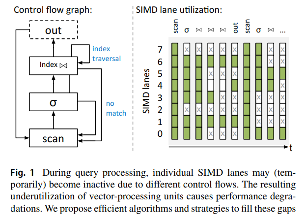
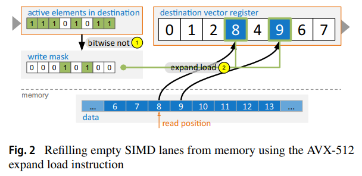
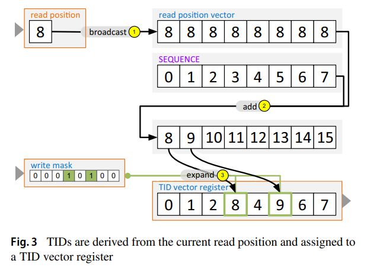
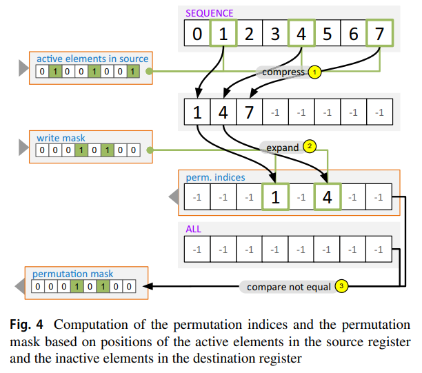
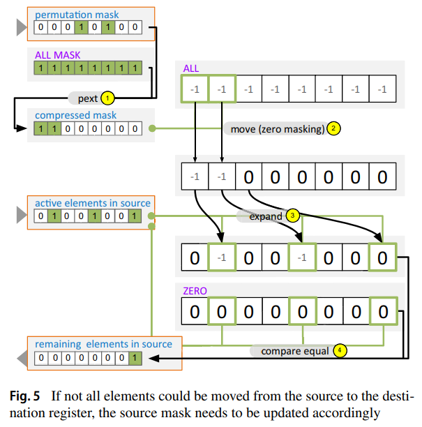
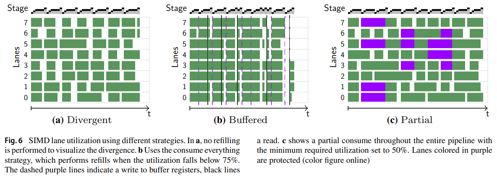
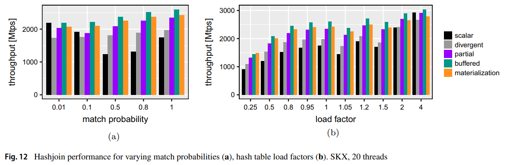

# [VLDB 2020] Make the most out of your SIMD investments: counter control flow divergence in compiled query pipelines

## Introduction

SIMD通常用在**column-at-a-time**或**vector-at-a-time**的执行模型中，像[HyPer](Morsel.md)这种系统由于以tuple-at-a-time为执行模型因此仅在scan算子和string处理中使用了SIMD

在实践中希望将整个流水线都**向量化vectorizing**是有难度的，因为并不是所有数据都会以相同的控制流来处理，部分数据可能需要被筛除，最简单的做法就是**忽略不满足条件数据的处理结果**，例如采用位图来标记有效数据位置，但相应的在这些不满足条件数据上的计算就是多余的，此时也可以称**向量单元未充分利用 vector-processing units underutilized**

传统做法可以是在每一次**向量算子vectorized operator**后都加入**内存物化点 (memory) materialization point**，将不满足条件的数据过滤，从而尽可能提高下一个向量算子的利用率，显然这种做法也可以**视为打断了流水线，每一个物化点都需要与内存交换数据**，本文提供了另一种更高效的做法，并对比了以下五种主要执行模式：

- **Scalar**: 标量执行模式
- **Divergent**: 向量执行模式，不使用再装填
- **Partial**: 向量执行模式，partial consume
- **Buffered**: 向量执行模式，consume everything
- **Materialization**: 向量执行模式，每个向量算子后都与内存交互数据保障下一个算子的高利用率

## Background

AVX-512的相关指令操作

- **Mask instruction**
  AVX-512指令支持谓词，通过一个位掩码bitmask可以将谓词作用于向量操作，使得仅对掩码`i-th`有效的向量`i-th`元素执行操作，其他位置的元素直接拷贝到目的地
- **Permute**
  根据给定的索引向量将输入向量shuffle处理，即`permute([3, 0, 3, 1], [a, b, c, d]) => [d, a, d, b]`，根据输入索引和输入向量，直接构造出新的向量
- **Compress/Expand**
  在有这个指令前，为了确定`permute`所需的索引向量，往往需要开销不低的查表等操作来构造索引向量，而AVX-512引入了`compress`和`expand`指令用于快速将元素调整到合适的位置，前者将掩码有效位置的元素直接连续排到目标寄存器`compress(1001, [a, b, c, d]) => [a, d, 0, 0]`，后者则是反向操作将连续的元素填充到掩码有效位置对应的目标寄存器`expand(0101, [a, b, c, d]) => [0, a, 0, b]`

## Vectorized pipelines

相比于**标量流水线scalar pipeline**例如HyPer，**向量流水线vector pipeline**最大的不同就是一次性可以使多条数据同时进入流水线，从而影响了控制流，标量流水线保证了每个算子只有一个数据需要处理因此控制流就跟随处理结果，而向量流水线每个算子有多个数据需要处理但**每个数据的控制流并不一定统一**

- 初始阶段，第一个scan算子，从而8条SIMD lanes均为活跃状态（绿色）
- 在后续两个阶段，分别因为select和join算子，lane#2和lane#7的数据不满足条件（X），但并没有走到no match的流程，其他lanes依然是活跃状态
- 再后一个阶段，lane#4已经处于不活跃状态，例如其发现join对象处于索引查找的阶段，lane#1和lane#6还需要3个迭代才能结束索引查找，在此期间lane#4一直不可用

查询流水线内的每个**条件分支都是潜在的控制流分歧点**，即**VPUs未充分利用的潜在风险点**，不满足条件的数据导致了后续算子的不充分利用（上例中的lane#2和lane#7），索引查找开销导致了算子内的不充分利用（上例中的lane#4），而直观的优化方式就在于动态给空闲的lanes分配数据，即**再装填refill**

## Refill algorithms

### Memory to register

扫描操作从内存中连续读取（假如是columnar layout）到向量寄存器中可以如下实现再装填

对于连续的读取，通过`SEQUENCE`常量叠加读取位置向量，并且作用`expand`操作所使用的位掩码，就可以轻松获得被填充的新数据对应的Tuple ID，从而使得TID向量于数据向量相匹配

### Register to register

在寄存器相互之间移动数据略微复杂一些，如下，细节过程参考论文原文

### Variants

上述是通用算法，对于一些特殊情况（特殊位置有元素）可以采用一些更高效率的变种算法，细节过程参考论文原文

## Refill strategies

通常**data-centric compiled query pipelines**会把流水线构建成一个for循环，查询中不同的算子就会在循环体中以`consume()`和`produce()`的形式生效（数据在算子之间生产和消费），而结合SIMD再装填算法的思路就在于在**每个算子中检查元组的数据，并及时进行再装填**避免VPUs利用率过低

- **Consume everything**
  分配额外的向量寄存器用于buffer tuples，当出现低利用率时（可以设置`THRESHOLD`来判断，并非要时时保持100%）就会（for循环当前迭代）**暂时不再处理数据而是将数据先放置在buffer中，等到后续就可以一次性读取并处理所有buffer tuples**从而提高利用率

  优点在于与现有框架（标量执行模式）融合较好，只需每个算子额外处理低利用率的清理，且buffer采用了向量寄存器，因此并没有与内存的通信，额外开销小，缺点在于**需要额外的寄存器**，寄存器之间移动数据更多压力较大
- **Partial consume**
  不再使用额外的向量寄存器，当出现低利用率时直接将部分数据留存在当前寄存器中不处理，并返回控制流给前序算子，但该lane的所有权依然属于当前算子，留存未处理的数据不能被其他操作覆盖，属于被保护protected状态，**前序算子生产的数据会继续被填充到当前寄存器的非活跃lanes直到填满后才会执行**，相当于**lane级别的缓存-批量执行**，每个lane在完整被当前算子处理过后其所有权就自然移交给后序算子

  这种做法相当于粒度更细的buffering需要对控制流精细控制，不但**额外需要记录每个lanes的所有权情况**，而且实际上属于protected状态的lanes等同于不活跃状态，**系统总体的实际利用率反而下降了**

不执行再装填、采用Conume everything的再装填、采用Partial consume的再装填这三种**策略并不互斥**，再装填算法本身也有一定的开销，实际系统中完全可以根据具体数据、硬件情况，对不同的算子、不同的执行情况采用不同的策略（*it depends...*），从而来**实现尽可能高的系统整体利用率**

## Evaluation

`SKIP`

