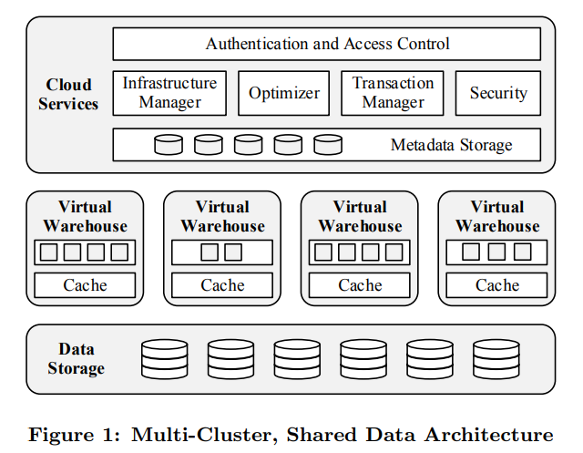

# [SIGMOD 2016] The Snowflake Elastic Data Warehouse

## Introduction

Snowflake的核心特点：

- **Pure SaaS**
- **Relational**
- **Semi-Structured**
- **Elastic**
- **Highly Available**
- **Durable**
- **Cost-efficient**
- **Secure**

## Storage vs. Compute

传统的shared-nothing架构有以下挑战：

- **Heterogeneous Workload**
  即使硬件层是相同的，工作负载也很难做到相同，例如批量加载的任务（重I/O负载而轻CPU负载）和复杂统计查询（重CPU负载而轻I/O负载）在不同的节点上（CPU强化或IO强化）表现可以完全不同，硬件同等强化就意味着其中一侧可能存在资源浪费
- **Membership Changes**
  扩容/缩容/故障带来的集群成员变更，会导致原先静态分区的数据出现大量的数据迁移，显著影响性能
- **Online Upgrade**
  类似membership changes，在线升级会直接影响到所有节点

Snowflake通过**存算分离**的方式来应对上述问题

## Architecture

- **Data Storage**: 采用云服务的对象存储服务，例如AWS S3，存储服务本身可独立弹性扩容并且高可用，自研/自维护的存储层（例如基于HDFS）难以媲美云服务的存储服务
- **Virtual Warehouses**: 采用云服务的弹性计算实例，例如AWS EC2，进行计算服务，并被抽象为Virtual Warehouse, VW的概念，用户付费使用不同规模的VM节点，这些节点弹性按需创建、无状态都从数据存储层读取数据、执行的查询相互隔离不会受其他VM节点的影响
  - VM的执行引擎采用了**Columnar、Vectorized、Push-based**模式（类似[MonetDB/X100](MonetDB.md)）
  - 由于引擎都是处理一组固定的不可变文件中的数据，因此传统查询处理的额外开销，例如事务管理，都不需要
- **Cloud Services**: 支持多租户，包含所有用户共享的鉴权、查询优化器、事务管理器等组件，本身通过多副本来实现高可用
  - 优化器是**Cascades模式**，带有自顶向下的cost-based optimization，会先以粗糙的查询执行计划开始，过程中动态调整，并且所有查询信息和统计数据都会用于审计和性能分析
  - 结合不可变文件的底层数据，事务模型是**快照隔离，通过MVCC实现**
  - 不采用传统的B树索引，而是[PAX形式](03.Storage_Models_Data_Layout.md#hybrid-storage-model-pax)，且每个数据块带有基本统计信息用于算子下推谓词求值

## Feature Highlights

- **Pure SaaS**
- **Continuous Availability**
  
  

  

  升级过程中也是灰度进行，所有新查询都由新版本的程序进行处理，而**旧版本不再接受请求，一旦当前任务处理结束即可以被下线**，过程中新旧程序共享状态（Metadata Storage，Cache）
- **Semi-Structured and Schema-Less Data**
- **Time Travel and Cloning**
  采用多版本并发控制MVCC实现快照隔离SI，当一个文件被删除时还会被额外保存一段时间，从而允许查询（在一个查询内同时）访问已被删除的数据和最新的数据
- **Securtity**

  

  

  - **Key Rotation**: 周期性创建新的key用于加密，而旧key就只能用于解密数据，即将key从active转为retired，例如上图`k1v1`变更为`k1v2`和`k1v3`用于不同的文件加密
  - **Rekeying**: 采用新key来重新加密旧的数据，从而旧key可以彻底被移除，即将key从retired转为destroyed，例如上图采用`k2v1`重新加密所有`k1v1`的数据，随后将`k1v1`删除

## UPDATE

[Building An Elastic Query Engine on Disaggregated Storage](Query_Engine_on_Disaggregated_Storage.md)
