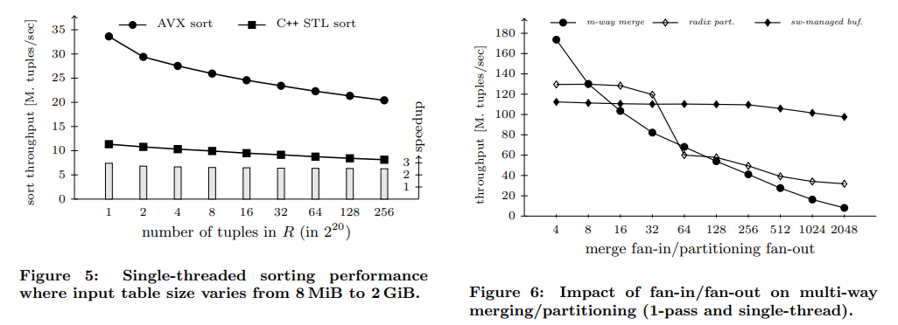

# [VLDB 2013] Multi-Core, Main-Memory Joins: Sort vs. Hash Revisited

## Introduction

- **radix-hash join is still superior** to sort-merge join in most cases
- insights on the implementation of data operators on **modern processors**

## Background

- Sort vs. Hash - Early Work
- Sort vs. Hash - Multi-core Era
- Hardware-Assisted Sorting
- **The Role of NUMA**
  Algorithms must be **hardware conscious** by taking the increasingly more complex **NUMA topologies** into consideration

## Parallelizing Sort with SIMD

Sort-merge join最主要的开销就在sorting阶段，而采用归并排序的sorting对现代CPU架构和SIMD友好

### Run Generation

起始排序阶段，输入关系被划分为大量每个只包含很少tuples的数据块进行排序，采用**sorting networks**的方式来充分利用SIMD，例如下述even-odd network：

```text
9 --*5--*3------- 3
    |   |
5 --*9--|--*6-*5- 5
        |  |  |
3 --*3--*5-|--*6- 6
    |      |
6 --*6-----*9---- 9
```

所有的排序过程可以被编译成一系列简单的`min/max`操作，且带有**有限的数据依赖关系并没有分支**，从而高度有利于SIMD和现代CPU架构：

```cpp
e = min (a, b)
f = max (a, b)
g = min (c, d)
h = max (c, d)
i = max (e, g)
j = min (f, h)
w = min (e, g)
x = min (i, j)
y = max (i, j)
z = max (f, h)
```

需要注意由于SIMD的一个向量寄存器包含一组值，而上述排序/交换过程是针对多个寄存器里相同位置的元素，即`Wi, Xi, Yi, Zi`的排序，而一个寄存器内的元素`Wi, ...Wk`顺序依然需要另外排序，通常单个寄存器内可以容纳4个元素，即`K = 4`，则寄存器之间通过8次`shuffle`指令完成转置则每个寄存器即有序可以存储，从而对16个数据采用4个向量寄存器排序，需要`10 x min/max`、`8 x shuffle`、`4 loads`、`4 stores`，最后的加速比就从`K = 4`降到约`2.7`

### Merging Sorted Runs

合并阶段依然可以采用**bitonic merge networks**来利用SIMD加速合并过程：

```text
a1 -> a4, b1 -> b4 sorted

a1 -------*----*------*- out1
          |    |      |
a2 -----*-|----|-*----*- out2
        | |    | |
a3 ---*-|-|----*-|----*- out3
      | | |      |    |
a4 -*-|-|-|------*----*- out4
    | | | |
b4 -|-|-|-*------*----*- out5
    | | |        |    |
b3 -|-|-*------*-|----*- out6
    | |        | |
b2 -|-*--------|-*----*- out7
    |          |      |
b1 -*----------*------*- out8

out1 -> out8 sorted
```

由于更大的输入往往对merge network不友好，处理N个输入项需要`O(N log^2 N)`个比较算子，从而可以考虑的做法就是采用merge network作为合并过程中的**kernel**，相当于大的**输入片段被拆分成适合kernel的小片段**，最后再连接所有已经有序的片段完成合并

## Cache Conscious Sort Joins

- **Sorting and the Memory Hierarchy**
  需要充分考虑到输入数据的量，将排序和归并分为三个阶段
  1. in-register sorting: 即在寄存器内完成排序，指前述的[run generation](#run-generation)
  2. in-cache sorting: 当数据依然能够填入CPU高速缓存的一半时，尽可能采用带有bitonic merge kernel的归并过程
  3. out-of-cache sorting: 常规合并操作直到数据全部有序
- **Balancing Computation and Bandwidth**


## Hash-Based Joins

- **[Radix Partitioning](11.Hash_Join.md#build-phase)**
- **[Software-Managed Buffers](Equi_Joins.md#optimizing-radix-partitioning)**

## Analysis of the Sort/Merge Phase

- Sort-Merge Join Algorithm – **m-way**
- Sort-Merge Join Algorithm – **m-pass**
- Massively Parallel Sort-Merge Join – **mpsm**
- Radix Hash Join – **radix**
- No-Partitioning Hash Join – **n-part**




> **Nevertheless, all the results clearly indicate that hash joins are still faster than sort-merge join counterparts.**
