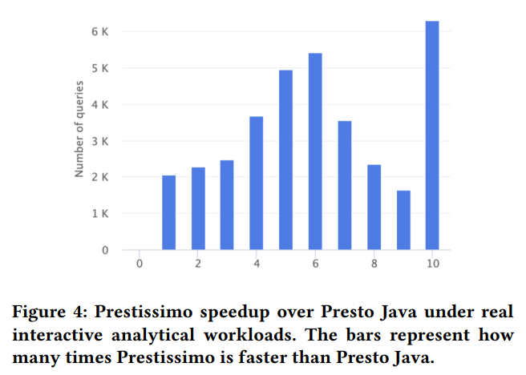

# [VLDB 2022] Velox: Meta’s Unified Execution Engine

## Library Overview

Velox is an open source **C++ database acceleration library** that provides high-performance, reusable, and extensible **data processing** components.

- **Type**: generic type system
- **Vector**: Arrow-compatible columnar memory layout
- **Expression Eval**: vectorized expression evaluation engine
- **Functions**: custom functions
- **Operators**: common data processing operators, e.g. `TableScan, Project, Filter, etc`
- **I/O**: generic connector interface
- **Serializers**: serialization interface in networking
- **Resource Management**: collection of primitives for handling resources, e.g. memory, buffer, tasks, threadpool, etc

## Use Cases

- Presto
- Spark
- Realtime Data Infrastructure
- Machine Learning

## Deep Dive

### Type System

> The type system is extensible to allow developers to **add engine-specific types** without having to modify the main library.

### Vectors

采用类似Apache Arrow的格式，每个向量包含**size**，**data type**以及**optional nullability bitmap**，并且向量可以任意嵌套包含，其特点在于：

- **Encoding**
  实际采用不同的编码格式，创建者需要选择最合适的编码格式，例如：
  - flat
  - dictionary
  - constant
  - sequence/RLE
  - bias (frame of reference)
- **Velox Buffers**
  Vectors都存储在Velox Buffers中，后者通过memory pool来提供向量数据的实际存储，同时支持不同的**所有权模式，例如owned/view**从而多个向量有可能共享同一份数据，即**浅拷贝**，Vectors和Buffers都采用引用计数
- **Lazy Vectors**
  支持延迟填充，仅在第一次访问向量内部数据时才真正完成materialization，从而允许在不会访问时（例如predicate pushdown跳过某一段时间）完全避免了多余的数据填充操作，尤其是当底层数据来自于S3等外部系统时
- **Decoded Vector**
  用于免除在大部分情况下不希望对Vector有精确控制的额外开发负担cognitive burden，其用于对底层不同的编码格式的Vector进行统一抽象暴露相同的访问API

Velox Vector与Apache Arrow基本兼容，主要在以下三方面有差异：

- **Strings**
  采用了HyPer的做法
  
  ```cpp
  struct StringView {
    uint32_t size_;
    char prefix_[4];
    union {
      char inlined[8];
      const char* data;
    } value_;
  }
  ```

- **Out-of-order Write Support**
  在处理Vector时首先**根据condition生成bitmask**，随后采用向量化的方式来批量/乱序处理整个向量的元素，避免逐个元素判断condition再处理
- **More Encodings**
  基于实际工作负载，Velox额外增加了RLE和constant这两种方式，后者代表整个向量的元素都相同

### Expression Eval

表达式处理分为compilation和evaluation两个阶段，并在各自阶段中会进行额外的优化：

- Compilation
  - **Common Subexpression Elimination**
  - **Constant Folding**
  - **Adaptive Conjunct Reordering**: 类似于**selectivity-based predicate reordering**，Velox会追溯每个逻辑表达式的表现，并**优先求值效率最高/过滤掉最多元素**的表达式
- Evaluation
  表达式求值包含了表达式树的递归下降recursive descent，并会传递一个**row mask用于标记需要计算的有效元素**（即忽略null值和不满足条件的值）
  - **Peeling**
    若输入数据是dictionary编码的，则部分运算可以**直接作用于dictionary内部向量**（即peeling），而可以避免处理包含更多数据的indices向量，例如：

    ```text
    input color column:
      indices:    [0, 1, 0, 2, ... , 1]
      dictionary: ["red", "green", "blue"]
    
    expression: upper(color)
      upper(["red", "green", "blue"]) => ["RED", "GREEN", "BLUE"]
    ```

  - **Memoization**
    类似上述实例，当输入计算拥有相同部分时，例如`color dictionary`，则海量的多批次`color indices`都可以**引用共享**的同一个`color dictionary`
  - **Code Generation**
    将整个表达式树改写为C++函数代码，编译优化后以共享库的方式链接使用，即JIT，本身编译优化链接需要耗时，处于实验阶段，在**批量加载的ETL阶段**会有较大好处

### Functions

- **Scalar Functions**
- **Aggregate Functions**

### Operators

类似[Morsel](Morsel.md#morsel-driven-execution)的**push-based模型**，其好处可以参考[DuckDB的说明](22.DuckDB.md#execution)，顶层执行任务是**Task**形式，以`TableScan`或者`Exchange`作为数据源输入，以`Exchange`作为结果输出，一个Task代表了一个算子树可以进一步分割为**Pipelines**，每个流水线就会有一个多个线程用于执行，称为**Drivers**

算子都实现一组通用的基础API接口，接口包括添加一批向量作为输入、产生一批向量作为输出、算子是否可以接受更多数据、提醒没有更多数据可以添加等

- **Table Scans, Filter, Project**
  column-by-column的形式扫描表数据，并且带有filter pushdown，同时filter在运行时动态调整求值顺序，从而尽快过滤掉更多数据，也是**selectivity-based filter reordering**，运行过程中每个filter以`time / (1 + values-in - values-out)`记录性能，从而优先求值能在最短时间内过滤最多数据的filter，过程中尽可能采用SIMD加速判断
- **Aggregate, Hash Joins**
  仔细设计并优化的hashing过程，见原文

### Memory Management

采用内存池的方式管理内存，所有占用内存的对象，即memory conusmers，可以提供**恢复机制**用于在内存分配失败的情况下进入恢复处理，**consumers可以被异步打断**，并要求释放内存，将作业信息溢写到次级存储/磁盘中，随后当consumers被恢复时再进行状态恢复和继续执行，**算子需要支持接口与调度层沟通内存信息**，包括给出潜在溢写能够释放的内存数量接口，以及溢写接口

- **Memory Caching**
  Velox还支持对数据进行缓存（考虑到访问S3等外部存储的IO高延迟），memory caching作为特殊的memory consumer可以**占用所有暂未被分配的内存，其在被要求让渡内存时就是释放缓存数据**，另外充分考虑**数据局部性原理**，当访问的数据间隔足够近时会直接连同中间数据一起读取并缓存（例如SSD是20K，而disaggregated storage是500K）
- **Smart Pregfetching**
  在运行过程中，Velox一直追溯被使用的column数据，并根据访问频率会尝试有IO空闲时提前**预读取热数据**，从而降低真正访问时的延迟

## Experimental Results


