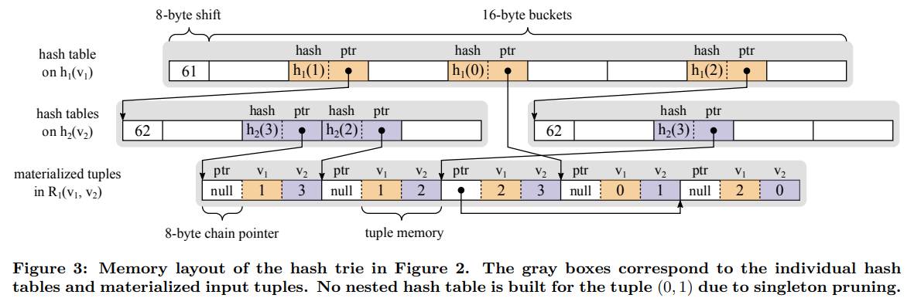
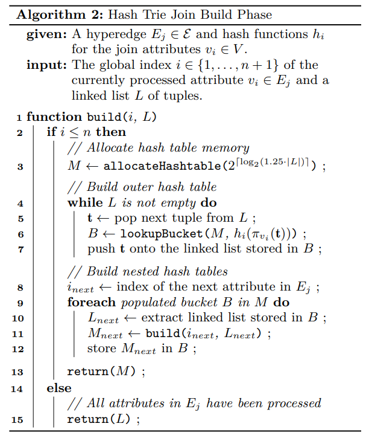

# [VLDB 2020] Adopting Worst-Case Optimal Joins in Relational Database Systems

## Introduction

大部分RDMBS都依赖binary joins来处理超过一个表的查询（例如三个表的join相当于两次binary join），而在多表连接的情况下采用多次binary join很容易导致不佳的性能、**过多的中间结果**等，而多表连接本身在OLAP系统中又非常常见

本文作者认为一个通用的multi-way join算法应该满足：

- optimizer**仅在multi-way join有优势的时候**，才在执行计划中引入multi-way join
- **高性能的索引结构能够在执行过程中on-the-fly构建**，且不需要持久化到磁盘

## Background

假定一个查询如下，其中每个关系 $R_j$ 都包含了属性 $v_1,...,v_n$：

```math
Q = R_1 \Join ... \Join R_m
```

对于在**主key上的相等性连接，binary join来实现上述多表连接的查询是高效率的**，但是一旦出现非主key的连接，采用binary join就可能导致海量的中间结果，例如下属查询：

```math
Q_\Delta = R_1(v_1,v_2) \Join R_2(v_2,v_3) \Join R_3(v_3,v_1)
```

假定三个表相等，并将tuples视为图中的边，从而 $Q_\Delta$ 的结果就包含了图中的有向环，即`(0, 1, 2)`、`(1, 2, 0)`、`(2, 0, 1)`三条数据；若是通过binary join的方式来连接，则首先要连接前两个关系，产生中间结果相当于是枚举了所有长度为2的有向路径，数量远超最终的三个结果


采用本文的worst-case optimal join算法会采用**递归回溯搜索的方式找到有效的连接key**，避免枚举海量的中间结果：

1. 首先迭代在表 $R_1$ 和 $R_3$ 中属性 $v_1$ 上出现的共同的值，即`k1 = {0, 1, 2}`
2. 对每一轮迭代给定 $v_1$ 继续递归迭代在表 $R_2$ 和 $R_1$ 子集中 $v_2$ 上共同出现的值，例如当`k1 = 0`时`k2 = 1`
3. 进一步类似的找到 $v_3$ 上的合理值，整个流程避免在连接流程中枚举海量的中间结果

### Worst-Case Optimal Join Algorithms


1. 在给定的一次递归 $i$ 内，首先区分出包含该 $v_i$ 属性的表加入集合 $R_{join}$ ，而不包含的则加入集合 $R_{other}$

    ```text
    i = 1, R = {R1, R2, R3}
    
    R_join = {R1, R3}
    R_other = {R2}
    ```

2. **选取所有 $R_{join}$ 内，属性 $v_i$ 的共同值，并依次迭代**，即依次赋予 $k_i$ 为某一个可能的值

    ```text
    for k_1 in {0, 1, 2} do
    ```

3. 每一次固定 $k_i$ 时，将相应的tuples都加入到 $R_{next}$，递归进入下一轮探索

    ```text
    k_1 = 0: R_next = {{(v1=0, v2=1)}, {(v3=2, v1=0)}}, enumerate(2, {R_next, R2})
    k_1 = 1: R_next = {{(v1=1, v2=2)}, {(v3=0, v1=1)}}, enumerate(2, {R_next, R2})
    k_1 = 2: R_next = {{(v1=2, v2=0)}, {(v3=1, v1=2)}}, enumerate(2, {R_next, R2})
    ```

4. 当 $i$ 抵达终点时，此时在输入参数 $R$ 中仅包含满足join条件的所有tuples，因此就是最终结果集合的一部分

    ```text
    // next, k_1 = 0
    i = 2, R = {{(v1=0, v2=1)}, {(v3=2, v1=0)}, R2}

    R_join = {{(v1=0, v2=1)}, R2}
    R_other = {{(v3=2, v1=0)}}

    for k_2 in {1} do
      R_next = {{(v1=0, v2=1)}, {(v2=1, v3=2), (v2=1, v3=3)}}
      enumerate(3, {R_next, R_other})
    
    // next, k_1 = 0, k_2 = 1
    i = 3, R = {{(v1=0, v2=1)}, {(v3=2, v1=0)}, {(v2=1, v3=2), (v2=1, v3=3)}}

    R_join = {{(v3=2, v1=0)}, {(v2=1, v3=2), (v2=1, v3=3)}}
                ^^^^                  ^^^^
    R_other = {{(v1=0, v2=1)}}

    for k_3 in {2} do
      R_next = {{(v2=1, v3=2)}, {(v3=2, v1=0)}}
      enumerate(4, {R_next, R_other})
    
    // next, k_1 = 0, k_2 = 1, k_3 = 2, done!
    i = 4, R = {{(v1=0, v2=1)}, {(v3=2, v1=0)}, {(v2=1, v3=2)}}
    produce(v1=0, v2=1, v3=2)
    ```

可以看出输入参数 $R$ 实际上仅包含了 $R_j$ 中**共享相同join key prefix的值**

### Implementation Challenges

在实现中，必须依赖高效的索引来存储上述的共享相同join key prefix的值，即**trie结构**，同时上述算法涉及到了非常多的集合操作，而传统的B+树索引或有序链表难以高效执行集合操作

## Multi-Way Hash Trie Joins

### Hash Tries

采用nested hash table的设计，技巧在于实际上的**hash table存储的是64位的散列值`hash(v)`而不是（可能不等长的）join key**，并且hash table的大小确保是2的幂次从而可以通过fast bit shifting来计算出`hash(v)`在hash table中的位置

当有散列冲突时，即例如图中的`h2(0) == h2(3)`，等到最后生成连接结果时通过额外判断连接条件来过滤，即**冲突处理被延迟**，从而换取更简洁的数据结构和中间流程


实际实现中还有额外的两点优化：

- **singleton pruning**
  由于nested hash table在较低层往往都只对应一个tuple，例如上图的`h1(0) -> h2(1) -> (0,1)`，因此可以直接在`h1(0)`的指针最高位中（x86_64系统的指针只有低48位有效，高16位并不使用）占用1个singleton bit来指示该指针是否直接对应到tuple，**避免了中间的长单链**
- **lazy child expansion**
  对于连接来说，可能大部分低级别的hash table从来不会被访问到（在其之上的值不满足连接条件），因此在build阶段可以**推迟这些低级别hash table的构建**，仅在需要时再展开，即lazy child expansion



### Build Phase

在构建阶段，hash trie会对查询 $Q$ 的每个输入关系 $R_j$ 都构建相应的散列表，算法就是**自上而下递归构造每个属性的散列表**，最底层的叶节点就是所有值



### Probe Phase

在探测阶段，采用迭代器iterators来访问每个关系的hash trie结构，与前述[通用算法](#worst-case-optimal-join-algorithms)流程所不同的点在于：

- 采用hash trie结构可以加速第2步集合求交，即下述流程7-9行
- 散列冲突的处理本身需要对比完整的tuple，在该算法中被延迟到最后输出结果时double check连接条件，即下述流程第18行


## Optimizing Hybrid Query Plans

优化器仅在采用WCOJ能够取得**潜在更优性能时才会考虑将binary join优化为WCOJ**，主要基于以下考虑：

- 输入输出的数据量估计，是否会造成中间结果膨胀
- 参与多连接的表数量
- 仅inner joins with equality predicates会被考虑优化


## Experiments


并且优化器在测试中很大概率能给出正确的优化建议（是否选用WCOJ）：

- T: True, F: False
- P: Positive, N: Negative

| Benchmark | Joins | TP | TN | FP | FN |
|:-         |     -:|  -:|  -:|  -:|  -:|
|TPCH       |     59|   0|  59|   0|   0|
|JOB        |    864|   0| 859|   0|   5|
|JOB no-filters| 234|  19| 140|   0|  75|
|Graph      |     48|  48|   0|   0|   0|
|Synthetic  |     80|  52|   8|  18|   2|
|Total      |   1285| 119|1066|  18|  82|
