# Lecture 02. Spatial Data Management

## 概述 Overview

1. **空间数据 Spatial Data**
   空间数据可以用**空间范围spatial extent**或者用**点points**来表示，其中空间范围又可以分为向量vector表示和光栅raster表示

   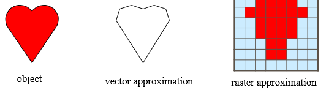

2. **空间关系 Spatial Relationships**
   - 拓扑关系 topological：每个对象都有**内部interior**和**边界boundary**
   - 距离关系 distance：曼哈顿距离、欧氏距离、闵式距离等
   - 方位关系 directional

3. **空间查询 Spatial Queries**
   基于空间关系的查询，例如找到最近的点、找到某个范围内所有对象等，主要有以下问题：
   - 维度 dimensionality：多维空间下没有一个全序
     > there is no total ordering of objects in the multidimensional space that preserves spatial proximity
   - 复杂的空间 complex spatial extent
   - 空间的操作和代数没有标准定义

   空间查询通常可以有两步处理过程：
   1. **过滤 Filter**：首先测试**Minimum Bounding Rectangle, MBR**是否符合查询的要求
   2. **细化 Refinement**：通过了过滤的对象再进行更精细的确认

## R树

### 概念

R-tree将MBRs分组聚集到页disk blocks上，每一组都是R-tree的叶节点，随后再将组也分组来生成更高一层，递归到最后最高层只有一个根节点，同时**允许MBR覆盖的区域存在重叠overlap，但是实际对象并不会属于多个区域/节点**

注意：**R树的目的是加速filter step**，减小需要refinement step的情况，另一方面**R树并不适用于存储高维空间数据**，因为维度过高之后，所有点之间的距离都会变的很"远"

R-tree的实现与B+-tree类似：

- 叶节点 leaf node：存储`<MBR, object-ID>`
- 非叶节点 non-leaf node：存储`<MBR, node-ptr>`
- 参数`M, m`：每个节点最多有`M`个entry，最少有`m`个entry，且`m <= M/2`，根节点最少有2个子节点

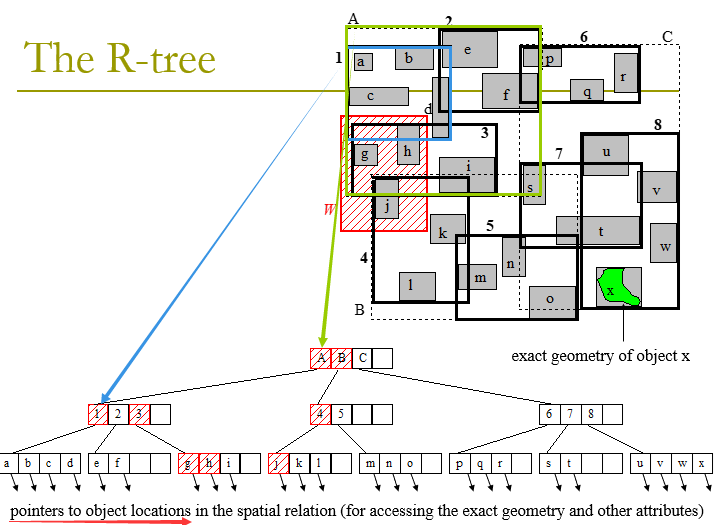

### 范围搜索

例如上图中就展示了范围搜索过程，搜索R-tree中与区域`W`有交集的对象可以表示为`range(W, node)`：

1. 若`node`是非叶节点，则测试子节点`child`是否和`W`有交集，若有就迭代`range(W, child)`
2. 若`node`是叶节点，则访问对象`object`是否和`W`有交集，若有就将`object`添加进结果集合

### 构建R树

插入insertion/删除deletion类似B+树，但需要结合空间数据进行优化

### 优化准则以及R*树

一种优化过的R-tree，在插入上比R-tree效率更高，其他类似；高质量的R-tree需要满足以下4个特点/优化点：

- **索引覆盖的区域尽可能小**，即MBRs较小，则此时**死区dead space**也会小

  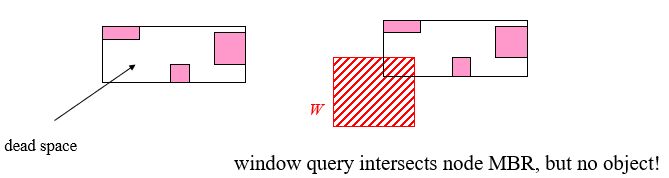

- MBR之间的**重叠面积overlap较小**，则此时一个查询需要额外判断相交与否的节点也会更少

  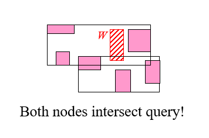

- **节点的边长尽可能小**，或者说节点的覆盖面接近正方形，类似一种数据局部性的概念，更接近正方形则相邻对象才聚在一个节点内

  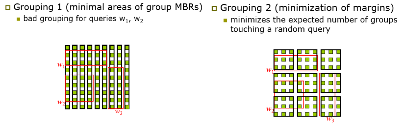

- **节点尽可能填充满**

### 启发式插入

在插入节点时通过一些启发式策略来尽可能实现较优的R树结构

1. **MBR被扩大的最小**

   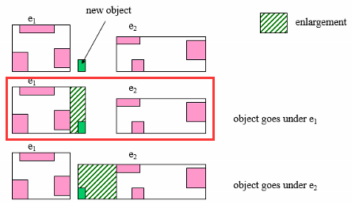

2. **MBR的重叠面积增加的最小**

   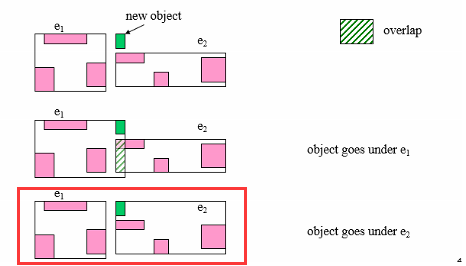

3. 若前两条相等，**选择更小BMR面积**
4. **强制重新插入**
   插入有可能引起节点分割，在引起节点分割前，首先**尝试分离原先节点里较远的部分子节点**（例如下图1,6），重分布到到其他未满节点，随后再重新插入节点（下图4），若依然不可行，再执行节点分割插入

   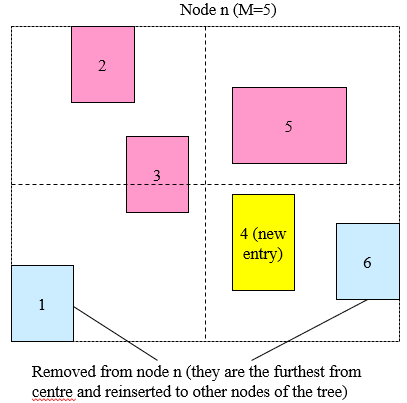

### 节点分裂

通常希望快速分裂一个节点为两个从而使得面积area、重叠overlap、边长margin都尽可能小，即尽可能满足最优R树的准则，一种通用算法如下：

1. 通过**最小边长**来确定分裂的轴

   ```text
   For each axis (X, Y), do:
     sum = 0
     For each sort (by lower_value, upper_value) of entries , do:
       For k = m to M+1-m, do:
         Place first k entries in group A and the rest in group B
         Sum = Sum + margin(A) + margin(B)
   Choose axis with the minimum sum
   ```

   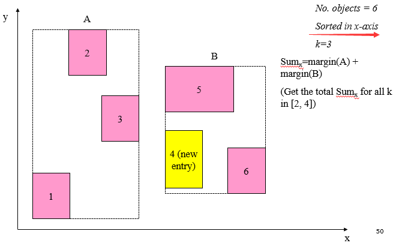

   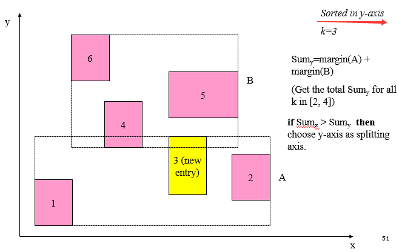

2. 选定轴后，通过**最小重叠**来确定沿着轴的分裂分组方式
3. 如果有多种方式有相同的重叠面积，则选择最小面积和的`minimum area(A) + area(B)`

### 批量构建R树

- 方法一：**迭代插入初始为空的树**
- 方法二：**x-sorting 快速构建完整的树**
  与B+树的bulk loading原理相同，根据X轴对矩形排序，根据排序每连续M个矩形作为一个叶节点，自底向上构建R树，往往更快且更好，但可能产生长带状的页节点

  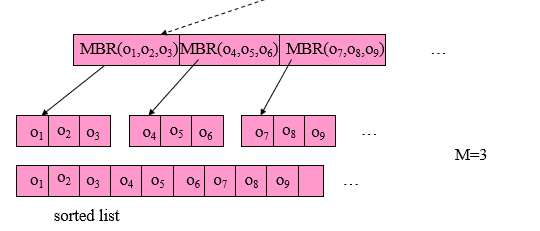

- 方法三：**希尔伯特排序 Hilbert sorting**
  使用空间填充曲线对矩形排序，结构更好，但可能有大的重叠区域

  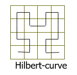

- 方法四：**递归平铺排序 sort-tile-recursive**
  使用某个轴进行排序，然后基于另一个轴获得`sqrt(n)`个矩形，通常效果最好

  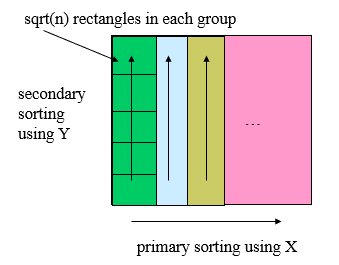

四种方法的综合对比效果如下：

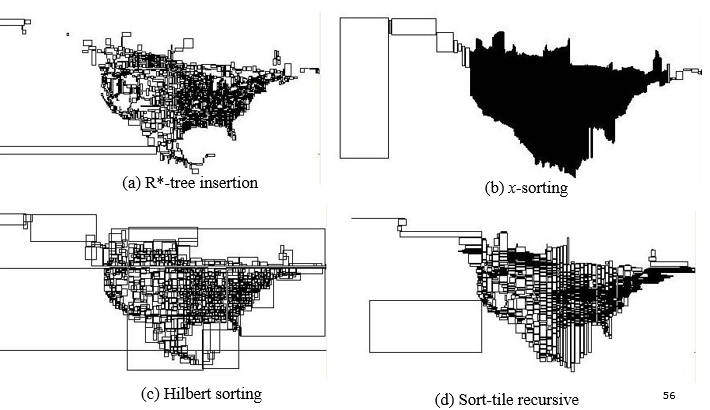

## 空间查询的处理 Spatial Query Processing

### 空间选择 Spatial Selections

### 最近邻居查询 Nearest Neighbor Queries

给定空间关系以及一个对象q，查找q在R范围内的最近的k个邻居，即**k-NN问题**

- **距离的衡量**
  由于MBR是存在空白的，并不真正的填满空间，因此**MBR间的距离一定小于等于真正的距离**

  ```text
  dist(MBR(n_i), MBR(n_j)) <= dist(e_i.MBR, e_j.MBR)
  对所有的e_i属于n_i、e_j属于n_j成立
  ```

  另外由于MBR是可以重叠的，**当两个MBR重叠时定义距离为0，当对象q在某个MBR内部时，定义q与该MBR的距离为0**
- **深度优先搜索 Depth-first NN search**
  1. 从root开始，每次都访问子节点中与q最接近的节点
  2. 抵达叶子节点，找到符合要求的NN，更新NN为此NN
  3. 回溯之后寻找其他节点，直到没有节点比当前的NN更近

  注意点：
  - 大的搜索空间可以被先找到的NN进行剪枝
  - 一个节点中应该按照距离从小大大来搜索，尽快剪枝
  - **非递增的not incremental**，因为如果要找2-NN、3-NN就必须重新开始查找
  - 空间开销小，只需要保存一条当前的访问路径（栈）即可
- **最先最好搜索 Best-first NN search**
  1. 使用**优先队列**存储所有entries，每次都访问队列里最优先的节点

  注意点：
  - 待查找的NN与起始点q的距离dist(NN, q)，只有节点的MBR与dist(NN, q)相交，这些节点才会被访问到
  - 不进行剪枝直到找到符合要求的结果
  - **递增的incremental**，即已有(k-1)-NN结果时可以递增找到k-NN
  - 内存消耗较大

### 空间连接 Spatial Joins

- **空间连接的种类**
  - join：例如找到所有相交的城市和河流
  - semi-join：例如找到所有与某条河相交的城市
  - similarity join：例如找到所有的酒店-餐厅对满足这一对对象的距离小于某个阈值
  - closest pairs：例如找到所有最近的酒店-餐厅对
  - all-NN：例如对每一个酒店，找到其最近的所有餐厅
  - iceberg distance join：例如找到酒店满足其附近（距离小于某个阈值）至少有10个餐厅
- **三类算法**
  - 两个输入的空间关系都有索引，synchronized tree traversal
  - 一个输入的空间关系有索引，indexed nested loop
  - 没有索引，spatial hash join
- **R树同步遍历连接 R-tree (intersection) join, synchronously traverses**
  假定两个输入的R树有一样的高度，则算法伪代码如下：

  ```cpp
  RJ(Node n_R, Node n_S) {
    for e_i in n_R:
        for e_j in n_S:
            if !isEmpty(intersect(e_i.MBR, e_j.MBR)):
                if isLeaf(n_R) // n_S is also a leaf
                    output (e_i.ptr, e_j.ptr)
                else
                    RJ(e_i.ptr, e_j.ptr)
  }
  ```

  可以通过以下两个方面对算法进行优化：
  - **空间限制 space restriction**
    如果**节点n1中的entry与节点n2的MBR不相交，则与n2中的任意entry都不相交**，因此首先扫描n1/n2中的所有entry，剪枝掉与对方MBR不相交的

    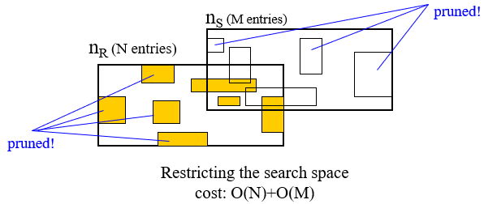

  - **平面扫描 plane sweep**
    将两个节点各自所有entry根据x投影的较小值排序，然后利用**平面扫描**快速找到x相交，找到之后再检查y相交，类似merge（如果有索引的话这种算法效率非常高）

    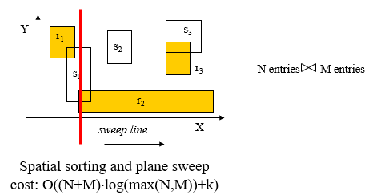

- **无索引的连接**
  - **空间散列连接 spatial hash join**
  - **基于分区的空间归并连接 partition based spatial merge join**
- **单个输入有索引**
  - **索引嵌套循环 indexed nested loops**：对每个无索引关系内的对象都进行索引查询连接
  - **即时构建索引连接 seeded tree join and bulk-load and match**：对没有索引的关系的即时构建R树索引，再执行同步遍历连接
  - **排序匹配 sort and match**：对没有索引的关系进行排序，并组合一批叶节点（但不构建R树）进行连接
  - **slot-index spatial join**
