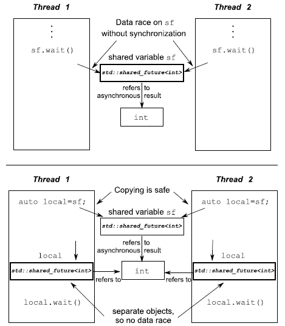

# Chaptor 04. Synchronizing Concurrent Operations

## 等待一个事件或条件 Waiting for an event or other condition

- **利用条件变量等待事件**
  在`condition_variable`头文件中定义了两种条件变量`std::condition_variable/std::condition_variable_any`，前者必须结合`std::mutex`，更灵活支持更多锁类型的后者可以结合符合要求的`mutex-like`对象，当然也因此有额外的开销

  注意：使用`condition_variable`被唤醒时存在**虚假唤醒spurious wakes**，可能使判断出错，因此需要`while`
- **利用条件变量构建线程安全队列**

    ```cpp
    void push(T new_value)
    {
      std::lock_guard<std::mutex> lk(mut);
      data_queue.push(new_value);
      data_cond.notify_one();
    }
    bool try_pop(T& value)
    {
      std::lock_guard<std::mutex> lk(mut);
      if (data_queue.empty())
        return false;
      value = data_queue.front();
      data_queue.pop();
      return true;
    }
    void wait_and_pop(T& value)
    {
      std::unique_lock<std::mutex> lk(mut);
      // wait(lock, func)首先检查是否满足条件，即func()是否返回true
      // 若不满足，则将传入的锁lock释放，并将自身线程加入data_cond的等待队列
      // 一旦另一线程使用了notify_one()则自身被唤醒并且尝试获得锁lock
      // 获得锁后再次检查即func()，此时若返回true就执行，否则继续释放锁并等待
      data_cond.wait(lk, [this] { return !data_queue.empty(); });
      value = data_queue.front();
      data_queue.pop();
    }
    ```

- **[惊群现象](https://en.wikipedia.org/wiki/Thundering_herd_problem)**
  当多个线程都在等待时，哪个线程会被`notify_one()`唤醒并执行是没有保证的（内核来决定），使用`notify_all()`可以唤醒某个条件变量上的所有等待线程
  
  而若等待线程较多，只有一个线程能真正进入临界区执行，此时其他被唤醒线程在竞争失败后只能重新进入等待，从而引起**大量上下文切换，系统性能波动**

## 等待一次性的事件 Waiting for one-off events with futures

一次性的事件被称为`future`，有两类`future`为`std::future<>/std::shared_future<>`定义在`future`头文件中

一个`std::future`的实例是相关联事件（代表事件的数据是模板参数，当没有数据时可以`<void>`）的唯一实例，而一个`std::shared_future`的实例可能是相关联事件的多个实例之一，因此对于`shared_future`而言，条件满足的一刻所有实例都会处于唤醒就绪

注意：`future`类本身不提供同步访问，因此需要额外的线程安全机制来保护`future`本身

- **从后台任务中返回值**
  使用`std::async`来启动一个异步任务而不是等待`std::thread`，之后通过调用`.get()`来获得`future`，若没有准备好，则调用`.get()`的线程被阻塞直到`future`就绪

    ```cpp
    // future<int>的模版参数int就是函数的返回值int
    // async另外第二个参数可以是
    // std::launch::async：总是在另一个线程中异步完成
    // std::launch::deffered：延迟执行，在调用get()时在当前线程中完成
    std::future<int> the_answer = std::async(find_the_answer_to_ltuae);
    do_other_stuff();
    // get()获取返回值，若未就绪就阻塞等待
    std::cout << "The answer is " << the_answer.get() << std::endl;
    ```

  注意：`async`返回的`future`若未被`wait`则在**销毁时会等待`async`运行完**，保证了线程不会泄露；其他情况下获得的`future`被销毁可能导致线程泄漏问题
- **与一个`future`对象相关联**
  `std::packaged_task<>`使`future`与可调用对象相关联，当建立`std::packaged_task<>`对象后，使用对象就会调用相关的可调用对象并使得`future`就绪（可调用对象准备好返回值），其模版参数是函数签名并且允许隐式类型转换，例如`std::packaged_task<double(double)>`可以接受一个传入`int`返回`double`的可调用对象

    ```cpp
    template<typename Func>
    std::future<void> post_task_for_gui_thread(Func f)
    {
      std::packaged_task<void()> task(f);
      auto res = task.get_future();
      std::lock_guard<std::mutex> lk(m);
      tasks.push_back(std::move(task));
      return res;
    }
    ```

- **做出`(std::)promises`**
  `std::packaged_task`包装一个可调用的对象，并且允许异步获取该可调用对象产生的结果
  通过使用`std::promise<T>`设置一个`T`类型的值，可以使其随后被与`std::promise`对象相关联的`std::future`对象获取，可以通过对`std::promise<T>`使用`get_future()`来获得相关联的`std::future`对象

    ```cpp
    // 有接收数据则接受并通过std::promise来设置值
    if (connection->has_incoming_data())
    {
      data_packet data = connection->incoming();
      std::promise<payload_type>& p = connection->get_promise(data.id);
      // 此时相关联的std::future调用get()时就会得到相应的payload
      p.set_value(data.payload);
    }
    ```

- **为`std::future`储存异常**
  当`std::future`对象相关联的可调用对象抛出异常，则这个异常值就会被存储在`std::future`中，以待后续调用.`get()`时看到这个异常，同理适用于`std::packaged_task/std::promise`，不过`std::promise`需要显式调用`set_exception()`而不是`set_value()`来设置异常

  注意：直接销毁与`std::future`关联的`std::promise`或`std::packaged_task`也会使得`std::future`存入一个异常，并且线程可能会泄露
- **被多个线程等待**
  由于`std::future`是为`call_once`准备的，因此多个线程读取同一个`std::future`会出现竞争，也是没有意义的，因为一旦被`get()`取走数据之后，`std::future`就不再有数据了，多个线程读取一个`std::future`导致UB，被多个线程等待的数据可以使用`std::shared_future`

  

## 有限时间等待 Waiting with a time limit

- **时钟 clock**
  与时间相关的库定义在头文件`chrono`中，注意**区分稳定时钟steady clock和不稳定时钟unsteady clock**，前者例如`std::chrono::steady_clock`保证始终每秒的计数值并且不可调，而后者例如`std::chrono::system_clock`则不保证每秒的计数值且可调进而可能会出现顺序上后调用的`now()`却返回了一个比前调用的`now()`更早的值（例如修改系统时间）
- **时长 duration**
  
    ```cpp
    // 第一个参数指存储的形式，第二个参数指每个单位代表多少秒
    // 例如这里用short来记录分钟数，每分钟60/1=60秒
    std::chrono::duration<short, std::ratio<60,1>>
    std::chrono::duration<double,std::ratio<1,1000>>
    // 实现时间之间的截断转换
    std::chrono::duration_cast<>
    ```

- **时间点 time point**
  `std::chrono::time_point<>`来建立基于不同时钟不同单位的时间点，利用稳定时钟建立时间点来控制时长，不稳定时钟不适合处理时长问题

    ```cpp
    auto const timeout = 
        std::chrono::steady_clock::now() + std::chrono::milliseconds(500);
    std::unique_lock<std::mutex> lk(m);
    while(!done)
    {
      // 利用wait_until配合稳定时钟
      if (cv.wait_until(lk,timeout) == std::cv_status::timeout)
        break;
    }
    ```

- **接受超时的函数**
  `std::mutex`和`std::recursive_mutex`不支持超时阻塞，`std::timed_mutex`和`std::recursive_timed_mutex`支持，后两者可以使用`try_lock_for()`或`try_lock_until()`来支持超时操作

## 利用同步简化代码 Using synchronization of operations to simplify code

- **利用futures进行函数式编程**

    ```cpp
    // 利用futures进行函数式编程并行快排算法
    template<typename T>
    std::list<T> parallel_quick_sort(std::list<T> input)
    {
      if (input.empty())
      {
        return input;
      }
      std::list<T> result;
      result.splice(result.begin(), input, input.begin());
      T const& pivot = *result.begin();
      auto divide_point = std::partition(
          input.begin(),
          input.end(),
          [&](T const& t) { return t < pivot; });
      std::list<T> lower_part;
      lower_part.splice(lower_part.end(), input, input.begin(), divide_point);
      // 分割后较小的部分数据用另一个线程进行排序
      // 若线程过多，则根据库的实现，会使得新线程非异步执行，
      // 而是在调用get()后阻塞该线程执行新线程（依赖于库的具体实现）
      auto new_lower = std::async(&parallel_quick_sort<T>, std::move(lower_part));
      // 分割后较大的部分数据用本线程递归调用算法进行排序
      auto new_higher = parallel_quick_sort(std::move(input));
      result.splice(result.end(), new_higher);
      result.splice(result.begin(), new_lower.get());
      return result;
    }

    // 不使用async而是自己封装一个packaged_task，这更有利于在线程池中运作
    template<typename F,typename A>
    std::future<std::result_of<F(A&&)>::type>
    spawn_task(F&& f, A&& a)
    {
      typedef std::result_of<F(A&&)>::type result_type;
      std::packaged_task<result_type(A&&)>
      task(std::move(f)));
      auto res = task.get_future();
      // 下面新建线程的部分可以改为提交task给线程池
      std::thread t(std::move(task),std::move(a));
      t.detach();
      return res;
    }
    ```

- **消息传递message passing来同步操作**
  将每个线程建模为一个有限状态自动机FSM，通过消息传递来改变状态自动循环运行，每个线程独立运行在一系列状态中，一旦接受到消息就根据情况改变状态做出响应并在状态中进行迁移，这种程序设计方式称为**Actor模型**
