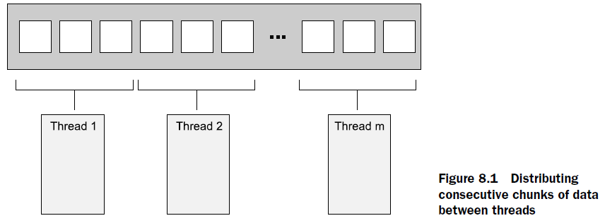
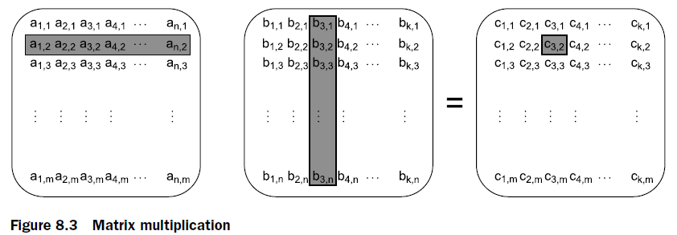

# Chapter 08. Designing Concurrent Code

## 将任务分割成多个线程完成的技术

1. **预先分割任务**

  开始任务之前，首先根据任务规模分割成一系列小的任务，然后通过一系列并发线程来处理每个小任务，参考Message Passing Interface, MPI和OpenMP框架，这**要求预先就知道这些小任务**

  

1. **递归分割任务**

  部分任务在开始前无法分割，而在**不断处理过程中可以被分割**，例如快排算法，一开始无法分割，而当一次排序后大小元素被分到两个区间，此时就可以分割成两个区间

1. **根据任务类型分割任务**

   不同的任务由不同的线程来处理，每个线程专注于一个类型的任务，类似Actor/CSP的并发编程范式，将**每个线程仅用来处理单一类型的任务**，分离每个线程的注意点（separation of concern），简化代码

   另外若不同线程间频繁通信为了解决一个事件，则可以考虑抽离出一个新线程专注于这个事件，若少数几个线程频繁通信但与其他线程较少通信，则可以考虑合并这些线程为单独一个线程

   进一步可以将一个由一系列操作（子任务）组成的任务交由仅分别处理这一系列操作的线程，形成**流水线式的pipeline任务处理**

## 影响并发效率的因素

1. **处理器数量**
   物理核心数和逻辑核心数存在差别，但是多线程编程时可以简单按照逻辑核心数来进行，同时运行**超过逻辑核心数的线程称为过度并发oversubscription**，可以用`std::thread::hardware_concurrency()`来确认当前环境可支持的线程数，但是注意系统中可能有其他程序在运行，因此物理可支持的线程数未必是最佳的并发线程数（`std::async`可以由C++运行时库来选择并发线程的调度，相对来说更优化），同时越多的处理器数量也可能导致更严重的竞争
2. **数据竞争data race和缓存跳动cache ping-pong**
   当被竞争的数据被访问的间隔足够短时，可能会出现许多线程在等待访问竞争数据，每次只有一个线程获得访问权限，**线程总在相互等待，总体上使得并发执行变成了串行执行**，称为高竞争high contention，反之称为低竞争low contention
   数据被CPU使用时会首先被缓存，而当数据被修改时，这一修改会从一个CPU的缓存逐步扩散使得所有线程都能知道被修改后的新值（涉及可见性和顺序，**缓存一致性协议**，例如MESI协议），因此其他CPU上的线程需要等待这个扩散过程（约耗时数百指令周期），而当高竞争下频繁修改数据时就会产生**数据不断被缓存后被CPU修改又立即反过来修改缓存这样的来回的ping-pong现象**，严重影响性能
   注意：对`atomic`类型的反复修改往往会引起处理器级的串行（乐观机制，如果频繁修改导致几乎所有CPU在等待缓存同步），而对`mutex`类型的反复修改往往会引起操作系统级的串行（悲观机制，一旦无法获得，当前线程就会睡眠等待），后者对性能的影响小于前者，但是依然会导致性能变差
3. **伪共享false sharing**
   即使数据只被单一线程访问，也可能由于伪共享导致出现cache ping-pong，例如一组数组`int array[2]`，足够小使得整个数组在一个高速缓存的块中，假定线程1只访问`array[0]`元素，线程2只访问`array[1]`元素，**虽然没有竞争，但是由于这些被不同线程访问的元素都在同一个高速缓存块中，导致每次访问都有可能要使这一块缓存在CPU的缓存之间迁移，形成cache ping-pong**，这一系列现象就是false sharing，解决方案就是将每个线程涉及的数据聚合组织在一起以使得不同线程的数据在不同的缓存块中，即**不同线程访问的数据通过padding等方式使数据对齐不同的缓存块cacheline alignment**
4. **局部性locality**
   与伪共享同理，若一个线程的数据分布在多个缓存块中，且每个缓存块仅使用少量数据，则在缓存载入时需要更多时间，造成空间浪费和性能惩罚
5. **过度并发与上下文切换**
   过多的线程或进程会导致系统在线程切换或进程切换时消耗掉更多的资源

## 为并发性能设计数据结构

核心在于处理好**数据竞争contention、伪共享false sharing、数据接近度data proximity**这三个问题

1. **分割数组元素**
   例如由于缓存和数据线性存储的特征，嵌套循环可能会有大循环在内/外表现出不同的性能，即数据访问模式对性能的影响，根本来说就是考虑时间局部性和空间局部性来进行数据分割，**尽可能让线程每次访问的数据都在上次访问的数据附近**会有最好的缓存命中效果
   
2. **其他数据结构的访问模式**
   与数组同理，需要考虑：
   - 优化数据粒度，让**每个线程访问自己的数据**而不是互相访问
   - 尽可能**减少共享**（[参考seastar的shared-nothing架构](https://github.com/JasonYuchen/notes/blob/master/seastar/Message_Passing.md)）从而避免数据同步带来的开销
   - 合理组织数据的内存布局，应**避免伪共享**
   > Try to adjust the data distribution between threads so that data that’s close together is worked on by the same thread.
   > Try to minimize the data required by any given thread.
   > Try to ensure that data accessed by separate threads is sufficiently far apart to avoid false sharing.

   对于锁来说，需要考虑：
   - **锁与需要保护的数据接近**：有利于线程一旦获得锁就可以与已经载入缓存的数据交互，但是当其他线程试图获得锁时就需要访问锁的内存，会有性能惩罚
   - 锁与当前线程操作的数据接近时，其他线程一旦试图获得锁就会导致当前线程与锁共享缓存块的数据失效（这是由于`mutex`底层是由原子操作实现的），即使共享缓存快的数据并没有竞争也会有性能惩罚产生cache ping-pong，即伪共享

    ```cpp
    // 也可以采用编译器指令 __attribute__((aligned(cache_line)))
    struct protected_data {
      std::mutex m;
      // 填充缓存，使得锁与访问的数据不共享同一缓存块
      char padding[65536];
      my_data data_to_protect;
    };

    struct my_data {
      data_item1 d1;
      data_item2 d2;
      // 填充缓存，使得相邻的my_data对象不共享同一缓存块
      char padding[65536];
    };
    my_data some_array[256];
    ```

## 其他并发编程的考虑

1. **并发算法的异常安全**
   一旦抛出异常，`thread`对象也会随着栈展开被摧毁，导致子线程调用`terminate()`，整个程序崩溃，异常安全需要考虑可能抛出异常的代码的处理以及子线程的`join`（若没有`join`会导致子线程结束调用`terminate()`）

   可以使用`std::future`来异步执行子线程：当有异常抛出时会被暂时保存在`future`中，等到调用`.get()`时才会继续抛出，但是需要注意在线程创建和线程`join`之间抛出异常时确保所有能`join`的线程都`join`，否则线程运行完且没有`join`会导致调用`terminate()`（可以通过RAII管理）

   注意当**一个`future`对象未被`wait`即被销毁时，析构函数会等到对应线程结束再进行销毁**，此时就不用在外部代码join对应线程，避免了潜在的线程泄露问题
2. 可扩展性和Amdahl定律
3. 使用多线程来隐藏延迟
   - 例如pipeline并发运行，`A->B`，环节`A`是I/O密集耗时长的，环节`B`是轻量快速的，若`A, B`各有一条线程运行，则显然`B`经常需要等待`A`传送任务，此时通过多线程并发运行`A`环节来减小B的等待时间，就是多线程隐藏延迟
   - 例如线程在等待I/O，则如果利用异步I/O，则其他线程可以继续完成任务
   - 例如线程等待其他线程完成任务，若都忙则可以自身线程来执行要等待的任务
4. 并发提高系统响应
   单一的GUI线程来响应用户，新任务通过子线程来完成，保证事件循环的高效
