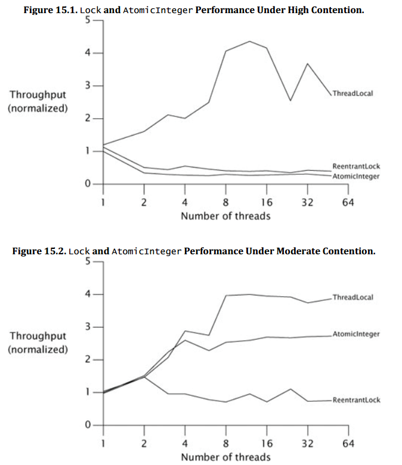

# Chapter 15. Atomic Variables and Non-blocking Synchronization

## 1. Disadvantages of Locking

- **高优先级线程被低优先级线程阻塞**
- **线程切换的开销**

## 2. Hardware Support for Concurrency

- **悲观方式 Pessimistic approach**
  互斥锁就是悲观锁，无论是否有其他线程在访问，都首先获得锁，存在额外开销
- **乐观方式 Optimistic approach**
  乐观锁，假设没有其他线程在访问，直接去访问，直到要做修改时再获得锁，如果得不到（有人在修改）就回滚并重试，并发度更高
- **Compare and Swap, CAS**
  对一个内存V进行访问，如果V的值是传入的期待值A，就设为传入的修改值B，如果不符合A就什么也不做，任意情况都会返回V当前的真实值，**CAS是原子操作并且是乐观模式**
- 非阻塞计数器
  
  ```java
  @ThreadSafe
  public class CasCounter {
    private SimulatedCAS value;
    public int getValue() {
      return value.get();
    }
    public int increment() {
      int v;
      do {
        v = value.get();
      } while(v != value.compareAndSwap(v, v+1));
      return v + 1;
    }
  }
  ```

需要特别注意的是在**高度竞争的情况下，原子变量的性能并不优秀**，大量CPU被浪费在了重试上，其最佳场景是中等烈度的冲突：



## 3. Atomic Variable Classes

原子变量比`volatile`s更好，使用原子引用`AtomicReference`可以通过原子的替换对象引用使得线程安全的一次更新对象内的多个普通变量：

```java
public class CasNumberRange {
  @Imuutable
  private static class IntPair {
    final int lower, upper;
    // ...
  }
  private final AtomicReference<IntPair> values = new AtomicReference<IntPair>(new IntPair(0, 0));
  /* getter/setter */
  public void setLower(int i) {
    while(true) {
      IntPair oldv = values.get();
      if(i > oldv.upper) throw // ...
      IntPair newv = new IntPair(i, oldv.upper);
      if(values.compareAndSet(oldv, newv))
        return;
    }
  }
}
```

## 4. Non-blocking Algorithms (Lock-free Algorithms)

有锁的算法会因为某线程持有锁而在等待IO/事件等导致其他需要锁的线程被阻塞

- 非阻塞栈 A Non-blocking Stack

  ```java
  @ThreadSafe
  public class ConcurrentStack<E> {
    AtomicReference<Node<E>> top = new AtomicReference<Node<E>>();
    public void push(E item) {
      Node<E> newHead = new Node<E>(item);
      Node<E> oldhead;
      do {
        oldHead = top.get();
        newHead.next = oldHead;
      } while (!top.compareAndSet(oldHead, newHead));
    }
    public E pop() {
      Node<E> oldHead;
      Node<E> newHead;
      do {
        oldHead = top.get();
        if(oldHead == null)
          return null;
      } while (!top.compareAndSet(oldHead, newHead));
      return oldHead.item;
    }
  }
  ```

- 非阻塞队列 A Non-blocking Linked Queue
  `TODO`
- 原子字段更新器 Atomic Field Updaters
  `TODO`
- **ABA问题**
  即从A变为B再变为A，可以视为没有发生变化吗，可以用**版本号**来解决，类似MVCC(multi version concurrency control)
