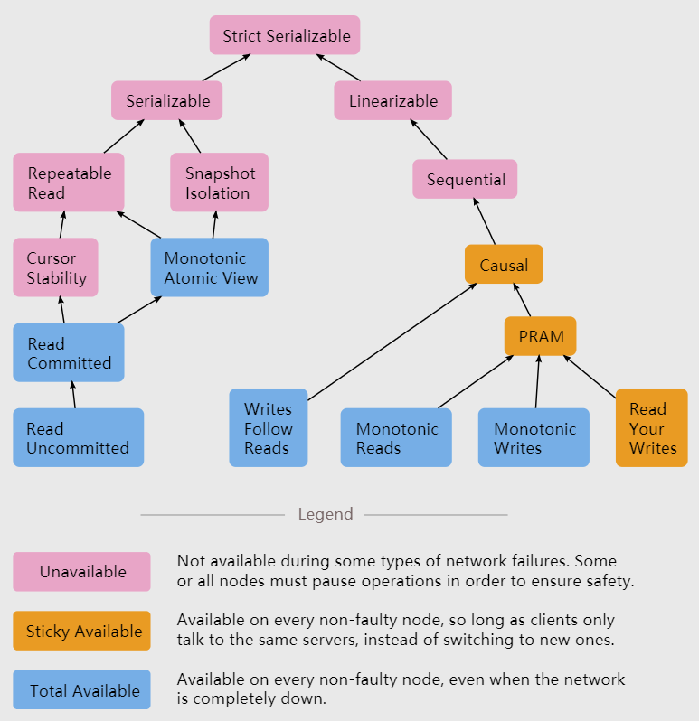

# Consistency Models

[original post](https://jepsen.io/consistency)

[material: Highly Available Transactions: Virtues and Limitations](https://amplab.cs.berkeley.edu/wp-content/uploads/2013/10/hat-vldb2014.pdf)

[Short version for strong consistency models](Strong_consistency_models.md)

------------------

- [Strict Serializable](Strict_Serializability.md)

------------------

- [Seriazable](Serializability.md)
- [Repeatable Read](Repeatable_Read.md)
- [Snapshot Isolation](Snapshot_Isolation.md)
- [Cursor Stability](Cursor_Stability.md)
- [Monotonic Atomic View](Monotonic_Atomic_View.md)
- [Read Committed](Read_Committed.md)
- [Read Uncommitted](Read_Uncommitted.md)

------------------

- Linearizable `TODO`
- Sequential `TODO`
- Causal `TODO`
- PRAM `TODO`
- Writes Follow Reads `TODO`
- Monotonic Reads `TODO`
- Monotonic Writes `TODO`
- Read Your Writes `TODO`

------------------

## 基本概念 Fundamental Concepts

### 系统 Systems

系统具有逻辑**状态state**，并且随着时间而变化，**分布式系统是并发系统concurrent system的一种类型**，因此绝大多数对并发系统的描述可以直接应用到分布式系统上，但是在**可用性availability**和**性能performance**上，两者有重要差别

### 进程 Processes

**进程是一个逻辑上单线程的程序**，来运行计算和操作，并且进程自身不是异步的，通过**独立的一系列进程来对异步计算进行建模**

逻辑上单线程意味着进程同一时刻内只会做一件事，实际实现可以是多线程的程序，这里只是为了建模而对进程的概念进行限制，在不同的文献中，进程往往也有其他同义词（但含义根据上下文可能有细微差别）例如nodes，hosts，actors，agents，sites，threads等

### 操作 Operations

操作使得系统可以从一个状态转换到另一个状态**state transition**

- 函数，参数，返回值 Functions, Arguments & Return Values
- 调用和完成时间 Invocation & Completion Times
  操作的调用是需要时间的，因此一个函数的完成有两个关键时间点，调用时间和完成时间，并且假定有一个全局时钟就可以对所有操作进行根据时间的排序
- **并发 Concurrency**
  由于操作需要时间，因此两个操作可以在时间上重叠，这就是并发，注意一个进程是逻辑上单线程的，因此一个进程内不会有并发的操作
- 宕机 Crashes
  如果一个操作由于某些原因没有完成（例如超时或断电），即没有完成时间completion time，则必须**被考虑为和调用时间invocation time比其晚的所有操作，都是并发的**，并且根据逻辑上单线程的约定，宕机的进程当前操作没有完成因此**后续不会再执行任何新的操作**

### 历史 Histories

**历史包含了操作和并发关系concurrent structure**，通常历史被表现为一组操作，每个操作有一个调用时间和完成时间

### 一致性模型 Consistency Models

**并发模型就是一组历史**，并且根据不同的约定定义这组历史在系统中是"good"还是"legal"，例如一个历史"violates serializability"，即这个历史不属于可序列化历史serializable histories，并发模型包含了一组所有许可的操作历史

> A consistency model is the set of **all allowed histories of operations**

对于文首的并发模型关系图，箭头代表可以推出，即被箭头所指的模型是发出箭头模型的子集，并且通常**对约束越多的模型认为越强stronger，对约束越宽松的模型认为越弱weaker**，以及不同的模型之间不一定能直接比较
