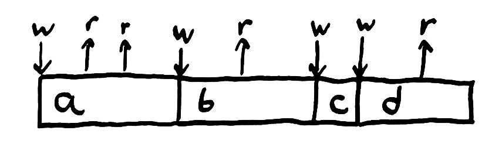
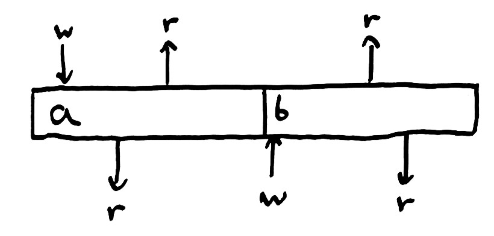
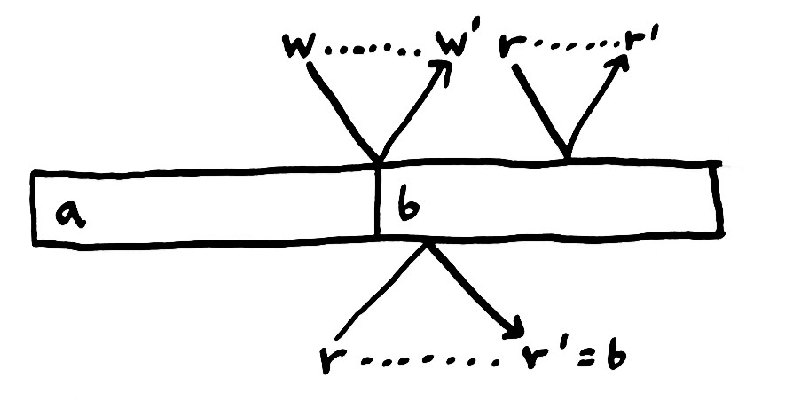
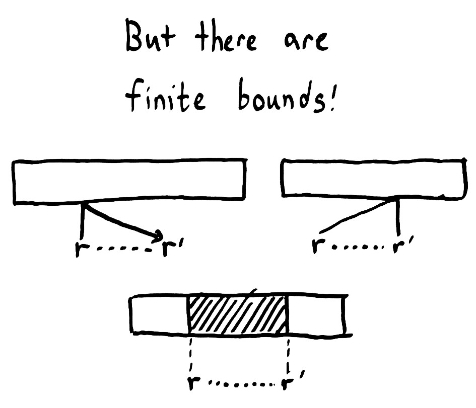
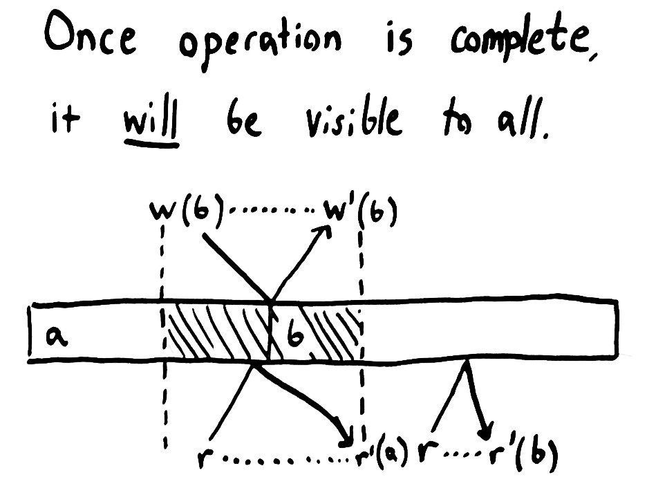
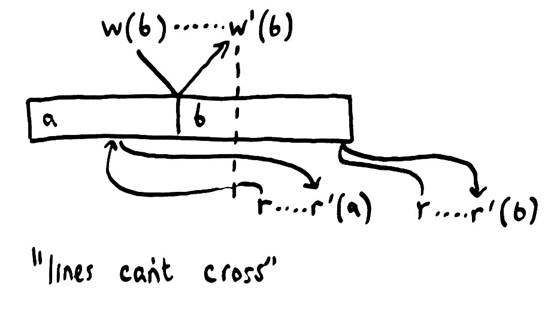
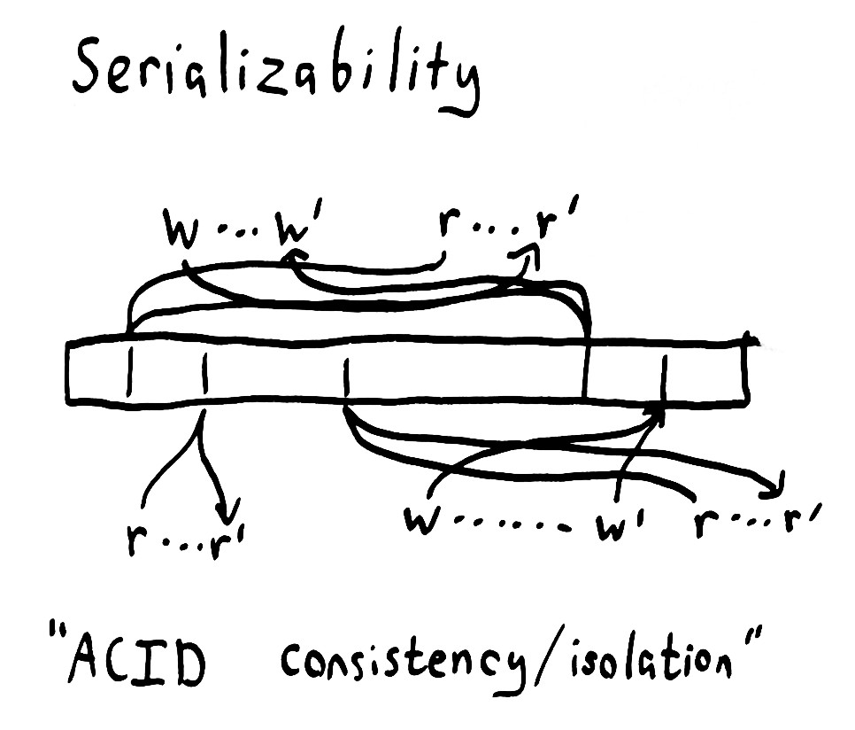
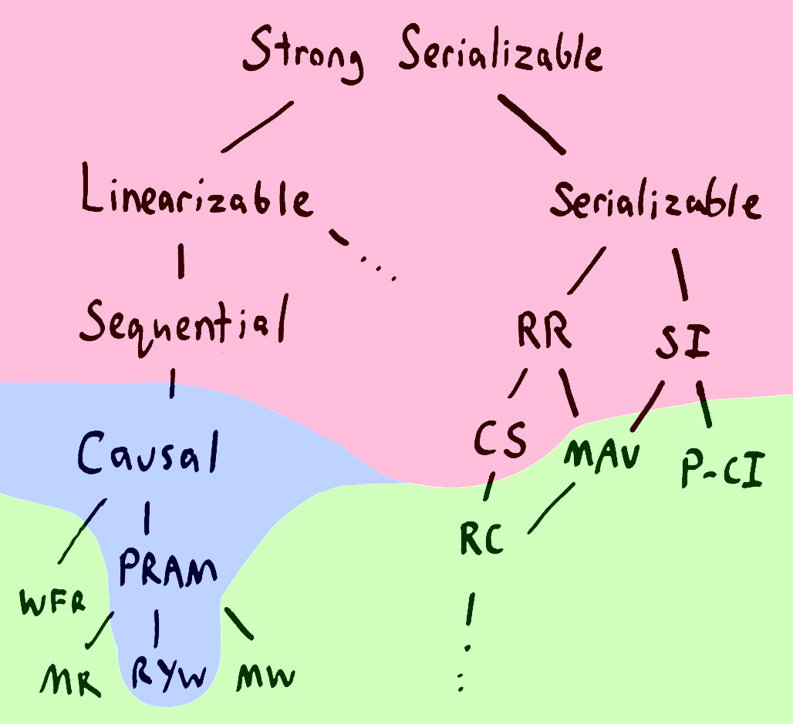

# Strong consistency models

[original post](https://aphyr.com/posts/313-strong-consistency-models)

## 正确性 Correctness

假定系统是由状态state组成，并且通过一系列操作operation可以将系统从一个状态转换为另一个state transition

如下图的操作历史可以获知，正确的系统应该会read出`aabd`，当我们write一个变量时，则后续的read都能反应这个值，即**read能获得最新的值**，当read返回的不是最新的值时，这个系统就是错误的，这种单个变量单个值的系统称为寄存器register



从而我们可以根据这种方式定义**系统的正确性correctness：给定规则rules，当系统的操作历史history总是符合这些规则时，系统就是正确的，而所谓的规则就是一致性模型consistency model**

> A consistency model is the set of **all allowed histories of operations**

## 并发历史 Concurrent histories

假定现在有图中上下两个processes在并发运行，则前述的register模型就会被打破，即上面的process会读出`ab`而`b`并不是该process最近写入的，为了能够**描述processes并发的模型（实际情况中总是多进程并发的），一个process可以read出变量最新的值而不在乎是哪个process写入的**



## "光锥" Light cones

能够描述processes并发的模型还不够，因为现实世界里数据的**read/write并不是瞬间完成的**，而是需要时间，就好像图中发起操作是入射光，到达系统的某一点，随后返回结果是反射光，从而完成整个操作（如同光锥），即**一个操作有调用时间invocation time和完成时间completion time**；并且不同processes的不同operations速度不同，体现在入射反射角度大小的不同，即调用时间和完成时间也不同



- **如果基于invocation time**，假如图中bottom-process的`read`比top-process的`write`要早但是抵达系统的点bottom比top要晚，就会出现read到`b`而不是read invocation时的最新状态`a`
- **如果基于completion time**，假如图中bottom-process的`read'`比top-process的`write'`要晚但是抵达系统的点bottom比top要早，就会出现read到`a`而不是read completion时的当前状态`b`，

这两种情况都违背了能够描述processes并发的模型，因此继续**放宽relax**模型的限制，**允许并发操作可以读出这些操作结果的任意顺序**，即上述例子中bottom-process可以读出`a`或`b`，但是top-process一定只能读出`b`

## 线性一致性 Linearizability

虽然消息发送和接收可以出现延迟，但是不可能穿越时间，因此每一个**操作的invocation time和completion time一起构成了整个操作的屏障bounds**，如图中深色区域所代表的任意一个时刻都有可能是操作真正执行的时刻，这个区域存在重叠的操作才是并发的操作



假定有一个系统的全局状态，任意process都与该系统进行交互，并且所有操作都能在`[invocation, completion]`内原子完成atomically，这样的系统称之为具有**线性一致性Linearizability**

> Each operation appears to take effect atomically at some point between its invocation and completion

所谓的 *some point* 就是指**可串行化点serialization point**

注意上述要求都是**从外界视角来看**的，系统本身是否真正原子完成操作等实现并不是考虑的点



**线性一致性会导致一旦一个操作完成，所有processes都能看到这个操作的结果**，操作实际生效的时间点一定在completion time之前，因此所有在completion time之后发起的操作，其生效时间点一定在其invocation time之后，因此后续操作执行时的系统状态一定包含了前序操作的结果，从而线性一致性也保证了不会出现过期读stale read、不单调读non-monotonic read

## 顺序一致性 Sequential consistency

对线性一致性模型进行放宽限制，允许单个process的操作在系统中**生效的时间平移skew in time**，即允许操作实际生效的时间点在invocation之前（例如read到旧数据，如下图）或是completion之后（例如推迟write生效），但是**依然要保证每个process内部所有操作依然有序**，从而获得了较弱的**顺序一致性模型Sequential consistency**



例如用户在twitter上发表了1,2,3三条消息，消息被缓存处理、写扩散，则关注该用户的用户并不一定能立即看到消息，而是在不同时刻看到1,2,3三条消息，但一定是1,2,3的顺序而不会乱序

## 因果一致性 Causal consistency

顺序一致性要求所有发生的操作在另一个process也按发生的顺序被观测到，但是有一些操作可能不需要那么严格的要求，例如`read(A) then read(B)`和`read(B) then read(A)`没有差别，但是`read(A) then write(B=A+1)`就不能被乱序为`write(B=A+1) then read(A)`，而这就是**因果一致性Causal consistency**的要求：**存在依赖的操作不能乱序，不存在依赖的操作不必按序，即独立的因果关系链independent causal chains相互之间可以并发执行**

## 可序列化一致性 Serializable consistency

假如一个操作**历史等价于某个原子顺序single stomic order（操作本身是原子性的），但是对于invocation time和completion time没有任何限制**，从而获得了**可序列化serializability**，如下图，top-process和bottom-process的所有操作等同于系统状态改变的一个原子顺序，但是其invocation time和completion time交错：



可序列化是弱weak的，例如下列操作的`print`可以输出`nil, 1 or 2`，因为只需保证等价于某个重排后的顺序，所以可能的发生方式很多，例如`x: 1->print->2`就会输出`2`：

```text
x = 1
x = x + 1
print x
```

可序列化是强strong的，例如下列操作的`print`一定会输出`3`，因为这些操作唯一可能的发生方式就是`x: nil->1->2->3->print`，否则就无法发生：

```text
print x if x = 3
x = 1 if x = nil
x = 2 if x = 1
x = 3 if x = 2
```

由于可序列化允许任意发生顺序（只要操作自己是原子性的），因此实际中**数据库领域提到的可序列化是强可序列化strong serializability**，而强可序列化的时间约束和线性一致性的约束是相同的

## 一致性的代价 Consistency comes with costs

CAP理论定义如下：

- **Consistency 一致性**：指**线性一致性linearizability**
- **Availability 可用性**：指每一个**发给未宕机节点的请求必须成功**，由于网络中断事件可以持续任意长的时间，因此节点不可以通过延迟响应来达到可用
- **Partition tolerance 分区容错性**：指由于网络中断等原因导致系统部分节点被隔离，出现分区，并且**现实情况下分区是一定会出现的**

**CAP认为三者只能牺牲其中一者以做到余下两者**，由于网络分区总是会出现，因此现实的系统**一定是AP或CP而不可能是CA**，下图中红色部分的一致性模型均不可能做到**完全可用fully available**：



放宽可用性的限制就可以实现更多的一致性模型，图中蓝色部分，例如强调请求总是发往固定的一个节点从而可以获得因果一致性causal consistency，读己之写read-your-writes consistency一致性

假如进一步放宽可用性要求能够完全可用，则可以做到图中绿色部分，例如单调读monotonic reads，单调写monotonic writes等

## 综合的方法 A hybrid approach

有一些算法的安全性依赖线性一致性，例如分布式锁服务，获得锁和释放锁必须全局有序totally ordered；而同时也有很多算法不需要线性一致性，最终一致性eventual consistency也可以被接受

**更强的一致性模型要求更多的协调和通信，因此导致更多的通信和延迟且性能受限**，例如现代CPU的内存模型就不是默认线性一致性的，内存操作会被重排reorder以提升性能，在实践中往往一个系统中会使用多种一致性模型，采用综合的方法在关键数据上保证线性一致性而在不敏感的部分采用更弱的一致性模型，以提升整体的系统性能
