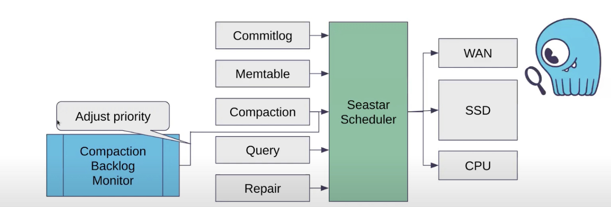
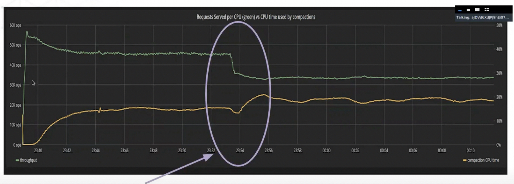

# Quarantine Database Tech Talks, 2020

[all talks with youtube links are listed here](https://db.cs.cmu.edu/seminar2020/)

## ScyllaDB: No-Compromise Performance

- [Low level architecture (thread-per-core) in seastar](https://github.com/JasonYuchen/notes/blob/master/seastar/Shared_Nothing.md)
- [Usrespace IO scheduler in seastar](https://github.com/JasonYuchen/notes/blob/master/seastar/Disk_IO_Scheduler.md)
- **Feedback based dynamic shares (IO scheduler) tuning in Scylla** (TODO: interesting)
  - Various **resource monitors** in Scylla to adjust the priority on the fly

  

  - A real example that when more resource available (released by green line), the utilization of yellow line is increasing soon and reaches **a new equilibrium**

  

- Native TCP/IP stack based on DPDK is not widely used
  Hard to deploy and hard to maintain in customer's datacenter
