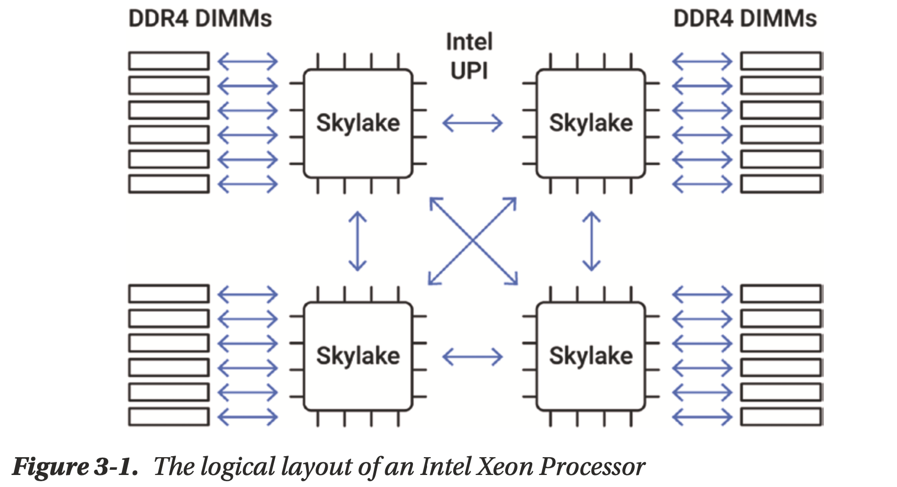
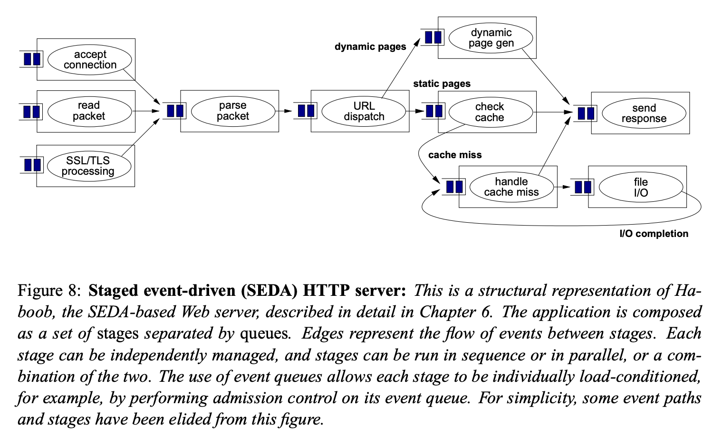
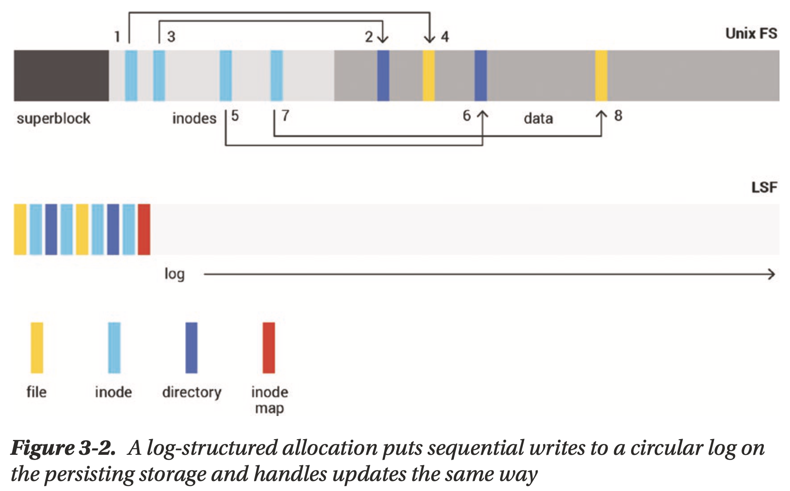
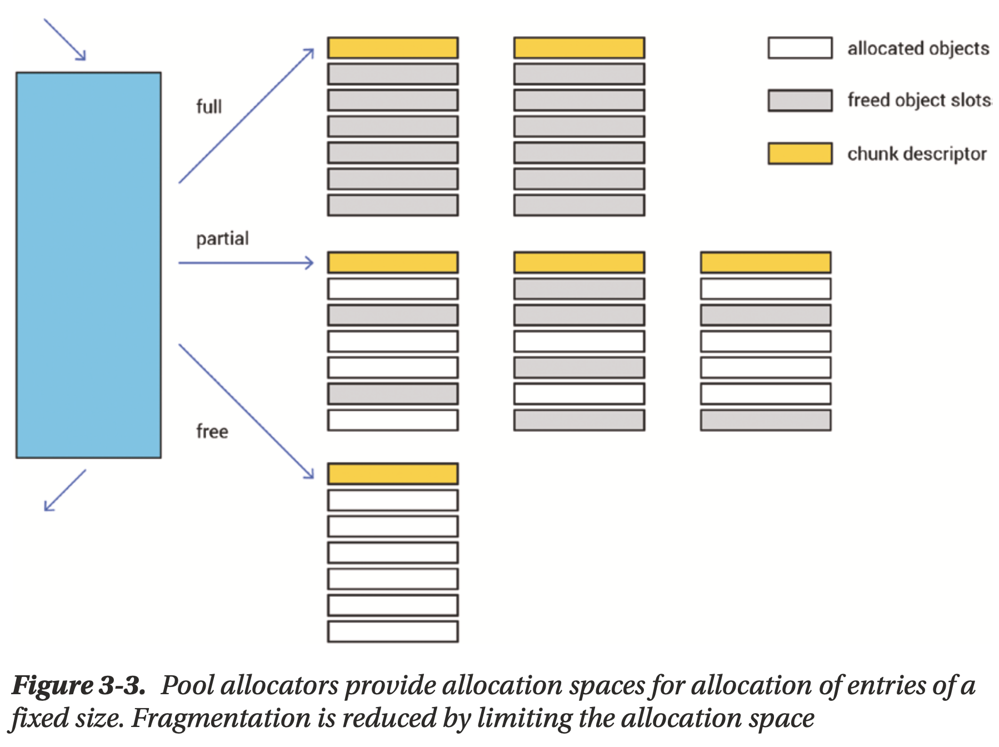
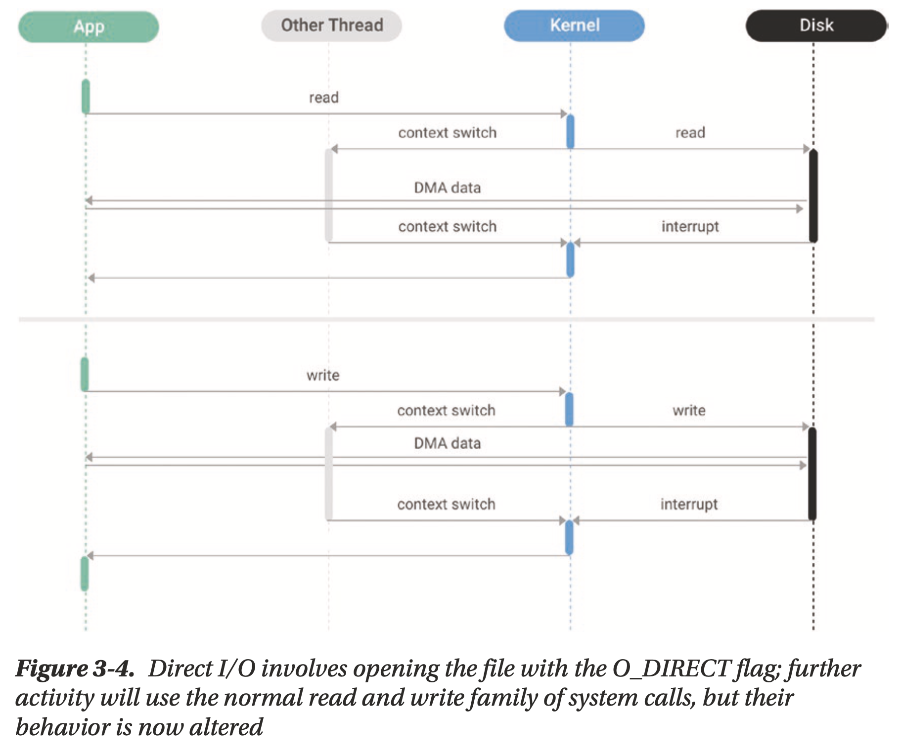
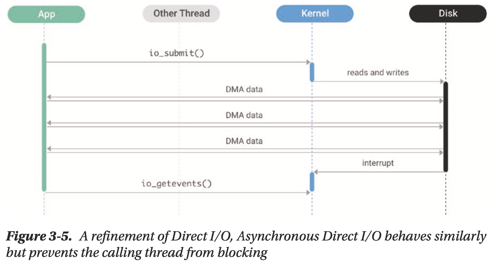
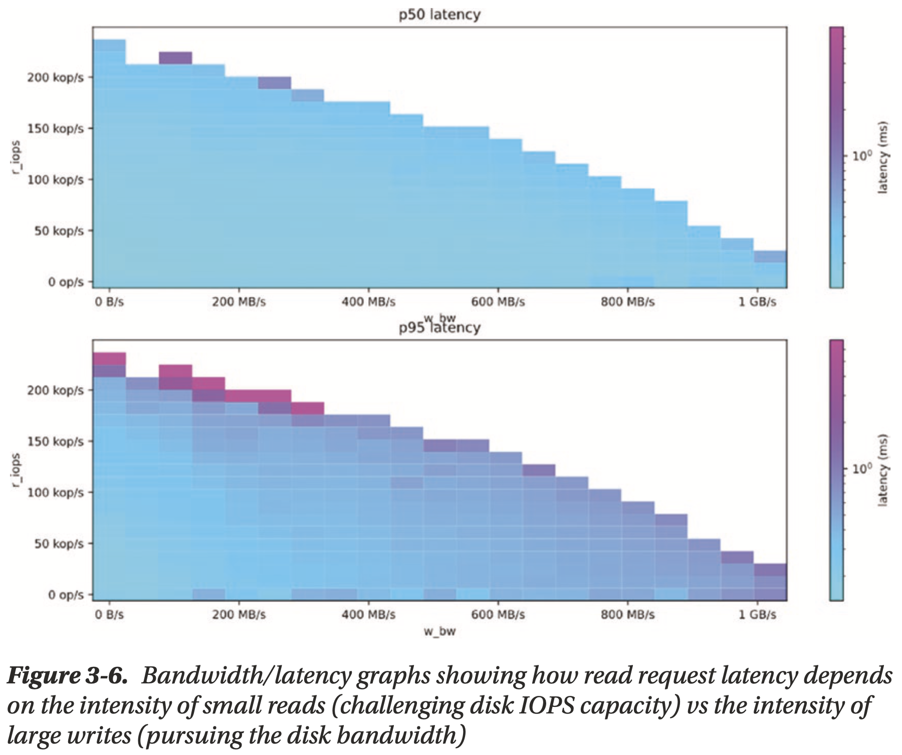

# Chapter 03 Database Internals: Hardware and Operating System Interactions

## CPU

### Share Nothing Across Cores

- Individual CPU cores aren't getting any faster
- the ongoing increase of CPU performance **continues horizontally**
- the performance of standard workloads depends more on the **locking and coordination across cores**
    - Coarse-grained locking: straightforward, low performant
    - Fine-grained locking: hard to program and debug, significant overhead even when no contention
    - **shared-nothing model** is perfectly worth considering

### Futures-Promises

An optimized implementations of futures and promises eliminates the costs associated with maintaining threads by the OS (**user-space CPU scheduling**):

- require no locking
- not allocate memory
- support continuations

### Execution Stages

- **reduce the amount of logic in the hot path**, but this has limitation, code "freezes" at some point
- **Staged Event-Driven Architecture, SEDA** splits the request pipeline into a graph of stages (a set of stages connected by queues) thereby decoupling the logic from scheduling (***rafter's processing module***) [SEDA paper](https://web.archive.org/web/20120704004128/http://www.eecs.harvard.edu/~mdw/papers/mdw-phdthesis.pdf)

    

## Memory

### Allocation

**log-structured allocation** in filesystems

- **append** sequential writes/updates to a circular log on the persisting storage
- **reclaim** blocks that became obsolete entries periodically to make more space for future writes

**pool allocation**

- per-thread basis to eliminate the locking and improve CPU cache utilization

### Cache Control

**I/O level** caching by kernel

- guide the kernel using `madvise(2)` and `fadvise(2)` system calls
- generally effective
- not tuned to a specific application
- cached data needs to be further converted/parsed into the object in memory, **in memory representation, IMR**

**object level** caching by application

- complicated cache management is all on the application side including:
    - cross-core synchronization
    - data coherence
    - data invalidation
- object collection should be able to handle millions/billions of those object

## I/O

### Traditional Read/Write

`read(2)` and `write(2)` system calls (involve page cache)

### mmap

memory-map the file into the application address space using `mmap(2)` system call (involve page cache)

### Direct I/O, DIO

Both traditional read/write and mmap involve the kernel page cache and defer the scheduling of I/O to the kernel, use `O_DIRECT` to **schedule I/O by application itself**

### Asynchronous I/O, AIO/DIO

Linux AIO or ***io_uring***

### Understanding the Tradeoffs

| Characteristic         | R/W       | mmap      | DIO      | AIO/DIO |
| ---------------------- | --------- | --------- | -------- | ------- |
| Cache control          | Kernel    | Kernel    | User     | User    |
| Copying                | Yes       | No        | No       | No      |
| MMU activity           | Low       | High      | /        | /       |
| I/O scheduling         | Kernel    | Kernel    | Mixed    | User    |
| Thread scheduling      | Kernel    | Kernel    | Kernel   | User    |
| I/O alignment          | Automatic | Automatic | Manual   | Manual  |
| Application complexity | Low       | Low       | Moderate | High    |

- Copying and MMU Activity
    - if data is in mmap cache, kernel is bypassed completely
    - if data is not in mmap cache, kernel may have to do page eviction
- I/O Scheduling
    - kernel cannot distinguish the **"priority" of write**, and may also cause a **write storm**
    - application has **better knowledge of its writ**e, and may schedule writes better than kernel
- Thread Scheduling
- I/O Alignment
    - kernel usually over-align to a 4096 boundary
    - application can issue 512 aligned reads to save bandwidth
- Application Complexity
- Filesystems vs. Raw Disks
    - management costs vs. performance gain, **prefer a mature and performant filesystem** (e.g. XFS, Ext4)
- Appending Writes

### How Modern SSDs Work

## Networking

The conventional networking functionality available in Linux is remarkably full-featured, mature, and performant. But Linux stack is constrained for truly networking-intensive applications:

- **Kernel space implementation**, separation of the network stack into kernel space causes **costly context switches and data copy**
- **Time sharing**, Linux relies on **costly interruptions** to notify the kernel to process new packets
- **Threaded model**, all data structures are protected with **locks**

### DPDK

**user space networking stack**

### IRQ Binding

**bind the IRQ processing to specific cores**, e.g. assigning cores from different NUMA nodes and teaching the NIC to balance the traffic between those cores using the receive packet steering facility
