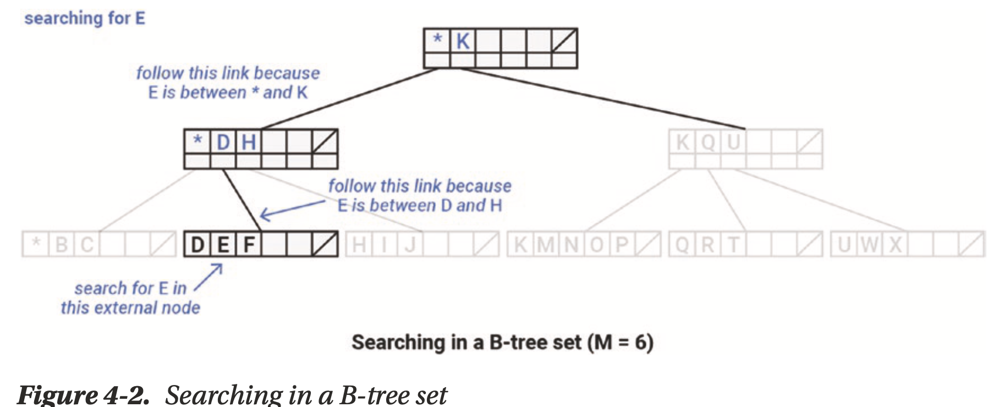
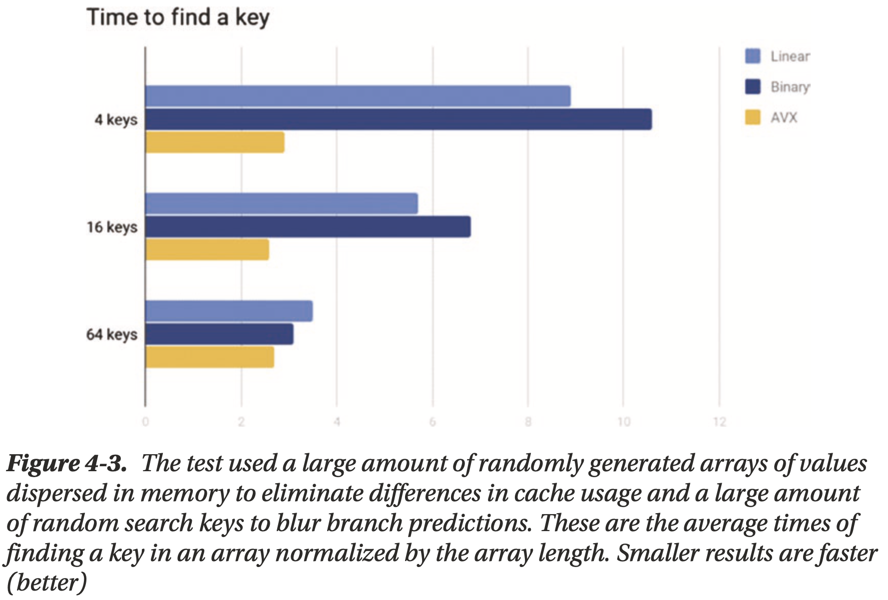
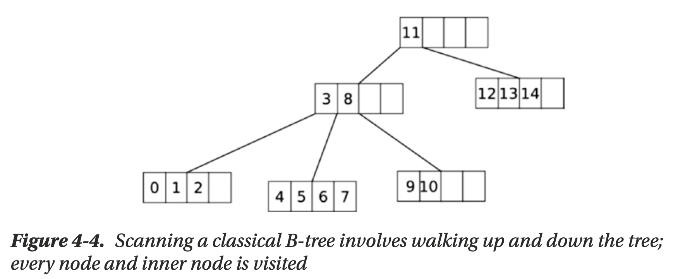
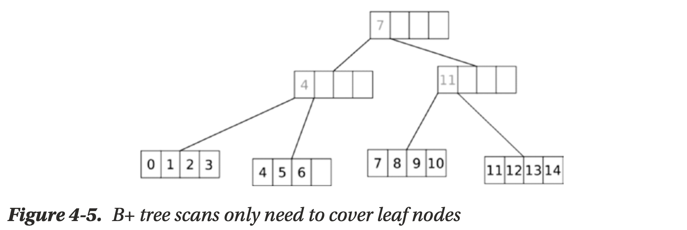

# Chapter 04 Database Internals: Algorithmic Optimizations

## Optimizing Collections

Maintaining large sets of objects in memory could consider using branchy trees like the **B- trees family**

## To B- or Not to B-Tree

B-trees are often a good choice for in-memory collections:

- **cache locality** as elements within the intra nodes are stored adjacently

    

- **lower branch mis-predications** as searching in the infra-node is linear

## Linear Search on Steroids

**SIMD-optimized linear search**

## Scanning the Tree

**B+-tree**

- **more memory** to keep same amount of elements
- **more cache friendly** when iterate over elements in a sorted manner

## The Secret Life of Separation Keys

Two ways of managing separation keys in a B+-tree:

- **light mode**, the separation key is independent from other key values
    - insertion and removal are a bit faster since they don't need to maintain separation keys
    - overheads if the key is not simple (strings, clustering keys, etc) as **copying** it might be costly
- **strict mode**, the separation key must coincide with some of other key values
    - avoid key copying by implementing separation keys as **references** on real ones
    - insertion and removal are complicated as they need to maintain the references
