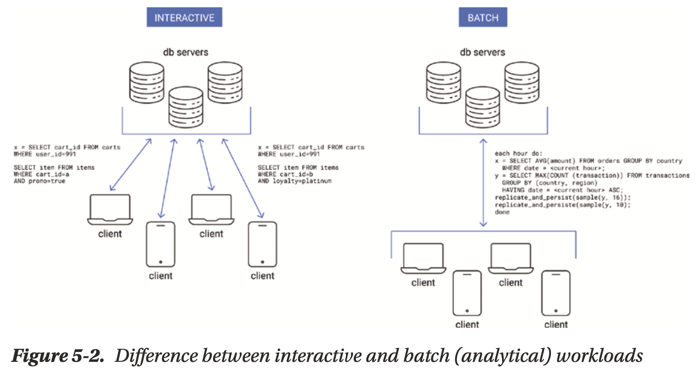
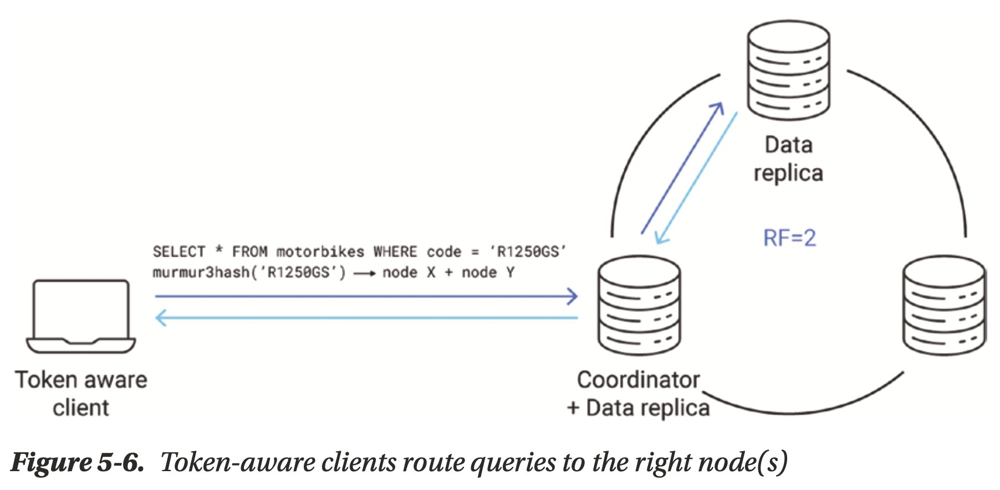

# Chapter 05 Database Drivers

## Relationship Between Clients and Servers

### Workload Types

- **Interactive Workloads**
    - latency guarantees
    - better to return an error in a timely manner than a correct response
    - often characterized by unbounded concurrency (hard to predict)
- **Batch (Analytical) Workloads**
    - latency insensitive
    - usually fixed, predictable concurrency
- **Mixed Workloads**

### Throughput vs. Goodput

***Goodput*** (**stable useful data transferred**) disregards **errors and churn-like redundant retries**

- **Shedding load** if X requests are already being processed, X is the **estimated capacity** of a database node
- **Refusing a request** if its **estimated memory** usage is larger then the database could handle at the moment
- **Probabilistically refusing a request** if  Y requests are already being processing, up to 100% if Y reaches X
- **Refusing a request** if its **estimated execution time** is larger than timeout, it may be timed-out anyway

## Timeouts

- **Client-Side Timeouts**

    configured in the database driver, drivers must be ready to handle stray, expired responses correctly

- **Server-Side Timeouts**

    A server-side timeout determines when a database node should start **considering a particular request as expired** to avoid wasting resources
    
    ***A rule of thumb***: a server-side timeout also exists and is **strictly shorter than the client-side one**.

## Contextual Awareness

### Topology and Metadata

- **Database takes the burden off its clients** and exposes a single endpoint (e.g. DynamoDB)
    - load balancing
    - overload prevention
    - retry mechanism
- **Drivers take the burden** to decide (e.g. ScyllaDB, Cassandra)
    - which node to connect
    - how many connections to keep
    - when to speculatively retry
    - when to close connections if nodes are suspected of malfunctioning
    - **cache the metadata to help execution**, e.g. use the table **schema** to do extra validation before sending out the data

Clients can

- **periodically fetch** topology information from the servers
- **subscribe** the events sent by the servers
- **take an active part in** one of the information exchange protocol, e.g. gossip
- take any **combination** of above methods

### Current Load

To distribute the load evenly and prevent unwanted spikes:

- Gathering **latency statistics** per each database connection in the driver
    - p99 latency?
- Exchanging information about **server-side caches**
    - cache full?
    - cache warm?
    - elevated traffic/latency regarding certain data items?
- Interpreting **server events**
    - overload errors?
    - timeout frequency?
    - goodput?

Drivers should try to amend the amount of data they send, the concurrency, the rate of reties, the speculative execution to keep the whole system in a healthy, balanced state

### Request Caching

Lifecycle of an **unprepared statement** (e.g. in CQL):

1. query string, e.g. `INSERT INTO mytbl(id, dscr) VALUES (42, 'forty two');`
2. packed into a CQL frame by the driver
3. CQL frame sent over the network
4. CQL frame received by the database
5. database interprets the frame and parses the query
6. database process the query

A **prepared statement** will be e.g. `INSERT INTO mytbl(id, dscr) VALUES (?, ?)`, and client only has to provide the arguments in `?`, databases will directly **bind** the values and process the prepared statement

## Query Locality

Drivers should take the client's location into account and **send the data directly to a nearby node** as long as all consistency requirements are fulfilled

Some databases apply a concept of **token awareness**, data will be directly sent to the owning node/CPU

## Retries

### Error Categories

- **Timeouts**: consider idempotence
    - read timeout
    - write timeout
- **Temporary errors**: retriable
    - node overload
    - dead node
    - temporary schema mismatch
- **Permanent errors**: non-retriable
    - incorrect syntax
    - authentication error
    - insufficient permissions

### Idempotence

retry policy must also consider the idempotence of the request, e.g. idempotent queries that can be safely retried:

- read-only requests
- conditional requests that have CAS characteristics
- requests with unique timestamps
- requests declared idempotent by `set_idempotent()`

### Retry Policies

- do not retry
- retry on the same database node
- retry on a different node
- retry with backoff
    - constant
    - linear
    - **exponential** (most common and good for overload prevention)

## Paging

**readahead** optimizations for paging

## Concurrency

- **Modern Hardware**
    - disk: HDD -> SSD
    - networking: multiple independent queues, receive-side scaling (RSS)
    - CPU: cores++++
    - OS: io_uring, SPDK, DPDK
- **Modern Software**
    - legacy thread pool model -> green threads, coroutine
    - asynchronous programming

## What to Look for When Selecting a Driver

- clear documentation
- long-term support and active maintainership
- asynchronous API
- decent test coverage
- database-specific optimizations
