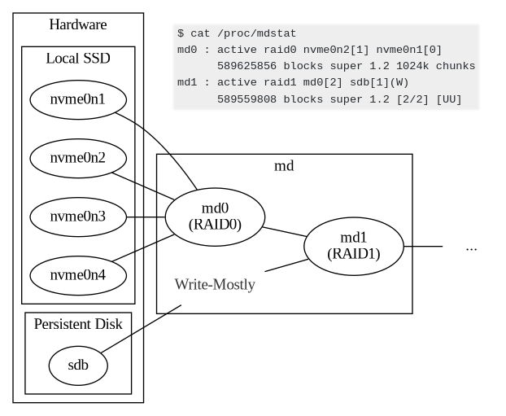

# Chapter 07 Infrastructure and Deployment Models

## Core Hardware Considerations for Speed at Scale

- Identifying the Source of Your Performance Bottlenecks
- Achieving Balance
- Setting Realistic Expectations

## Recommendations for Specific Hardware Components

- **Storage**: bandwidth for sequential r/w and IOPS for random r/w
    - **Disk Types**: locally-attached NVMe SSDs when latency is critical, only use HDDs for write-mostly workload

      [how discord combined hard disks](https://discord.com/blog/how-discord-supercharges-network-disks-for-extreme-low-latency)

      

    - **Disk Setup**: distributed databases often have internal replication mechanism, RAID (except RAID-0, which can boost disk I/O performance) is not always good for distributed databases
    - **Disk Size**: consider existing data with replication, anticipated near-term data growth, overhead of internal operations
    - **Raw Devices and Custom Drivers**: error prone, complex, lock-in
    - **Maintaining Disk Performance Over Time**: monitor the durability of disks, `fstrim`
    - **Tiered Storage**: allow the database to offload historical cold datasets to cheaper storage
  - **CPUs/Cores**: avoid overcommitting CPU resources if performance is a priority
  - **Memory/RAM**
    - **disk-to-memory ratio**: varies from database to database, e.g. ScyllaDB recommends 100, i.e. 1GB memory for 100GB disk data
    - **memory-to-core ratio**: e.g. ScyllaDB recommends 8, i.e. 8GB memory for 1 vCPU
  - **Network**: often overlooked
    - **server side**: ScyllaDB recommends 10Gbps, and use **CPU pinning** to mitigate the impact of hardware, e.g. network, interrupts
    - **client side**: be sure to check client networking, and be sure to place the application server as close as possible to the databases

## Considerations in the Cloud

- **NVMe disks may be cheaper**: compare the costs of NVMe backed-up storage against network-attached disks
- **instance types**: storage-intensive? network-intensive? CPU-intensive? prefer **benchmarks** against instance types running your workload
- **availability zone**: intra-zone, low cost but high outage risk; inter-zone, high cost but low outage risk

## Fully Managed Database-as-a-Service

- **security requirements**
- options for **observability and monitoring** platform
- **flexibility** with the deployment and **tunable options**
- **support** options and SLAs
- difficulty of **data migration**

## Serverless Deployment Models

**near-instant scaling** of database infrastructure and **pay for use**, charge you for what you actually consume

- risk of **cost overruns**, uncertainty of unpredictable costs
- **compatibility with existing infrastructure components**, e.g. message queueing, analytics tools, etc
- **troubleshooting** potential problems is often more challenging

## Containerization and Kubernetes

Containerization and Kubernetes may have **significant performance penalty** without mitigation strategies:

For containerization:

- ensure the containers have **direct access to the database's underlying storage**
- direct expose the **host OS network** to the containers
- allocate **enough resources** to the container if have questions, ensure these are not overcommitted

For Kubernetes:

- **dedicated and independent K8S nodes** for databases with **affinities** policy
- enable `hostNetworking` and set up the required kernel parameters, e.g. `fs.aio-max-nr` for ScyllaDB
- ensure database pods have a **guaranteed QoS class**
- use an **operator** to orchestrate and control the lifecycle of the database cluster
