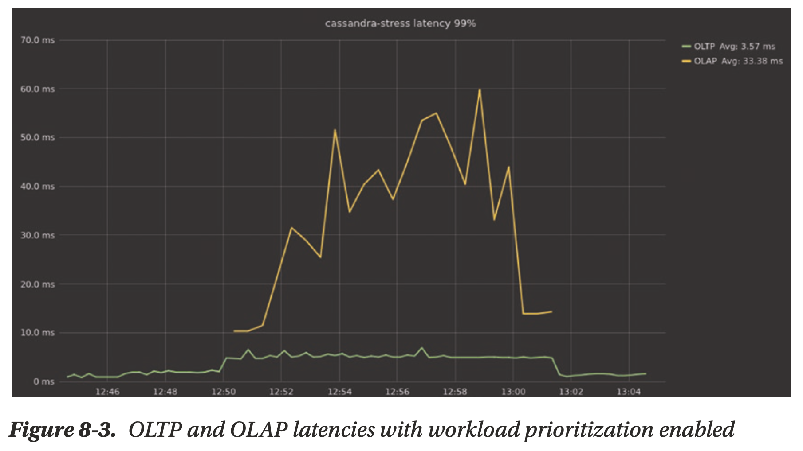

# Chapter 08 Topology Considerations

## Replication Strategy

- **Rack Configuration**
    - have as many racks as you have replicas
- **Multi-Region or Global Replication**
    - r/w use a consistency level that is confined to replicas within a specific datacenter (select local replicas)
    - client should prioritize close datacenter
- **Multi-Availability Zones vs. Multi-Region
    - multi-zone and multi-region are good for disaster recovery
    - cross-region traffic has higher cost
    - multi-region has the additional benefit of minimizing local application latencies in those local regions

## Scaling Up vs. Scaling Out

Aiming for the most ***powerful nodes*** and ***smallest clusters*** that meet your high availability and resiliency goals

- **System sprawl in horizontal scaling**, "near to linear scalability"
- **Less noisy neighbors**, a deployment of many small nodes is susceptible to the noisy neighbor effect in multi-tenancy cloud platforms
- **Fewer failures** as large nodes deliver a higher MTBF than small nodes
- **Datacenter density**
- **Operational simplicity**, small nodes multiply the effort of real-time monitoring and periodic maintenance

[ScyllaDB Heat Weighted Load Balancing](www.scylladb.com/2017/09/21/scylla-heat-weighted-load-balancing)

## Workload Isolation

- **Physical isolation**: entirely isolate one workload from another, double cost
- **Logical isolation**: e.g. ScyllaDB offers **workload prioritization feature** where you can assign different wrights for specific workloads, no more cost but low prioritized workload performance may degrade
- **Scheduled isolation**: schedule the workload in question at low-peak periods and experiment with different concurrency settings to avoid impairing the primary workload

ScyllaDB users sometimes use workload prioritization to balance OLAP and OLTP workloads.

[Discord with ScyllaDB](https://www.youtube.com/watch?v=S2xmFOAUhsk)

[ShareChat with ScyllaDB](https://www.youtube.com/watch?v=Y2yHv8iqigA)

## Abstraction Layers

An abstraction layer on top of the databases, applications connect to this database-agnostic abstraction.

- **Portability**
- **Developer simplicity**
- **Scalability**
- **Customer-facing APIs**: shed requests, limit concurrency across tenants, perform auditability and accountability
- A small inefficiency can quickly **snowball** into a significant performance problem

## Load Balancing

Databases typically have their **own way to balance traffic** across the cluster

- load balancer may become a bottleneck
- balancing policy may be suboptimal
- load balancer is a new SPOF

**Client-side load balancing**: send requests to the available nodes instead of a single one

## External Caches

external caches are not as simple as they are often made out to be:

- **An External Cache Adds Latency**: slow path of uncached data
- **An External Cache Is an Additional Cost**: better to increase the database internal cache
- **External Caching Decreases Availability**
    - cache's high availability solution can hardly match that of the database itself
    - when the cache fails, the database will get hit by the unmitigated traffic
    - cache cannot coordinate handling failure with the database
- **Application Complexity: Your Application Needs to Handle More Cases**: cache invalidation, consistency, etc
- **External Caching Ruins the Database Caching**: database cannot cache objects based on the real traffic, the internal cache is rendered ineffective
- **External Caching Might Increase Security Risks**
- **External Caching Ignores the Database Knowledge and Database Resources**: database should have sophisticated logic to decide which objects, indexes, and accesses it should cache and evict, e.g. database can realize a scan and choose not to cache scanned objects, but an external cache may blindly cache these objects
