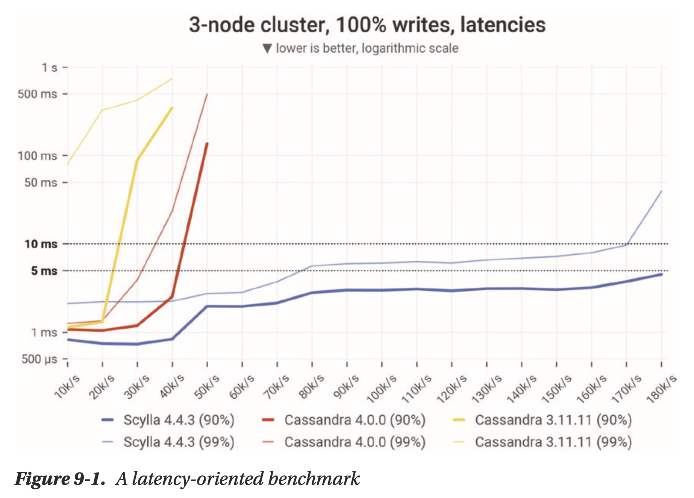
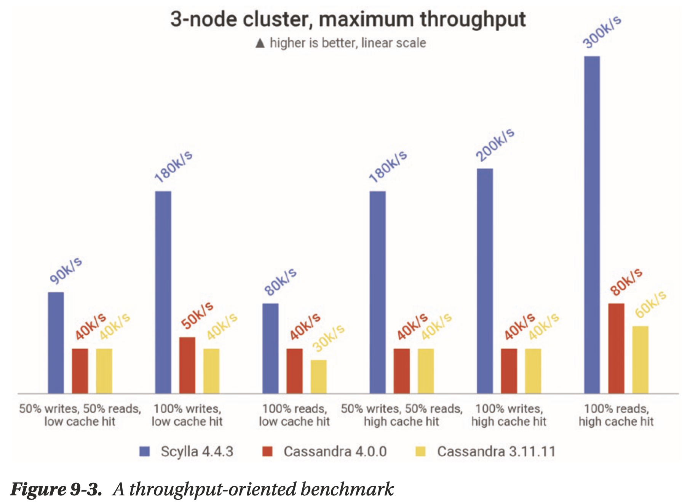

# Chapter 09 Benchmarking

## Latency or Throughput: Choose Your Focus

- **Throughput focus**: often for analytics use cases, sending a new request as soon as the previous request completes
- **Latency focus**: how many IOPS the database can handle without compromising latency

## Less Is More (at First): Taking a Phased Approach

Start simple, confirm, then scale incrementally

- **two phases of benchmarking**
    - specialized stress tool
    - real workload (at least a sampling of it)
- **move incrementally**
    - start super small (10% of the target throughput)
    - troubleshoot as needed
    - keep optimization in mind throughput

## Benchmarking Do's and Don'ts

- **Know What's Under the Hood of Your Database** (or find someone who knows like database vendors): e.g. LSM-tree based database's compactions do have a significant impact on performance, but they are unlikely to kick in if benchmark for just a few minutes
- **Choose an Environment That Takes Advantage of the Database's Potential**: e.g. do not run a benchmark using a Docker image on a laptop
- **Use an Environment That Represents Production**
- **Don't Overlook Observability**: having observability is critical for identifying and troubleshooting issues, e.g. cache hit rate
- **Use Standardized Benchmarking Tools Whenever Feasible**
    - YCSB
    - TPC-C
    - NdBench
    - Nosqlbench
    - pgbench
    - TLP-stress
    - Cassandra-stress
  - **Use Representative Data Models, Datasets, and Workloads**: the closer you approximate your production environment, the better you can trust the results
  - **Exercise Your Cache Realistically**: cache maybe super cold in some situations (e.g. after an upgrade or hardware failure)
  - **Look at Steady State**: databases behave differently in real life than they do in short transient test situations
  - **Watch Out for Client-Side Bottlenecks**
  - **Watch Out for Networking Issues**: e.g. use CPU pinning to tell the system that all network interrupts should be handled by specific CPUs
  - **Document Meticulously to Ensure Repeatability**

## Reporting Do's and Don'ts

- **Be Careful with Aggregations**: it may overlook a lot of critical information
- **Don't Assume People Will Believe You**: share fine granularity details about the setup
- **Take Coordinated Omission Into Account**: [reference](../seastar/Coordinated_Omission.md), queueing with correction or simulation, or queueless with simulation

## Special Considerations for Various Benchmarking Goals

- Preparing for Growth
- Comparing Different Databases
- Comparing the Same Database on Different Infrastructure
- Assessing the Impact of a Data Modeling or Database Configuration Change

## Beyond the Usual Benchmark

less common or more extreme tests

- Benchmarking Admin Operations, e.g. how long it takes to add/remove a node
- **Testing Disaster Recovery**, test the time and effort required to restore from a backup
- Benchmarking at Extreme Scale, e.g. [ScyllaDB with Petabyte Data](https://www.scylladb.com/2022/07/14/benchmarking-petabyte-scale-nosql-workloads-with-scylladb/)
