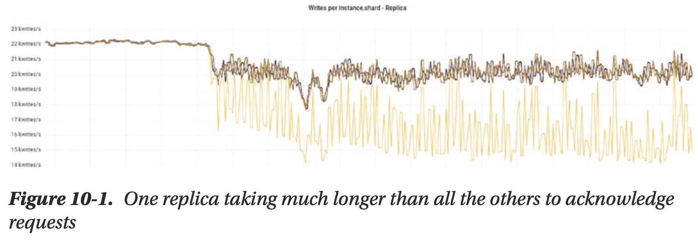
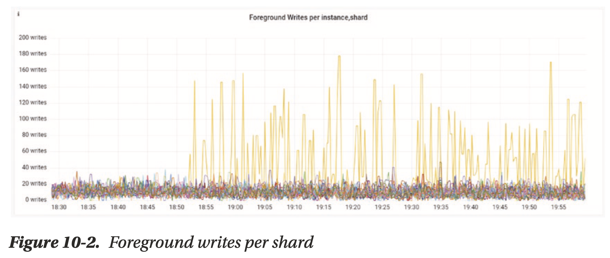
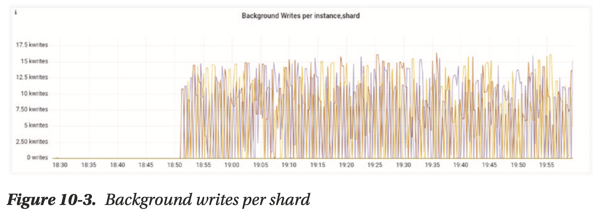
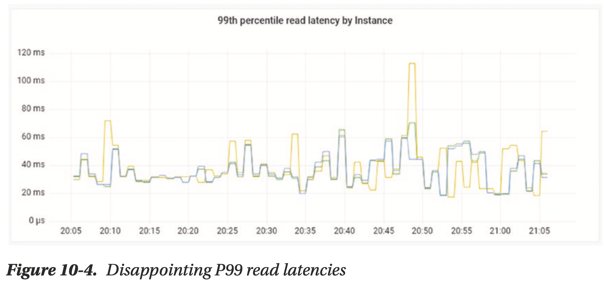
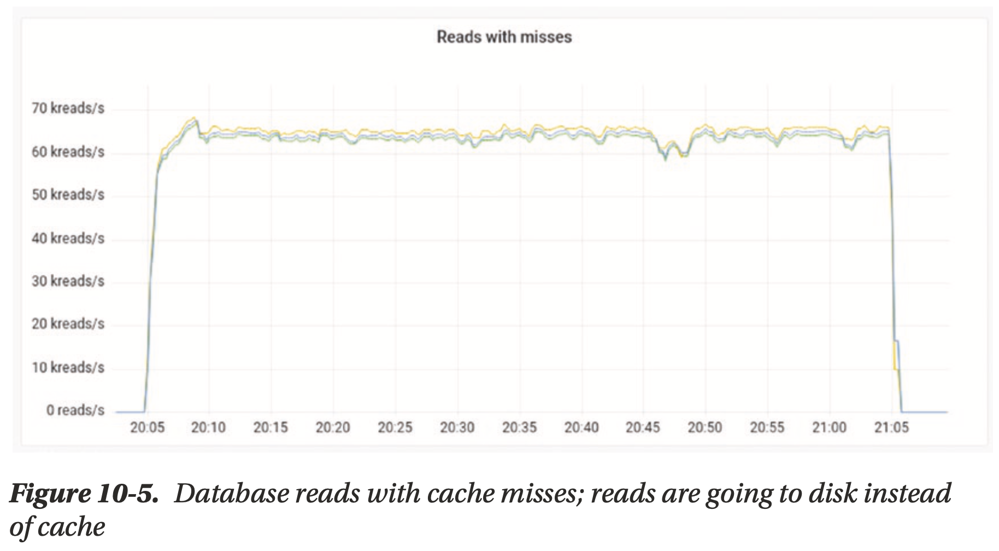
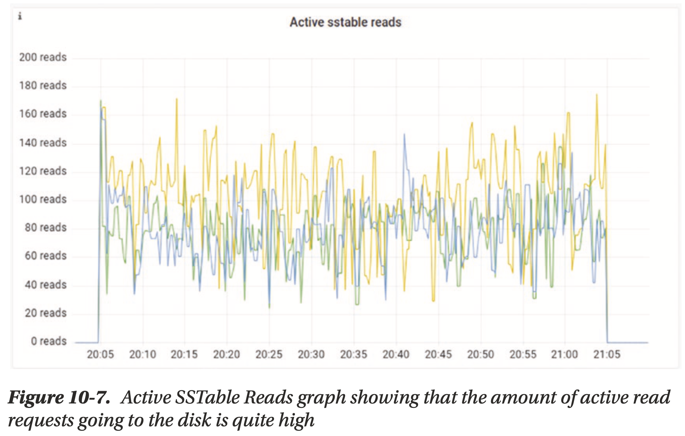
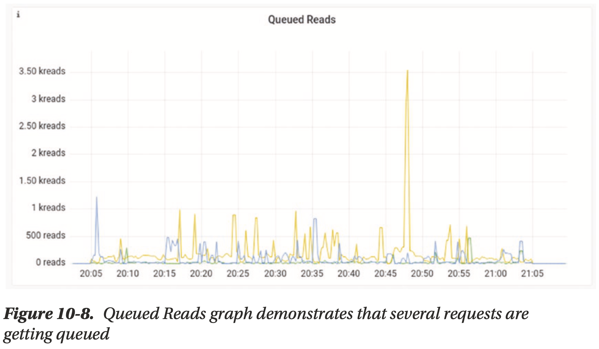

# Chapter 10 Monitoring

## Taking a Proactive Approach

## Tracking Core Database KPIs

***Less is more.*** We recommend zeroing in on **a small set of KPIs in each area** (cluster, infrastructure, application) that really matter to your business.

### Database Cluster KPIs

insight into a database cluster’s health like I/O queues, task groups, errors, reads/writes, timeouts, replicas, CDC, etc

e.g. with a wide column database like ScyllaDB:

- **Node availability**
- **Average R/W latencies**
- **P99 R/W latencies**
- **RPS**
- **Timeouts**
- **Caching**
- **Connections**
    - how many?
    - balanced?
- **Garbage collector pauses**
    - background service to purge unused objects (not only programming language's GC)

What to look for at different levels? (datacenter, node, CPU/shard)

1. initiate the research with the **datacenter-level** view, problem confined to single region or all regions?
2. look into the data points on a **per-node level**, any specific replica abnormal, misbehaving?
3. digging into **CPU level** for a shard-per-core architecture

## Application KPIs

Application KPIs are the key to exposing client side and driver issues like query, poor data model, etc

- **Latency**
    - database latency
    - network RTT
    - (de)serializtion
- **CPU consumption**
- **Network IRQs**
    - softirq
    - CPU-pinning
- **Readiness/liveness**
- **GC pauses**

## Infrastructure/Hardware KPIs

- **Disk space utilization**
- **Disk bandwidth utilization**
- **CPU utilization**
- **Memory utilization**
- **Network availability**

## Creating Effective Custom Alerts

## Walking Through Sample Scenarios

- one replica is lagging in ack requests

    

    the application is overloading the system by sending more requests (**foreground queue**) than the database can handle

    

    one replica is lagging and the entire system will throttle down due to this slowest node, other nodes have a pileup in ack-ed tasks (**background queue**), e.g. delay replicating data across nodes

    

- disappointing P99 read latencies

    

    reads aren't hitting the cache

    

    active SSTable reads indicates the amount of active read requests going to the disk (by the design of LSM-tree)

    

    queued reads means the underlying storage system can't keep up with the request rate (see the design of [Seastar's IO Scheduler](../seastar/New_Disk_IO_Scheduler_For_RW.md))

    

    how to resolve? review queries and access patterns to **use the cache more efficiently**, e.g. look at the distribution of inserts, reads, deletes, updates, the number of connections per node/shard, the number of reading rows, etc

    watch out cross-datacenter requests

## Monitoring Options

- the database vendor's monitoring stack (recommended)
- build your own dashboards and alerting
- third-party database monitoring tools
- full stack application performance monitoring tool

**be careful whenever installing third-party solutions that could directly interact with the database process**
