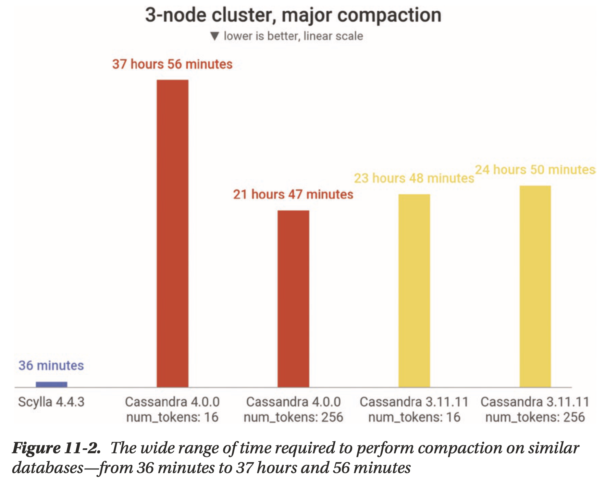
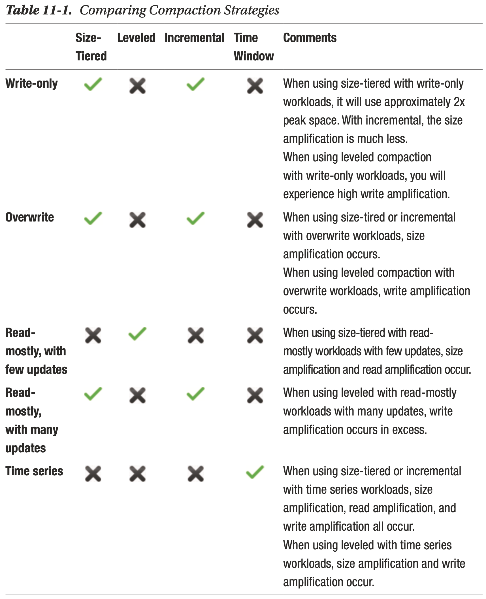

# Chapter 11 Administration

## Admin Operations and Performance

Databases don’t know your business and could very naively decide to execute resource-intensive admin operations at what’s actually a performance-critical time.

## Looking at Admin Operations Through the Lens of Performance

What admin operations should you focus on?

- **Performance Impact**: What's the impact on your specific workload?
- **Business Impact**: How much does that impact matter to your business?
- **Controllable**: To what extent can you control it?

Some of the most common suspects:

- **Node recovery**
- **Ramping up/down capacity**
    - entire cluster/region to rebalance data
- **Data migration**
    - typically no downtime
    - balance between speed and service stability
- **Database upgrades**
    - cold cache
- **Logging and tracing**
    - can potentially be resource-intensive
- **Data synchronization**
    - eventually consistent database needs background process to get data in sync, e.g. gossip protocol
- **Backups**
- **Compaction**

## Backups

### Impacts

- **Dataset size and replication factor**
- **Scope**
    - full backup? specific cluster? system-wide snapshot? incremental backup?
- **Frequency**
- **Bandwidth throttling**
    - as fast as possible during low peak periods
    - as unobtrusively as possible during steady workloads
    - see [priority-based scheduling](../seastar/Dynamic_Priority_Adjustment.md)
- **Scheduling options**
    - to control precisely when backups occur
- **Data compression**
    - tradeoff between CPU usage and disk usage
- **Parallelism**
- **Storage medium**

### Optimizations

Work with your team to understand the **backup coverage** that you need and **what type of backup pain you’re willing to accept**, then adjust your options accordingly.

## Compaction

LSM-based databases use compaction to remove deleted entries and reorganize data to enable faster, more efficient reads and writes.

### Impacts

- **Compaction backlog**
    - indicate the amount of data to compact
    - a growing compaction backlog indicates something is wrong
- **Inefficient compaction strategy selection**
    - different workloads need different compaction strategy, e.g. write-heavy workload needs infrequent compaction but read-heavy workload wants more aggressive compaction
    - understand how compaction strategy impacts the read/write/space amplification
- **Compaction throughput**
    - tune the rate-limiting values and monitor the compaction backlog to find the sweet spot

### Optimizations

the ultimate goal should be **low read/write/space amplification**

**Adjusting compaction strategy leads to rewrite all table data**
