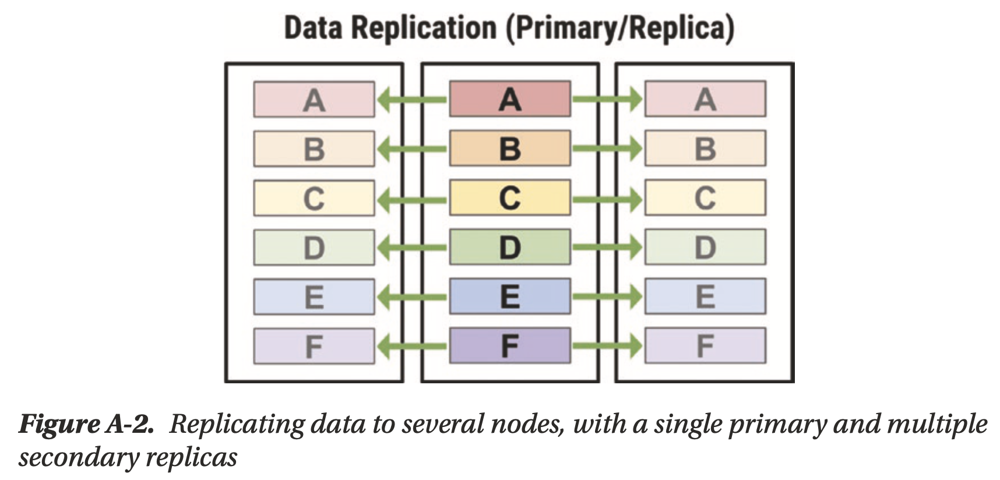
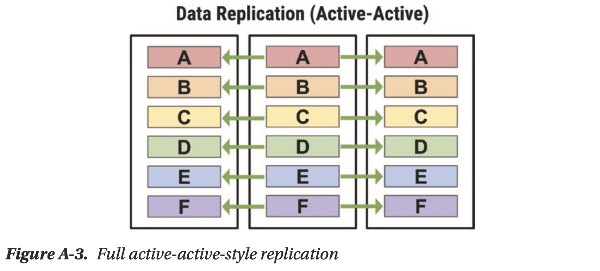
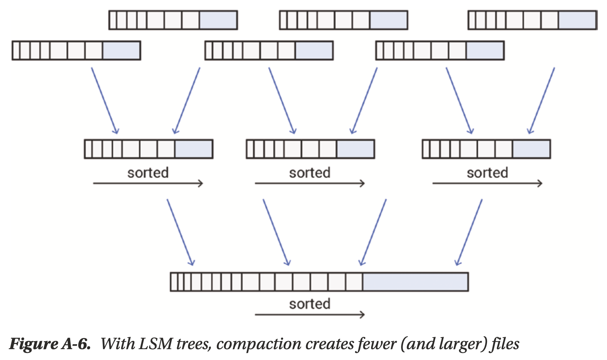
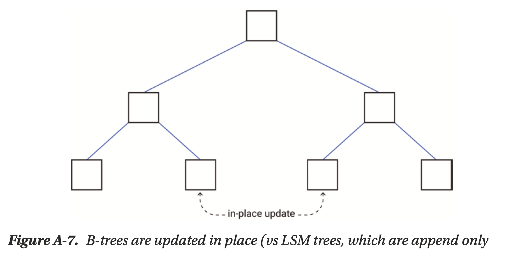
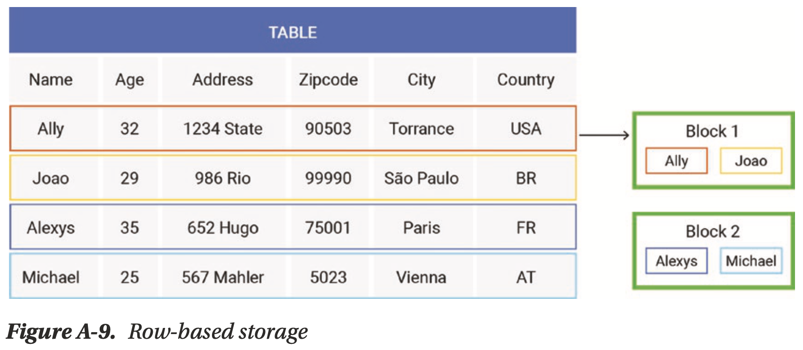
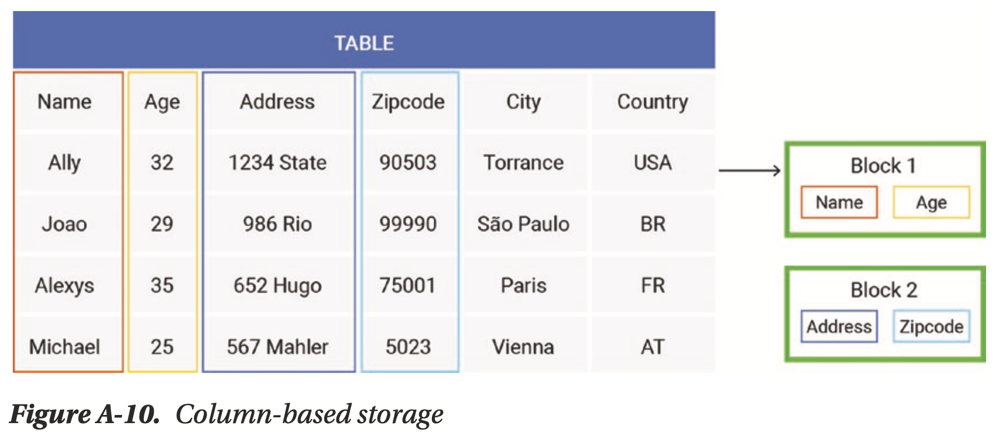
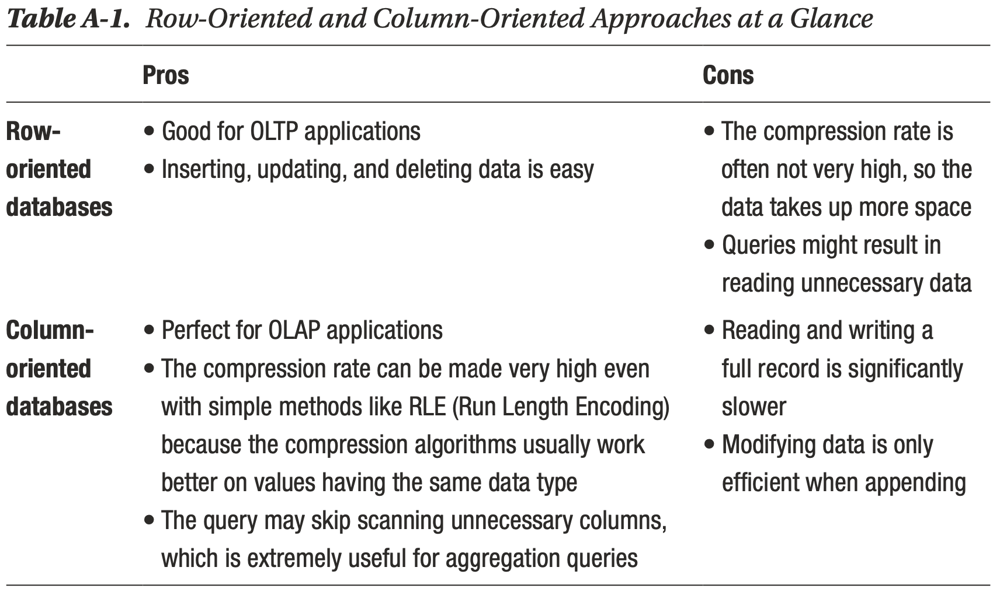

# Appendix A A Brief Look at Fundamental Database Design Decisions

## Sharding and Replication

**Sharding** is to ensure that data is **well-balanced** across your cluster for reading and writing.

- **Range-based sharding**: best performance for range lookups, but is otherwise prone to hotspots, e.g. Bigtable, HBase, etc
- **Hash-based sharding**: best performance for most scenarios, e.g. DynamoDB, Redis, ScyllaDB, etc, for ScyllaDB, a primary key consists of two parts:
    - **Partition key**: identify the node that stores a particular row, hash-based
    - **Clustering key**: store the data in a sorted order, range-based

**Active-active leaderless** topology leads to **eventual consistency**

***Quorum*** consistency is not strong consistency, e.g. with `N=3, RF=3, W=2, R=2`:

1. client sets `x=1`, node A and node B committed
2. client sets `x=2`, node A and node C committed
3. client gets `x` from node B and node C, `x=1` or `x=2` ?

- Which `x` should all nodes accept? `x=2` should overwrite `x=1` ? ***No***, the requests may be concurrent
- Use client timestamp? ***No***, timestamp is not reliable in distributed systems
- Use client sequence number? ***No***, maybe different clients
- Need sophisticated **conflicts resolution** algorithm, e.g. in [Cassandra](https://stackoverflow.com/questions/67028682/how-does-cassandra-handle-write-timestamp-conflicts-between-quorum-reads)
- Quorum system is still appealing as some business scenarios *do not really care the order*, e.g. the order of goods in the shopping cart

## Consensus Algorithms

Consensus algorithms ([PAXOS](../papers/2001_Paxos_Made_Simple.md), [Raft](../raft/03.Basic_Raft_Algorithm.md), etc) provide **strong consistency**

- **Validity**: made decision must have been proposed by at least one node
- **Agreement**: nodes shouldn't decide differently once a decision is made
- **Stability**: made decision remains forever
- **Termination**: made decision gets spread to all replicas eventually

[Distributed Consensus Revisited](../dcr/3.Known_Revisions.md)

***New leader selection*** in leader-based algorithm is just as complex as leaderless algorithms, it happens rarely and is considered to be ***a necessary evil***

## B-Tree vs. LSM Tree

LSM trees are optimized for heavy write workloads and B-trees are optimized for heavy read workloads.

LSM trees apply compaction, bloom filter, cache, etc, to improve read performance.

B-trees are well suited to transactions.

## Record Storage Approach

- **Row-Oriented Databases**
    - **OLTP**

    

- **Column-Oriented Databases**
    - **OLAP**

    

