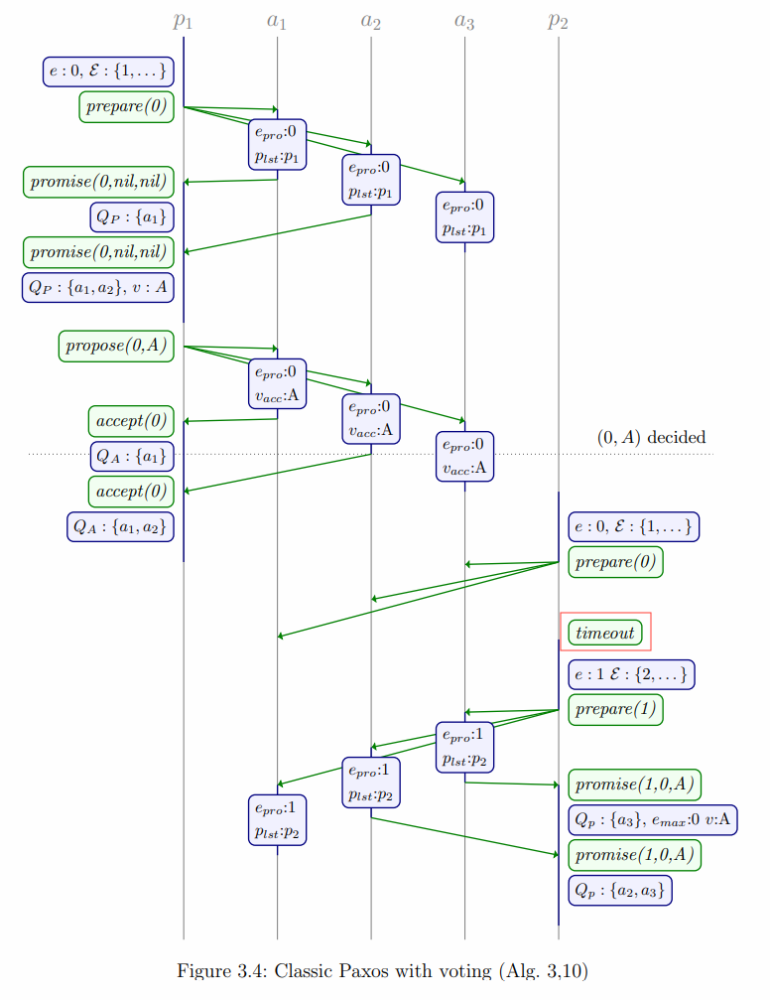

# Chapter 3. Known Revisions

Classic Paxos只用于对单个值达成分布式共识，本章介绍多个被广泛使用的**Class Paxos衍生算法**

## Negative Responses, NACKs

在Classic Paxos算法中，当proposer请求的epoch比acceptor的要小的时，即$e < e_{pro}$，acceptor选择不回复任何消息任由proposer超时重试，遵循*If you can't say something nice, don't say nothing at all*原则

在实际实现中，通过**拒绝响应Negative Responses**来提升算法的性能，而不是每次都需要proposer超时，**当不满足epoch要求时acceptor可以返回$no\_promise(e)$和$no\_accept(e)$从而加快proposer的执行**

进一步，acceptor可以通过在拒绝响应中添加自身的额外信息来使得proposer能够更快感知到集群状态，例如$no\_promise(e,f,g,v)$和$no\_accept(e,f,g,v)$

- $e$：被拒绝的请求所携带的epoch
- $f$：acceptor自身更大的last promised epoch，即$e_{pro}$
- $(g,v)$：acceptor的last accepted proposals，例如在Raft算法中节点拒绝响应时会携带current term

当proposer收到：

- $no\_promise(e,f)$：立即重新开始Phase I并选择新的epoch满足$e > f$
- $no\_accept(e,f)$：立即重新开始Phase I并选择新的epoch满足$e > f$

[Raft中节点收到任意term更高消息时就会自动转为Follower](https://github.com/JasonYuchen/notes/blob/master/raft/03.Basic_Raft_Algorithm.md#4-%E9%80%89%E4%B8%BE%E4%B8%BB%E8%8A%82%E7%82%B9-leader-election)

## Bypassing Phase II

**若proposer在Phase I结束后已经发现majority acceptors都已经确定了某个值**，即收到了majority都回复了相同已接受提案的$(f,v)$的响应$promise(e,f,v)$，则按Classic Paxos算法该proposer应该带上该提案$(f,v)$并继续Phase II，但是显然这一个步骤是多余的，**proposer可以直接响应客户端已提交的值$v$，回避不必要的Phase II**

proposer在Phase I收到回复后的状态处于：

- **Decision not reached**：没有收到任何proposal，从而没有决定任何值，proposer可以采用自己的值并开始Phase II
- **Decision reached**：所有收到的$promise(e,f,v)$均持有相同的$(f,v)$且数量达到majority，此时proposer已经感知到达成共识的值并不需要再执行Phase II
- **Uncertainty**：收到部分proposal，此时proposer无法判断是否达成共识，需要采用拥有最大epoch即$e_{max}$提案的值并执行Phase II

[Raft中日志复制时，只要收到majority响应就认为提交，并不需要等待majority的commit index](https://github.com/JasonYuchen/notes/blob/master/raft/03.Basic_Raft_Algorithm.md#5-%E6%97%A5%E5%BF%97%E5%A4%8D%E5%88%B6-log-replication)

## Termination

proposer始终需要与majority沟通从而提交值或者感知已经被选择的值，从而对于一无所知的proposer而言系统也必须存活majority acceptors才能使得该proposer感知到被选择的值

在Classic Paxos中**引入Phase III，使acceptor能够感知到达成共识的值**，Classic Paxos中每个acceptor仅仅独立运行并响应proposer的请求，在Phase III中**proposer一旦感知到被选择的值后，在响应客户端的同时就主动发送$decide(v)$给所有acceptors**，从而每个acceptor确认$v = v_{dec}$已经达成共识，此后即使只存活了一个acceptor都可以告知所有proposer已经被选中的值$v_{dec}$

[Raft中所有节点会持有commit index来记录达成共识的位置，但并不会持久化且不违背安全性](https://github.com/JasonYuchen/notes/blob/master/raft/03.Basic_Raft_Algorithm.md#8-%E6%8C%81%E4%B9%85%E5%8C%96%E7%8A%B6%E6%80%81%E5%92%8C%E9%87%8D%E5%90%AF-persisted-state-and-server-restarts)

## Distinguished Proposer

当多个proposer并发提出提案时，整个系统就会陷入竞争和冲突，导致达成共识的时间显著增加，在Paxos Made Simple中Lamport提出了**使用leader/distinguished proposer来避免冲突**

在系统稳定运行时，只会有一个distinguished proposer来提出提案，即**作为一个序列化点point of serialization**，此时没有冲突，能以最优的方式达成共识，假如该节点缓慢或宕机，则系统选举出新的distinguished proposer

显然从Classic Paxos算法本身的安全性角度来说，distinguished proposer不需要达成共识，系统**任意时刻都可以有0、1、多个distinguished proposer而不影响安全性**，但是为了保证系统能继续正常运行，0个或多个distinguished proposer的时间应该是短且有限的，稳定运行时只有1个distinguished proposer并且所有节点都认可

在异步网络假设中，完美的**故障检测**（用于确认leader是否存活）是不可能的，只能通过**心跳heartbeat和超时timeout**的方式尽可能缩短leader不存活导致系统无法进展的时间

distinguished proposer在各种共识算法中都被广泛使用，包括后续会讨论的Multi-Paxos

[Raft中的leader就是distinguished proposer的一种衍生，并且Raft额外限制了成为leader的条件，同时也使得leader作为single source of truth](https://github.com/JasonYuchen/notes/blob/master/raft/03.Basic_Raft_Algorithm.md#4-%E9%80%89%E4%B8%BE%E4%B8%BB%E8%8A%82%E7%82%B9-leader-election)

## Phase Ordering

Classic Paxos中Phase I的acceptor并不需要proposer提供候选值$\gamma$，而在Phase II中才提供候选值$\gamma$，那么显然**proposer可以在有候选值之前首先执行Phase I，随后等到有候选值时就可以直接执行Phase II**达成共识，这种方式也是普遍被使用的（结合distinguished proposer可以减少Phase I冲突），包括后续会讨论的Multi-Paxos

[Raft中选举成为leader相当于对leader term的所有index都隐式执行了Phase I，从而后续replicate log时相当于直接执行Phase II](https://github.com/JasonYuchen/notes/blob/master/raft/03.Basic_Raft_Algorithm.md#4-%E9%80%89%E4%B8%BE%E4%B8%BB%E8%8A%82%E7%82%B9-leader-election)

## Multi-Paxos

Classic Paxos只描述了对一个候选值达成共识的算法，实践中往往需要对一个无限序列达成共识，从而可以分为以下两大类算法：

- **Classic Paxos Algorithm**：执行多次Classic Paxos算法从而对多个值达成共识，但是相互之间没有顺序关系，在实践中非常少见，例如Classic Paxxos、Mencius、Fast Paxos
- **Multi-Paxos Algorithm**：某个proposer作为leader/distinguished propoer并执行一系列的Phase I，从而在有需要时按顺序执行Phase II，并在出现下一个leader前一直协调整个系统，在实践中普遍使用，例如Chubby、Zookeeper、Ring Paxos、Viewstamped Replication、Raft

Multi-Paxos在Classic Paxos上最核心的优化就是对一个候选值的序列**共享Phase I**，并且结合distinguished proposer和phase ordering，从而可以实现**Phase I只执行一次，并且相应的proposer就被提升为leader/distinguished proposer**随后负责执行一系列Phase II来对一个序列的值达成共识

当另一个proposer由于心跳超时等原因怀疑当前leader宕机时，就可以主动执行Phase I从而成为新的leader，这个过程就称为**选举leader election**，Multi-Paxos在完成leader选举后的稳定运行期间，始终只有一个leader，并且对所有值都只需要执行一轮Phase II，即**一轮对majority acceptor的RPC以及数据持久化就可以达成共识**

**Multi-Paxos重度依赖leader**，系统稳定运行时，leader需要负责接受候选值、将候选值分配具体的index、提出候选值给acceptors、收集响应来感知达成共识的值、通知所有节点已经达成共识的值等，从而Multi-Paxos系统中**leader通常会成为系统瓶颈**，虽然达成共识只需要一轮RPC，但是只有leader节点可以直接提出候选值，**其他节点收到候选值后需要推送给leader从而依然需要额外一轮RPC**

[Raft中也提出了轮换leader等缓解leader负载的方式](https://github.com/JasonYuchen/notes/blob/master/raft/06.Client_Interaction.md#%E6%9B%B4%E6%9C%89%E6%95%88%E7%9A%84%E5%A4%84%E7%90%86%E5%8F%AA%E8%AF%BB%E8%AF%B7%E6%B1%82-processing-read-only-queries-more-efficiently)

## Roles

Classic Paxos中将节点的角色分成了**proposer和accepter**，而在大多数衍生算法和实际实现中，这两个角色被**合并称为replica**，另外在一些实现中例如etcd、dragonboat引入了新的角色：

- **observer**：只接已经收达成共识的数据而不参与共识，类似于Classic Paxos中的**learner**
- **witness**：只参与选举，而不接收任何达成共识的数据

[Raft的实际实现中引入witness来加速选举并减轻有故障节点时可用性的下降](https://github.com/JasonYuchen/notes/blob/master/raft/11.Related_Work.md#%E5%87%8F%E5%B0%91%E8%8A%82%E7%82%B9%E6%95%B0reducing-number-of-servers-witnesses)

## Epochs

在Classic Paxos算法中epoch需要满足**全序totally ordered**且每个proposer采用的epoch**互不重叠disjoint subset**，其算法可以是：

- **Naive Round-robin**：最简单的算法可以是所有proposer采用**循环round-robin**的方式取用epoch，例如一共有3个proposer，则#1 proposer每次采用`1,4,7,...`，#2 proposer每次采用`2,5,8,...`，#3 proposer每次采用`3,6,9,...`
- **`(sid, pid)`**：其中`sid`就是proposal sequence number且需要持久化最近使用的来确保不被重用，`pid`就是proposer id通过config由部署者指定，在进行epoch大小对比时，就可以字典序对比`(sid, pid)`
- **`(sid, pid, vid)`**：仅采用`(sid, pid)`需要每次使用新的`sid`时都进行持久化，延迟较高，通过引入`vid`代表proposer的版本号，**每次proposer启动时更新并持久化`vid`一次即可**，此后`sid`就不必再进行更新也能确保重新启动后的proposer生成的`(sid, pid, vid)`更大

## Phase I Voting for Epochs

在Classic Paxos中，**当acceptor要求proposer提供的epoch严格大于last promised epoch即$e_{pro}$时**，实际上proposer生成的epoch并不一定要唯一，因为根据算法能进入Phase II的proposer一定已经通过了majority下的Phase I，因此**至多只有一个proposer能进入Phase II**，其唯一性已经得到了保证，对acceptor的算法修改如下：

- acceptor接收到$prepare(e)$时，若$e$是第一个promised epoch或者$e > e_{pro}$**或者$e = e_{pro} \And p = p_{lst}$即发起请求的proposer与最后一次proposer相同**，则更新$e_{pro}$和$p_{lst}$并回复$promise$

采用这种算法后，proposer不再需要分配唯一的epoch号而可以使用任意的epoch，**由acceptor算法来保证至多只有一个proposer有可能进入Phase II**

[Raft采用`(term, index)`的形式来标记每个entry，term就是每个distinguished proposer的任期标识，就是采用这种voting for epochs的方式达成共识](https://github.com/JasonYuchen/notes/blob/master/raft/03.Basic_Raft_Algorithm.md#4-%E9%80%89%E4%B8%BE%E4%B8%BB%E8%8A%82%E7%82%B9-leader-election)

## Proposal Copying

## Generalization to Quorums

## Miscellaneous
