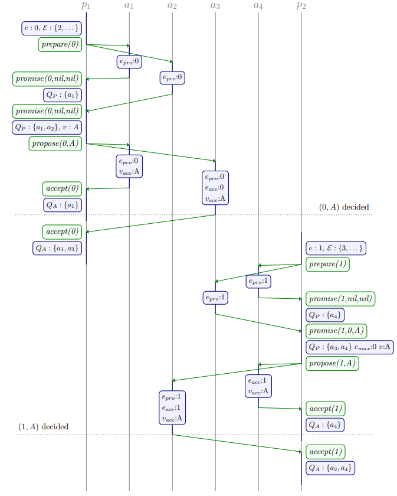
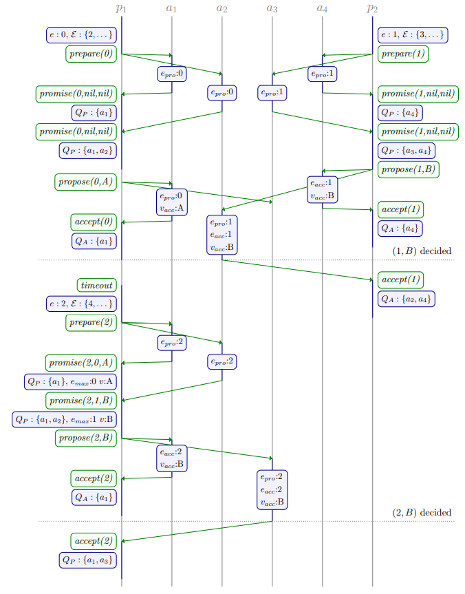

# Chapter 4. Quorum Intersection Revised

## 跨阶段的quorum交集 Quorum intersection across phases

将Classic Paxos Phase I所使用的quorum记为$\mathcal Q_1$，将Phase II所使用的quorum记为$\mathcal Q_2$

在Classic Paxos中要求所有quorum都存在交集，与Phase无关，从而其quorum要求是：

```math
\forall Q,Q' \in \mathcal Q_1 : Q \cap Q' \neq \emptyset
\\
\forall Q,Q' \in \mathcal Q_2 : Q \cap Q' \neq \emptyset
\\
\forall Q_1 \in \mathcal Q_1, \forall Q_2 \in \mathcal Q_2 : Q_1 \cap Q_2 \neq \emptyset
```

实际上**只需要来自$\mathcal Q_1$和$\mathcal Q_2$的quorum存在交集即可**，各自内部的quorum可以不必存在交集，即上述要求的前两条是多余，即只需要满足：

```math
\forall Q_1 \in \mathcal Q_1, \forall Q_2 \in \mathcal Q_2 : Q_1 \cap Q_2 \neq \emptyset
```

从而相应的proposer算法中，对quorum的判断修改为（只需指定其中一个集合例如$\mathcal Q_2$而可以计算出满足条件的$\mathcal Q_1$）：

- **Phase I** ：`while` $\exist Q \in \mathcal Q_2 : Q_P \cap Q = \emptyset$ `do`继续执行Phase I，quorum还不满足
- **Phase II**：`while` $\forall Q \in \mathcal Q_2 : Q_A \nsupseteq Q$ `do`继续执行Phase II，quorum还不满足

对acceptor的算法并不需要改变，此时**在Phase I中，如果所有来自$\mathcal Q_2$的$Q$都与该$Q_P$存在交集时，就可以进入Phase II**，而在Phase II中则算法不变

显然在Phase I中的$Q_P$如果与所有Phase II的$Q$都存在交集，而在Phase II中达成共识要求$Q_A$满足任意一个$Q$的超集，则$Q_A$与$Q_P$一定存在交集，那么Phase I提出的值一定在Phase II中被感知到，从而是安全的

假定有4个acceptors和2个proposers，并定义Phase I的$\mathcal Q_1=\{\{a_1,a_2\},\{a_3,a_4\}\}$以及Phase II的$\mathcal Q_1=\{\{a_1,a_3\},\{a_2,a_4\}\}$，这种选择符合前面的要求，**Phase I的每个quorum都与Phase II的每个quorum相交**

示例一中，2个proposers依次执行，而proposer 2成功感知到了达成共识的值$A$



示例二中，2个proposers并发执行并且从**互不相交的quorum中通过了Phase I**

- proposer 1的$propose$请求由于$e < e_{pro}$被acceptor 3拒绝，并且在随后的重试中感知到了proposer 2提出的达成共识的值$B$
- 拥有更大$e$的proposer 2提出的值$B$覆盖了acceptor 2关于proposer 1的记录



## 跨epoch的quorum交集 Quorum intersection across epochs

## 作用 Implications

### Bypassing phase II

### Co-location of proposers and acceptors

### Multi-Paxos

### Voting for epochs
