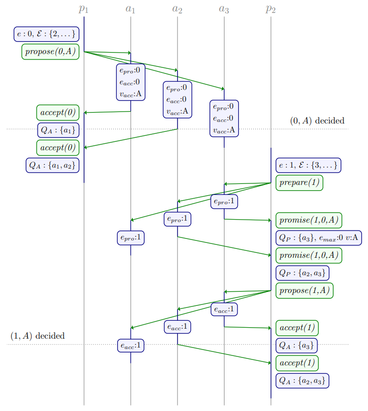
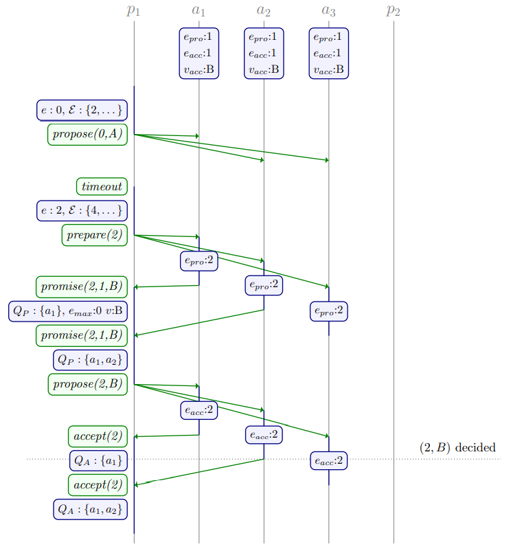

# Chapter 4. Quorum Intersection Revised

## 跨阶段的quorum交集 Quorum intersection across phases

将Classic Paxos Phase I所使用的quorum记为$\mathcal Q_1$，将Phase II所使用的quorum记为$\mathcal Q_2$

在Classic Paxos中要求所有quorum都存在交集，与Phase无关，从而其quorum要求是：

```math
\forall Q,Q' \in \mathcal Q_1 : Q \cap Q' \neq \emptyset
\\
\forall Q,Q' \in \mathcal Q_2 : Q \cap Q' \neq \emptyset
\\
\forall Q_1 \in \mathcal Q_1, \forall Q_2 \in \mathcal Q_2 : Q_1 \cap Q_2 \neq \emptyset
```

实际上**只需要来自$\mathcal Q_1$和$\mathcal Q_2$的quorum存在交集即可**，各自内部的quorum可以不必存在交集，即上述要求的前两条是多余，即只需要满足：

```math
\forall Q_1 \in \mathcal Q_1, \forall Q_2 \in \mathcal Q_2 : Q_1 \cap Q_2 \neq \emptyset
```

从而相应的proposer算法中，对quorum的判断修改为**Revision A**（只需指定其中一个集合例如$\mathcal Q_2$而可以计算出满足条件的$\mathcal Q_1$）：

- **Phase I** ：`while` $\exist Q \in \mathcal Q_2 : Q_P \cap Q = \emptyset$ `do`继续执行Phase I，quorum还不满足
- **Phase II**：`while` $\forall Q \in \mathcal Q_2 : Q_A \nsupseteq Q$ `do`继续执行Phase II，quorum还不满足

对acceptor的算法并不需要改变，此时**在Phase I中，如果所有来自$\mathcal Q_2$的$Q$都与该$Q_P$存在交集时，就可以进入Phase II**，而在Phase II中则算法不变

显然在Phase I中的$Q_P$如果与所有Phase II的$Q$都存在交集，而在Phase II中达成共识要求$Q_A$满足任意一个$Q$的超集，则$Q_A$与$Q_P$一定存在交集，那么Phase I提出的值一定在Phase II中被感知到，从而是安全的

假定有4个acceptors和2个proposers，并定义Phase I的$\mathcal Q_1=\{\{a_1,a_2\},\{a_3,a_4\}\}$以及Phase II的$\mathcal Q_1=\{\{a_1,a_3\},\{a_2,a_4\}\}$，这种选择符合前面的要求，**Phase I的每个quorum都与Phase II的每个quorum相交**

示例一中，2个proposers依次执行，而proposer 2成功感知到了达成共识的值$A$


示例二中，2个proposers并发执行并且从**互不相交的quorum中通过了Phase I**

- proposer 1的$propose$请求由于$e < e_{pro}$被acceptor 3拒绝，并且在随后的重试中感知到了proposer 2提出的达成共识的值$B$
- 拥有更大$e$的proposer 2提出的值$B$覆盖了acceptor 2关于proposer 1的记录


## 跨epoch的quorum交集 Quorum intersection across epochs

对不同的epochs也可以采用不同的quorum准则，**标记$Q_n^e$为Phase $n$和Epoch $e$的quorum集合**，则对于每个epoch采用不同准则时可以表达为：

```math
\forall Q \in \mathcal Q_1^e , \forall f \in E , \forall Q' \in \mathcal Q_2^f : Q \cap Q' \neq \emptyset
```

对于原先的quorum交集要求可以进一步弱化为**对于$e$而言Phase I的quorum（$\mathcal Q_q^e$）与$f<e$的Phase II的quorum（$\mathcal Q_2^f$）存在交集即可**：

```math
\forall Q \in \mathcal Q_1^e , \forall f \in E : f < e \implies \forall Q' \in \mathcal Q_2^f : Q \cap Q' \neq \emptyset
```

给定$e$下的Phase I和Phase II中的acceptors没有相交的要求，同样对Phase I的quorum和$f > e$的Phase II的quorum也没有相交的要求

从而相应的proposer算法中，对quorum的判断修改为**Revision B**：

- **Phase I** ：`while` $\exist z \in E : z < e \wedge \exist Q \in \mathcal Q_2^z : Q_P \cap Q = \emptyset$ `do`继续执行Phase I，quorum还不满足
- **Phase II**：`while` $\forall Q \in \mathcal Q_2^e : Q_A \nsupseteq Q$ `do`继续执行Phase II，quorum还不满足

在特定的情况下，**Phase I的quorum甚至可以为空**，即跳过Phase I直接开始Phase II，例如：

- **当采用最小的epoch即$e_{min} = min(E)$时，Phase I就没有quorum交集要求**，即该proposer可以跳过Phase I直接进入Phase II，由于epoch都是唯一的因此**只有一个proposer可以采用这种方式**

  

- 此时也有可能发生proposer没有感知到达成共识的值，并采用$e_{min}$直接进入Phase II但并不会影响安全性，**因为Phase II quorum需要和更高epoch的Phase I quorum有交集**从而会被acceptor拒绝$e_{min} < e_{pro}$，如下：

  

从更加弱化的要求可以看出，**Phase I的quorum只是被用来与前序$f < e$的Phase II的quorum判断交集**而不是与Phase I & II判断交集，从而在实践中可以随epoch动态调整Phase II的quorum，从而减少Phase I quorum的要求

## 作用 Implications

### Bypassing phase II

在[3.2节](https://github.com/JasonYuchen/notes/blob/master/dcr/3.Known_Revisions.md#bypassing-phase-ii)中讨论了Classic Paxos跳过Phase II的算法，实际上类似的优化也可以应用于此：当Phase II quorum $\mathcal Q_2^e$的acceptors返回了$(e,v)$时，proposer就可以直接返回给客户端达成共识的$v$并且**跳过余下的Phase I以及Phase II过程（只要$\mathcal Q_2^e$的acceptors在$\mathcal Q_1^f$的acceptors返回$promise$之前，返回了相同的提案$(e,v)$）**

### Co-location of proposers and acceptors

同一个节点同时作为proposer和acceptor时：

- 实例一：**All aboard Paxos**

  当同一个节点同时作为proposer和acceptor时，**当所有节点存活**的情况下可以仅用一轮RPC就达成共识，**Phase I可以完全变成本地完成**而不需要通信，这要求所有acceptors都在Phase II accept，即都存活

  假定三节点系统$A = \{a_1,a_2,a_3\}$，则其合法的quorum集合可以是：

  ```math
  \mathcal Q_1 = \{\{a_1\},\{a_2\},\{a_3\}\} \\
  \mathcal Q_2 = \{\{a_1,a_2,a_3\}\}
  ```

  根据这种quorum设计，**基于[Revision A](#跨阶段的quorum交集-quorum-intersection-across-phases)，当Phase II时所有节点都存活就能满足$\mathcal Q_2$的要求**，从而完全跳过Phase I并采用一轮RPC达成共识

  进一步**基于[Revision B](#跨epoch的quorum交集-quorum-intersection-across-epochs)的动态调整quorum要求，可以弱化Phase II所有节点存活的要求**，对算法修改如下表：

  - 初始的一部分epoch，所有节点都必须存活并accept
  - 随后的epoch，**通过强化$\mathcal Q_1$的quorum要求，并弱化$\mathcal Q_2$的quorum要求**以避免总是要求所有节点存活
  - 从而只要所有节点都存活则一轮RPC可以达成共识，当只有majority存活时，退化到Classic Paxos并通过两轮RPC达成共识

  ||Phase I quorums $\mathcal Q_1^e = $|Phase II quorums $\mathcal Q_2^e = $|
  |:-|:-|:-|
  |$e = 0$|$\{\{\}\}$|$\{\{a_1,a_2,a_3\}\}$|
  |$e \in [1,k]$|$\{\{a_1\},\{a_2\},\{a_3\}\}$|$\{\{a_1,a_2,a_3\}\}$|
  |$e = k + 1$|$\{\{a_1\},\{a_2\},\{a_3\}\}$|$\{\{a_1,a_2\},\{a_2,a_3\},\{a_1,a_3\}\}$|
  |$e \in [k+2, \infty]$|$\{\{a_1,a_2\},\{a_2,a_3\},\{a_1,a_3\}\}$|$\{\{a_1,a_2\},\{a_2,a_3\},\{a_1,a_3\}\}$|

- 实例二：**Singleton Paxos**
  
  与实例一相反，**当强化Phase I的quorum要求时就可以弱化Phase II的quorum要求，从而只要有任一acceptor存活就可以完成共识过程**

  假定三节点系统$A = \{a_1,a_2,a_3\}$，则其合法的quorum集合可以是：

  ```math
  \mathcal Q_1 = \{\{a_1,a_2,a_3\}\} \\
  \mathcal Q_2 = \{\{a_1\},\{a_2\},\{a_3\}\}
  ```

  这种设计下也可以参考引入[3.3节的Phase III](https://github.com/JasonYuchen/notes/blob/master/dcr/3.Known_Revisions.md#termination)来让达成共识的值最终被所有节点感知并存储

- 实例三：**Majority quorums for co-location**

  假定一个**采用majority quorum**的五节点系统$U = \{u_1,u_2,u_3,u_4,u_5\}$，每个节点同时充当acceptor和proposer，epochs采用round-robin的方式提前分配，即例如对于节点$u_1$则其使用$\Epsilon = \{0,5,10,...\}$，其majority quorums为：

  ```math
  Q = \{\{u_1,u_2,u_3\},\{u_1,u_2,u_4\},\{u_1,u_2,u_5\}...\}
  ```

  由于proposer自身也是acceptor，因此quorum中也会纳入自身，从而只需要获得其余四个节点中的两个即满足majority quorum

  从[Revision B](#跨epoch的quorum交集-quorum-intersection-across-epochs)来看，**Phase I quorum只需要与$f < e$的早期Phase II quorums存在交集即可**，从而可以写出前三次$e = 0,1,2$的Phase I quorum集合：

  ```math
  Q_1^0=\{\{\}\} \\
  Q_1^1=\{\{u_1\},\{u_2,u_3,u_4\},\{u_2,u_3,u_5\},\{u_2,u_4,u_5\},\{u_3,u_4,u_5\}\} \\
  Q_1^2=\{\{u_1,u_2\},\{u_1,u_3,u_4\},\{u_1,u_3,u_5\},\{u_1,u_4,u_5\}\,\{u_2,u_3,u_4\},\{u_2,u_3,u_5\},\{u_2,u_4,u_5\},\{u_3,u_4,u_5\}\}
  ```

  显然与纯粹的majority quorum相比，**前三次epoch的quorum要求显著降低**，这种方式可以被应用到任何quorum系统中：**对于$f < e$的前序所有参与者的集合，都是$e$的合理Phase I quorum**

（个人观点）从实例一和实例二的过程来看，Paxos的Phase I和Phase II类似于[分布式存储系统的写入和读取quorum](https://github.com/JasonYuchen/notes/blob/master/ddia/05.Replication.md#%E6%97%A0%E4%B8%BB%E5%A4%8D%E5%88%B6-leaderless-replication)，满足写入$W + R > N$就可以保证读取到的是最新的写入值

### Multi-Paxos

在[3.6节](https://github.com/JasonYuchen/notes/blob/master/dcr/3.Known_Revisions.md#multi-paxos)中指出稳定状态下的Multi-Paxos集群就是单个distinguished proposer/leader持续执行Phase II并在majority of acceptors上达成共识

从Revision A可以看出，quorum交集判断只在Phase I和Phase II之间需要，从而可以根据需要权衡Phase I和Phase II各自的quorum的要求，例如降低Phase II的要求并提高Phase I的要求，而对于Multi Paxos而言，性能performance、集群规模system size、容错性fault tolerance都紧密耦合，**采用Revision A的优化就可以降低Multi-Paxos稳定状态的系统开销，但同样会提高异常情况下的故障恢复代价**

- leader需要收到majority的accept才能确定一个值达成共识，从而系统延时就受限于majority of acceptors中最慢的一个节点，此时采用Revision A的方式，**可以减少quorum的数量从而提高响应速度减少延迟**（即只需要写入更少的节点就认为达成共识）
- [3.12节](https://github.com/JasonYuchen/notes/blob/master/dcr/3.Known_Revisions.md#miscellaneous)中提到leader只需要发送请求给Phase II quorum的acceptors，假如有节点未及时响应只需要调整为另一个quorum的acceptors即可，可以显著减少leader负担和集群网络负担，但是这种方式无论是否出现节点宕机都会增加延迟（例如网络丢包导致某个quorum未及时响应，**需要发送备份请求backup request给另一个quorum，延迟增加**），此时采用Revision A减小了quorum后可以同时减小延迟和集群负载
- 另外的优化可以是引入[observer/learner的角色](https://github.com/JasonYuchen/notes/blob/master/dcr/3.Known_Revisions.md#roles)

### Voting for epochs

在[3.9节](https://github.com/JasonYuchen/notes/blob/master/dcr/3.Known_Revisions.md#phase-i-voting-for-epochs)中提到Classic Paxos的Phase I可以被用来确保epoch的唯一性，这种方式同样适用于Revision A&B：

$\forall Q,Q' \in \mathcal Q_1^e : Q \cap Q' \neq \emptyset$

采用这种机制从而允许任意proposer都可以使用任意epoch包括$e_{min}$，但是这也导致了**不能跳过Phase I**

## 总结

proposer在Phase I的`while`判断条件：

- Classic Paxos: $\exists Q \in \mathcal Q : Q_P \cap Q = \emptyset$
- Revision A: $\exists Q \in \mathcal Q_2 : Q_P \cap Q = \emptyset$
- Revision B: $\exists f \in E : f < e \wedge \exists Q \in \mathcal Q_2^f : Q_P \cap Q = \emptyset$
