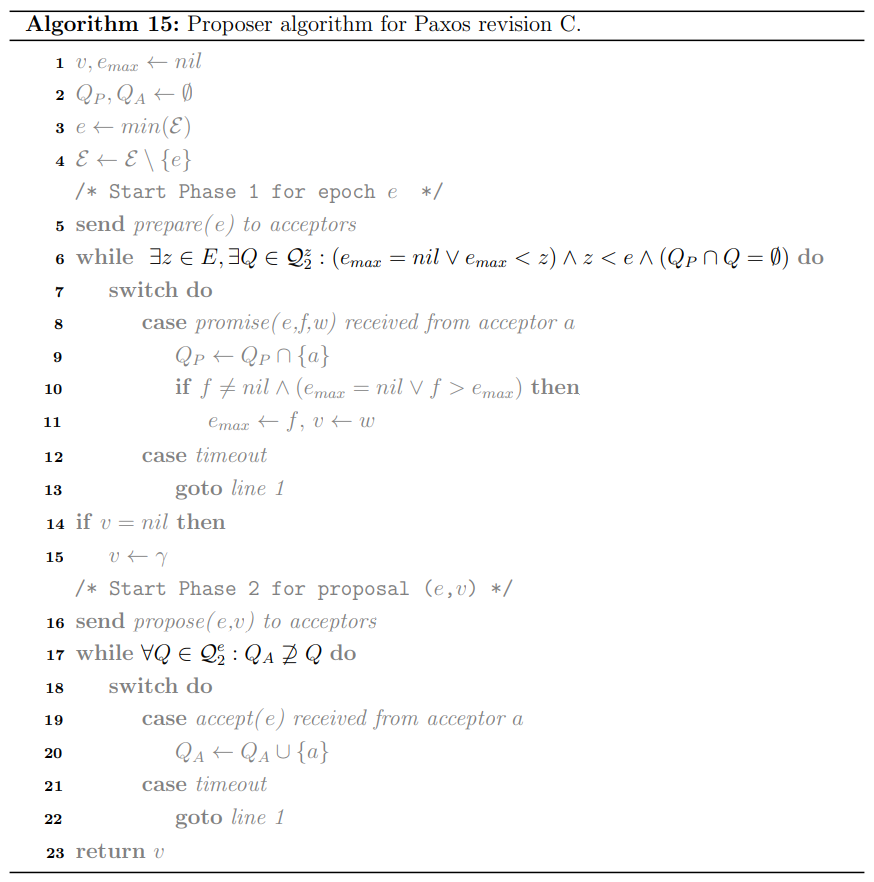
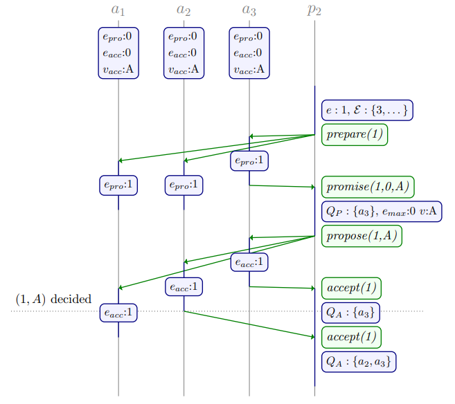

# Chapter 5. Promises Revised

Classic Paxos要求proposer在Phase I必须收到majority acceptors回复的$promise$才可以继续执行Phase II，而在第四章的[Revision B](https://github.com/JasonYuchen/notes/blob/master/dcr/4.Quorum_Intersection_Revised.md#%E8%B7%A8epoch%E7%9A%84quorum%E4%BA%A4%E9%9B%86-quorum-intersection-across-epochs)中将该要求放宽至收到$promise$的quorum与先前所有epoch的Phase II quorum存在交集就可以继续执行Phase II

**第四章的优化只是改变了能够进入Phase II的quorum条件，与收到的$promise$内容无关，实际上根据收到的$promise$提供的额外信息，可以更加灵活的进一步放宽进入Phase II的条件**

在Revision B中要求一个proposer的Phase I quorum必须与所有此前的每个epoch的Phase II quorum都存在交集，这种要求是假定proposer对其他任意proposer所使用的Phase II quorum没有任何感知

实际上当proposer在Phase I收到任意一个acceptor返回的$promise(e,f,v)$响应时就可以立即得出假如**在epoch为$f$时对$v$已经达成共识，则任意其他acceptor必然会返回相同的$(f,v)$**，或者说所有epoch早于$f$的一定都收敛至$v$，相当于可以重用$f$的结果，基于此：

当一个proposer在epoch为$e$时感知到了基于[value selection rule](https://github.com/JasonYuchen/notes/blob/master/dcr/2.Classic_Paxos.md#%E7%BB%8F%E5%85%B8paxos%E7%AE%97%E6%B3%95-classic-paxos)所提出的$(f,v)$，则就**不必再与epoch早于$f$的Phase II quorum存在交集**，只需要考虑$f < g < e$的Phase II quorum即可，Revision B的quorum交集要求可以放宽至如下**Revision C**：

$\forall Q \in \mathcal Q_1^e , \forall g \in E : f < g < e \implies \forall Q' \in \mathcal Q_2^g : Q \cap Q' \neq \emptyset$

从而相应的proposer算法中，对quorum的判断修改为：

- **Phase I** ：`while` $\exists z \in E , \exists Q \in \mathcal Q_2^z : (e_{max} = nil \vee e_{max} < z) \wedge z < e \wedge (Q_P \cap Q = \emptyset)$ `do`继续执行Phase I，quorum还不满足
- **Phase II**：`while` $\forall Q \in \mathcal Q_2^e : Q_A \nsupseteq Q$ `do`继续执行Phase II，quorum还不满足

采用这种优化后proposer算法简化版本的描述：

- **Revision A**: $\exists Q \in Q_2 : Q_P \cap Q = \emptyset$
- **Revision B**: **A** and $e \neq e_{min}$
- **Revision C**: **B** and $e \neq succ(e_{max})$

proposer 2在Phase I中因感知到$promise(e,f,v)$而提前退出的实例：

- 发送$prepare$给所有acceptor
- 收到第一个$promise(e,f,v)$时就感知到了$A$从而直接退出Phase I
- 进入Phase II并发送感知到的$A$

> proposers may use the **transitivity of quorum intersection to re-use the intersection of previous epochs** and thus complete phase one prior to satisfying the usual quorum intersection requirement
