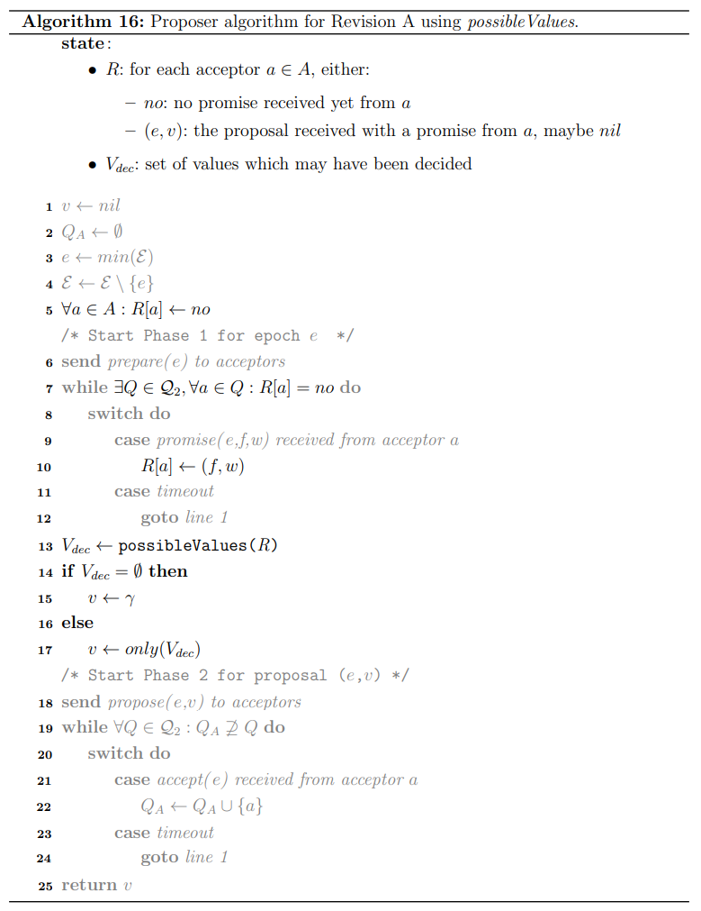
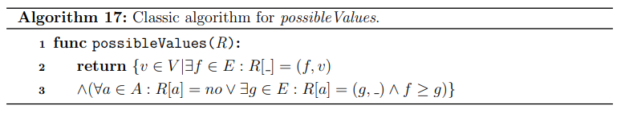
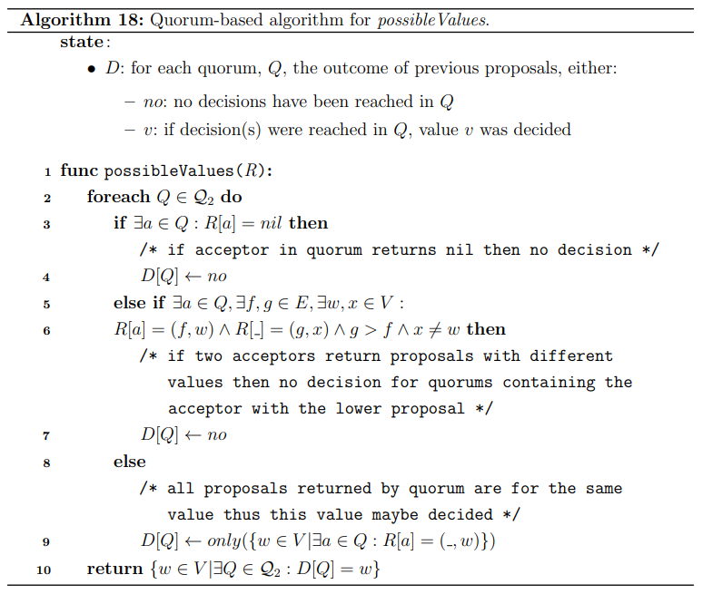
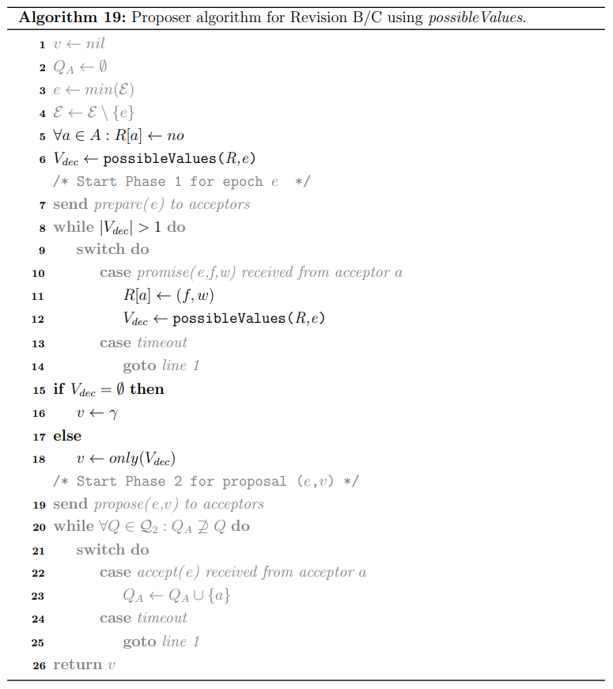
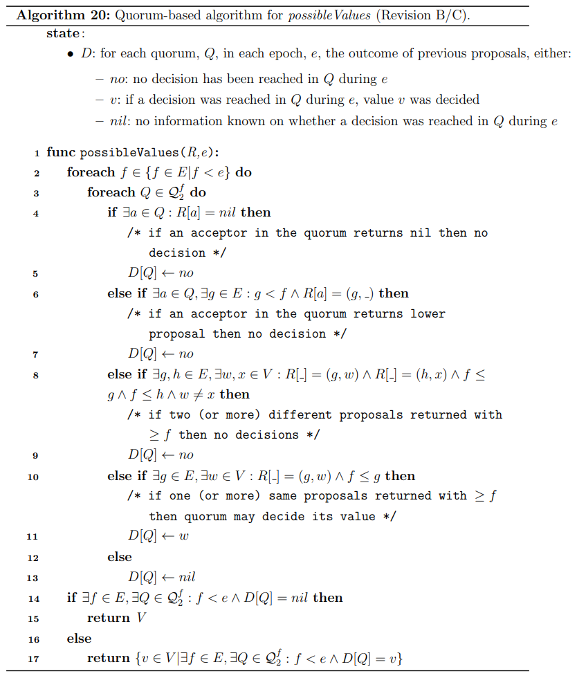

# Chapter 6. Value Selection Revised

**经典的值选择算法classic value selection**：

- 初始，$e_{max}$和$v$都设置为空，并且在Phase I过程中，每收到一个$promise$就进行相应的更新
- 当收到的$promise$带有更大的$e$时就更新$e_{max}$并将$v$更新为该$promise$携带的值
- Phase I结束时若$v$非空，则采用$v$进入Phase II，若$v$为空，则携带自己的候选值
- 实现中可以**采用`R[a]`来追踪所有acceptors的响应结果**

本章中讨论更为灵活的**quorum-based value selection算法**

## Epoch Agnostic Algorithm

### 算法流程

采用[Revision A](https://github.com/JasonYuchen/notes/blob/master/dcr/4.Quorum_Intersection_Revised.md#%E8%B7%A8%E9%98%B6%E6%AE%B5%E7%9A%84quorum%E4%BA%A4%E9%9B%86-quorum-intersection-across-phases)的算法流程如下，特别强调了**value selection的流程**：

其中值选择算法就是`possibleValues(R)`函数，对于经典算法来说，其实现就是返回一组值且与该组值相关的$promise$拥有最高的$e$，或者返回空集如果所有$promise$都没有携带值：

基于quorum，可以将值选择算法修改如下：

- **第一阶段首先确认是否已经达成了决定**，对$\mathcal Q_2$中的所有quorum分别执行判断，并将结果保存在$D$中：
  - 如果存在任意acceptor返回了空值，说明未达成决定
    > if an acceptor $a$ sends $promise(f,e,w)$ where $(e,w) = nil$ then no decision is reached in epochs up to $f$ (exclusive) by the quorums containing $a$
  - 如果存在任意两个acceptors返回了不同的proposal，说明未达成决定
    > if acceptors $a_1$ and $a_2$ send $promise(g,e,w)$ and $promise(g,f,x)$ where $e<f$ and $w \neq x$, then no decision is reached in epochs up to $g$ (exclusive) by the quorums containing $a_1$
  - 所有acceptors都返回了相同的值，说明已经达成决定
- **第二阶段根据$D$来判断全局情况**，只要存在一个$\mathcal Q_2$中的quorum达成了决定，就可以返回该值，否则返回空值

当多个acceptor的$promise$携带有值返回时，classic value seleciton会在其中选择一个值（`possbileValues(R)`返回的值，最大epoch对应的$v$）并提出，而quorum-based value selection可能会认为没有一个结果达成了决定（`possibleValues(R)`返回空）从而选择自己的候选值进行提出，**可见quorum-based value selection能够判断出一些值并没有达成决定从而可以选择自己的候选值**，更加泛化

### 实例

系统条件如下：

- $A=\{a_1,a_2,a_3,a_4,a_5\}$
- $\mathcal Q_2=\{\{a_1,a_2,a_3\},\{a_4,a_5\}\}$

**情形一**：当$e=5$时proposer 1依次收到了如下响应：

1. 来自$a_1$的$promise(5,3,A)$
2. 来自$a_2$的$promise(5,nil,nil)$
3. 来自$a_4$的$promise(5,2,B)$

从而**基于classic value selection**，显然会采用拥有最高epoch的值，即$A$，而**基于quorum-based value selection**时，显然epoch在0-4之间并没有达成决定，因此可以任意选择值在Phase II提出

**情形二**：当$e=5$时proposer 1依次收到了如下响应：

1. 来自$a_1$的$promise(5,3,A)$
2. 来自$a_2$的$promise(5,1,A)$
3. 来自$a_4$的$promise(5,2,B)$

从而**基于classic value selection**，显然会采用拥有最高epoch的值，即$A$，而**基于quorum-based value selection**时，由于$(2,B)$与$(1,A)$的存在意味着包含$a_2$的quorum $a_1,a_2,a_3$并没有达成决定，同样由于$(3,A)$与$(2,B)$的存在意味着包含$a_4$的quorum $a_4,a_5$也没有达成决定，**由于$\mathcal Q_2$下的2个quorum都没有达成决定**，因此可以任意选择值在Phase II提出

## Epoch Dependent Algorithm

采用[Revision B/C](https://github.com/JasonYuchen/notes/blob/master/dcr/4.Quorum_Intersection_Revised.md#%E8%B7%A8epoch%E7%9A%84quorum%E4%BA%A4%E9%9B%86-quorum-intersection-across-epochs)的算法流程如下，特别强调了**value selection的流程**：

其中**值选择算法`possibleValues(R, e)`会额外考虑每个epoch**的情况：

