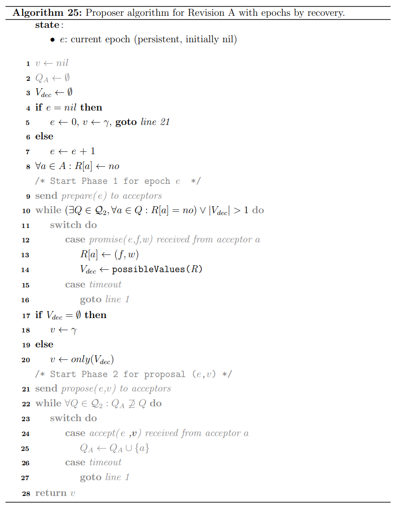

# Chapter 7. Epochs Revised

## Epochs From An Allocator

采用一个**epoch分配器**进行动态分配，并且需要保证每个epoch至多只被分配了一次，在[3.8节](https://github.com/JasonYuchen/notes/blob/master/dcr/3.Known_Revisions.md#epochs)中讨论了多种epoch的构成方式，例如采用$(vid,sid)$形成$E=\{(1,1),(1,2),...(2,1),(2,2)...\}$形式的epoch，其中$sid$在每次分配时自增并且不需要持久化保存，而$vid$在proposer每次宕机重启时自增，必须持久化保存

## Epochs by Value Mapping

采用唯一的epoch主要用于限制proposer不能在相同的$e$下发送不同的值$v$，即$propose(e,v)$必须唯一，则从值$v$的角度来说，如果能够**保证每个$v$都有唯一的$e$也可行，因此可以通过$v$来生成$e$，即value mapping**，当proposer不能通过Phase I来提出自己的候选值时，在选择$promise$中的候选值$v$时必须一并选择相应的$e$

这种方式的优点在于proposer不必再持久化保存epoch，每个proposer希望propose的值带有最小epoch时就可以直接跳过Phase I，但是缺点在于此时的Phase I需要对value有感知，[不能提前执行Phase I](https://github.com/JasonYuchen/notes/blob/master/dcr/3.Known_Revisions.md#phase-ordering)

## Epochs by Recovery

通过引入**恢复机制**，使得proposer可以选择任意的epoch，当存在同一个epoch有多个value的冲突时会进行恢复从而确保$(e,v)$唯一，基于[Revision B](https://github.com/JasonYuchen/notes/blob/master/dcr/4.Quorum_Intersection_Revised.md#%E8%B7%A8epoch%E7%9A%84quorum%E4%BA%A4%E9%9B%86-quorum-intersection-across-epochs)，假如允许任意epoch，会存在以下问题，及相应的解法：

- **有可能出现同一个$e$的不同$v$被不相交的Phase II quorum接受**
  要求Phase II quorum对相同的$e$必须相交，即
  
  $\forall Q,Q' \in \mathcal Q_2^e : Q \cap Q' \neq \emptyset$

- **一个值可能已经被一个Phase II quorum接受，随后又被相同$e$的另一个值覆盖，违背了协议安全性**
  要求Phase II的提案$(e,v)$被接受的条件为$e>e_{acc}$或$(e,v) = (e_{acc},v_{acc})$，覆盖但安全的实例可以[参考此](https://github.com/JasonYuchen/notes/blob/master/papers/2001_Paxos_Made_Simple.md#example)

  

- **可能出现值冲突value collision导致系统活锁**
  目前的值选择算法value selection中如果出现不同的acceptor返回的$promise$响应中存在一样大的epoch而不同的value，则proposer无法确定选择哪个值，因为无法从$promise$中得出此前的$prepare$抵达顺序，因此无法判断哪个值有可能被决定，需要进一步约束quorum相交条件

  $\forall Q \in \mathcal Q_1^e, \forall f \in E : f < e \implies \forall Q',Q'' \in \mathcal Q_2^f : Q \cap Q' \cap Q'' \neq \emptyset$

以下是Revision A with epochs allocated by recovery，与[Revision A with quorum-based value selection, Algorithm 16](https://github.com/JasonYuchen/notes/blob/master/dcr/6.Value_Selection_Revised.md#epoch-agnostic-algorithm)有三点显著的不同：

1. proposer不再需要从disjoint sets中选取epochs，每次使用$e$时自增且持久化保存，即Algorithm 25, Line 4-7
2. `possibleValues(R)`中选择值时，面对相同$e$不同$v$的$promise$就选择$no$，即Algorithm 25, Line 7-10
3. 假如从$promise$中判断出有多个可能的$v$时，就需要等待更多的$promise$直到只有单个可能的值或是没有值，即Algorithm 25, Line 10

`TODO: 实例`

- 2个顺序执行的proposers，$a_3$已经接受了$(0,A)$
  
  

- 2个顺序执行的proposers，$a_3$起始尚未接受任何值，且发给$a_3$的$propose(0,B)$丢失

  

- 2个顺序执行的proposers，$a_3$起始尚未接受任何值，并接受了$(0,B)$，随后的$a_2$和$a_3$分别返回相同$e$但不同$v$的$promise$，在**等到$a_1$的响应时**才能最终选择$A$

  

- 2个并发执行的proposers，并且均提出了相同的值$A$，迅速被确认

  

## Hybrid Epoch Allocation

|Approach|Unique to values|Unique to proposers|Assignment required|
|:-|:-|:-|:-|
|Pre-allocation|Y|Y|Y, to proposers|
|Voting|Y|Y|N|
|Allocator|Y|Y & N|N|
|Value-based|Y|N|Y, to values|
|Recovery|N|N|N|

1. **Multi-path Paxos using allocator**
   采用单一的allocator可能引入了SPOF导致系统重度依赖allocator，混合使用epoch分配方式可以缓解这一问题，如下，在能够获取epoch的情况下可以跳过Phase I直接进入Phase II，否则就退化到从Phase I开始：

   

2. **Multi-path Paxos using value-based allocation**
3. **Multi-path Paxos using recovery**
   在fast path上采用了strict majority quorum $size = \lceil 3n_a/4 \rceil$，参考[Fast Paxos](https://github.com/JasonYuchen/notes/blob/master/papers/2001_Paxos_Made_Simple.md#fast-paxos)的说明

   

   
