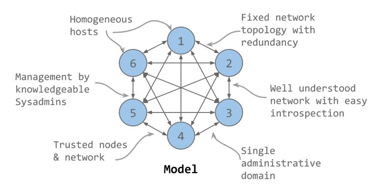
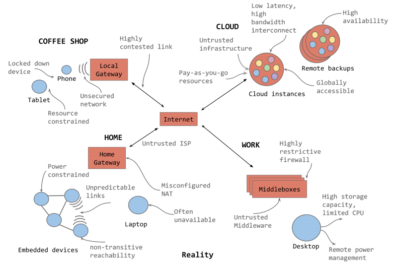
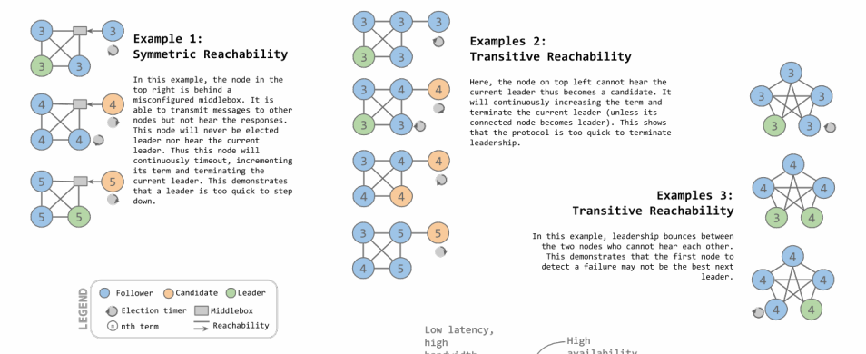

# Unanimous - In Pursuit of Consensus at the Internet Edge

共识算法（例如Paxos）的运行环境总是有一个较强的假设，如同所有节点都运行在**单个数据中心**中，如下图：

而internet级别的环境往往极端复杂，可能共识算法的真实运行环境如下（现实中共识算法往往应用在服务端，极端情况下往往是**跨多个数据中心**或跨大陆）：

## 可能出现的问题

以[Raft算法](https://github.com/JasonYuchen/notes/tree/master/raft)为例，其节点间的通信情况可能发生如下异常：

1. 例一：**对称可达性 Symmetric Reachability**
   由于网络配置异常，右侧节点只能发出消息给左侧三个节点，而不能收到左侧节点的消息，则Raft基本算法框架下就会出现该节点始终不能当选leader，也无法感知到leader的存在，从而一直增加term并发起选举，不断冲击左侧正常集群使得leader不断转为follower，整个集群持续不可用

   通常[pre-vote](https://github.com/JasonYuchen/notes/blob/master/raft/09.Leader_Election_Evaluation.md#chapter-9-leader-election-evaluation)或[heartbeat lease](https://github.com/JasonYuchen/notes/blob/master/raft/04.Cluster_Membership_Change.md#3-%E7%A0%B4%E5%9D%8F%E6%80%A7%E7%9A%84%E8%8A%82%E7%82%B9-disruptive-servers)可以解决这种集群外冲击
2. 例二：**传递可达性 Transitive Reachability**
   与例一类似，但是此时右侧节点只能收到相邻节点的消息但无法收到左侧节点的消息，从而只要不是相邻节点称为leader，右侧节点同样会一直自增term并冲击左侧正常集群

   解决方法与例一相同
3. 例三：**传递可达性 Transitive Reachability**
   存在两个节点相互无法联系，但是各自都能与整个集群其余节点通信，导致了**leadership会在这两个节点之间bounce**，即其中一个节点无法收到另一个节点成为leader的消息，从而超时后发起选举并成功，而原leader同样无法收到，继而两个节点周期交错发起选举，使得集群不可用

   解决方法可以是hearbeat lease，由于同样能与majority交互，pre-vote无法解决这种场景

## 做法

1. Designed for developer usability and performance, even in the hostile internet edge
2. Based on the reality of the modern Internet, not Paxos's model assumptions
3. Conservative leader election with smart failure detectors, converging towards the most reliable and highly connected nodes
4. A complete modular specification with extensions such as dynamic membership, Byzantine fault tolerance, load balancing and address discovery
5. Fine-grained approach to participation including various degrees of passive participation
