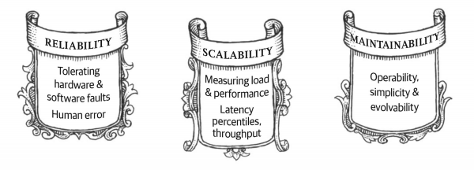

# Chapter 1. Reliable, Scalable, and Maintainable Applications

## 考虑数据系统 Thinking About Data Systems

使用一些通用的组件来设计一个数据系统（架构），需要考虑：

- 如何在部分组件出错甚至不可用时保证数据的准确和完整？**可靠性Reliability**
- 如何在部分组件劣化时依然保持高性能？
- 如何应对增加的负载？**可扩展性Scalability**
- 如何设计良好的API？**可维护性Maintainability**

## 可靠性 Reliability

- 硬件故障
    例如硬盘平均故障时间MTTF是10-50年，因此对于有10000磁盘的系统，平均每天会损坏一块
- 软件错误
    多个硬件故障往往是独立的，而软件错误可能会出现在所有节点（整个系统）中
- 人为错误

## 可扩展性 Scalability

- 描述负载
    以twitter为例，一个user发布的tweet要被n个follower见到
    1. 每个follower要看自己关注人的tweet时，就从每个关注者已发表的tweet中读取，合并
    2. 每个user发布tweet时就推送到每个follower的缓存中
- 描述性能
    使用percentile比median(p50)更好
- 应对负载
    1. 垂直扩展scaling up：增加单机性能
    2. 水平扩展scaling out：增加集群规模
    针对不同的具体情形设计不同的架构来应对负载
- 可维护性
    1. 可操作性：让运维更简单
    2. 简洁性：控制复杂度
    3. 可演化性：容易修改
