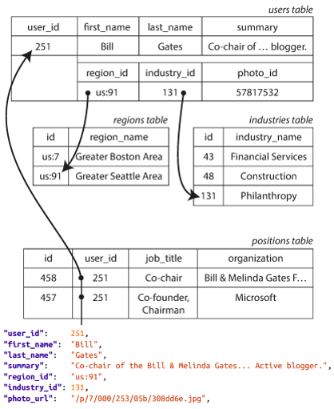
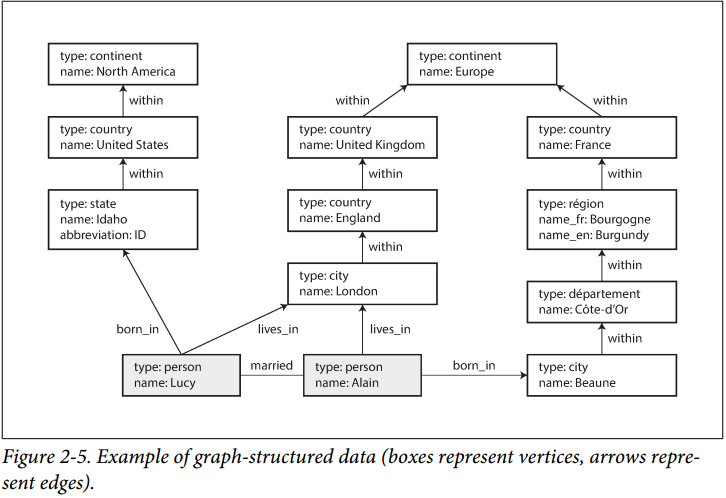

# Chapter 2. Data Model and Query Languages

## 关系模型对比文档模型 Relational Model Versus Document Model

1. NoSQL的诞生
   - 文档数据库DocumentDB着重单个文档的数据都是自我包含self-contained的，不同的文档之间存在关系非常罕见
   - 图数据库GraphDB则着重任何数据都可能与其他任何数据发生任何关系
1. 对象和关系的不匹配，由此需要[Objecy-Relational Mapping, ORM](https://en.wikipedia.org/wiki/Object%E2%80%93relational_mapping)
以简历为例，JSON格式的简历要比关系模型下的简历有更好的自明性，并且局部性也更好
1. **多对一和多对多关系**
关系型数据库下的多对一关系可以利于减少数据重复，并且很容易join，而文档模型下join很弱或者没有，此使就需要应用层通过更多的查询然后模拟join，而例如JSON本质上是支持一对多关系
1. 如今的关系模型对比文档模型
   - 文档模型schema更灵活，数据局部性更好
   - 在文档模型中不能根据某个值直接引用其他项目
   - 虽然文档模型join很弱，但是一般采用文档模型的应用并不需要join，具体取决于场景
   - 对于高度相关的数据（多对多），文档模型很不合适，关系模型可以适用，图模型是最适配的
   - 对于schema不定且可能运行时改变的数据，关系模型就非常有害
   - **关系型数据库越来越支持JSON/XML，文档型数据库越来越支持join，融合互补是趋势**

## 查询语言 Query Languages for Data

1. **声明式declarative和命令式imperative**
    命令式即编程语言的方式，逐行执行，而声明式即只声明需要的结果，过程由SQL optimizer/executor来决定，由此可以在不影响外部的情况下对SQL引擎进行修改提升，只要保证结果一致即可
1. Web上的声明式查询
1. MapReduce查询

## 图数据模型 Graph-like Data Models

1. 属性图Property Graphs
   - 节点vertex包括
        - 唯一的ID
        - 向外的边（出度）
        - 向内的边（入度）
        - 一组属性值（K-V对）
   - 边edge包括
        - 唯一的ID
        - 起始节点
        - 终止节点
        - 描述起始和终止节点之间的关系
        - 一组属性值（K-V对）
   - **重要特点**
        - 任意节点可以通过边连接任意节点，没有schema来限制连接关系
        - 根据给定节点可以高效获取该节点的所有向外的边和向内的边（度)
        - 通过各种不同的关系，一个简单的图上可以存放各种复杂的信息
1. Cypher查询语言
1. SQL中的图查询语言

