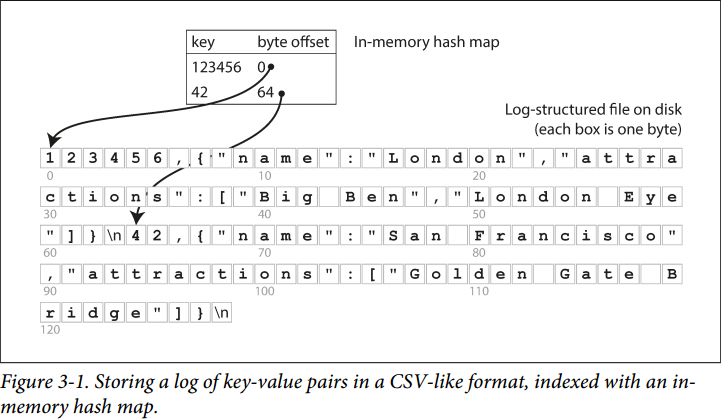
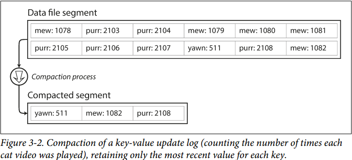
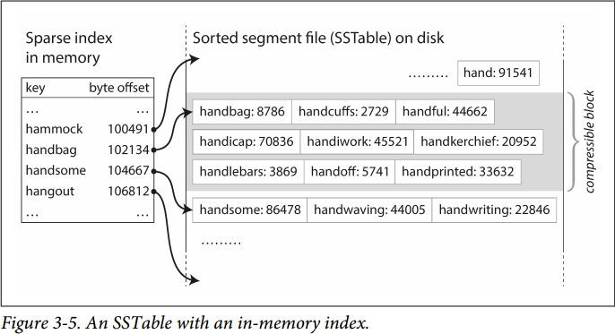
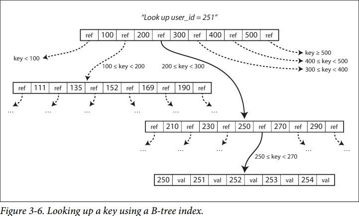
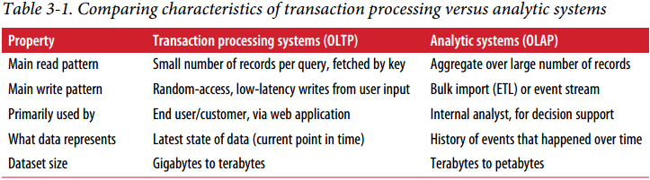
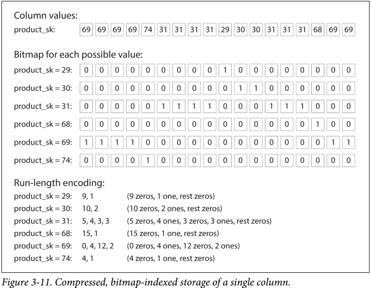
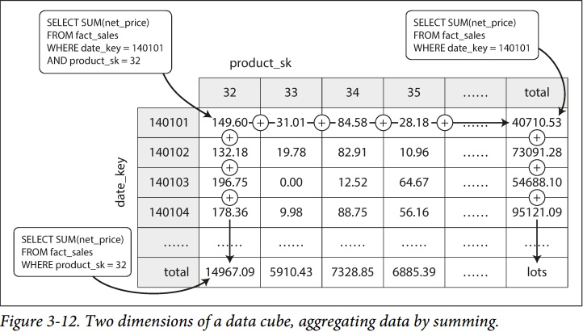

# Chapter 3. Storage and Retrieval

## 驱动数据库的数据结构 Data Structures That Power Your Database

### 1. 散列索引 Hash Indexes

散列索引在内存中维护散列表，将key映射到对应的磁盘上数据的位置offset：

对于不停append only的log，通过设置阈值并且进行压缩compaction生成新的文件来垃圾回收，如下图：

对于真实可行的索引，还需要考虑以下设计：

- **格式**：直接使用二进制格式，并且通过size后raw string的格式来高效存储
- **删除**：通过特殊的标记值来表示这个key已被删除，则随后在compaction中就会跳过
- **崩溃恢复**：数据库重启时，内存索引（散列表）会丢失，需要根据真实数据情况或是索引本身的持久化快照进行重建
- **不完整的数据**：在任何时候数据库崩溃都可能导致写入了不完整的log，使用checksum等机制来确认数据完整性
- **并发控制**：由于文件的append依赖顺序，因此可以通过multiple producer single consumer进行并发控制

#### 散列索引通常有如下优点

1. 由于append是顺序写入，比in-place修改（随机写入）效率要高很多（HDD&SSD），因此使用看似浪费空间的顺序写入可以获得更理想的性能，空间通过compaction来保持（注意，随着硬件发展，**随机写入已经不再是最新存储设备的瓶颈，参考SOSP2019 KVell**）
2. 并发以及崩溃恢复在顺序写入的情况下更简单，前面完整写入的记录是immutable的
3. 通过compaction合并旧文件的过程可以避免in-place导致的碎片化

#### 散列索引通常有如下缺点

1. 散列索引必须足够小能够被完整容纳在内存当中
2. 对任意key的查找非常快O(1)，但是无法高效实现范围range查找

### 2. Sorted String Table, SSTable和Log Structured Merge Trees, LSM-Trees

根据key对数据进行排序，排序后的[稀疏索引Sparse Index](https://docs.mongodb.com/manual/core/index-sparse/)放置在内存中，并且映射到对应磁盘上的位置offset，磁盘上每个有序的log segment文件内不包含重复的key，从而有利于range access和log compaction

#### SSTable的优点

1. Compaction过程非常简单（归并排序），并且新的segment内的某一key会覆盖任何旧segment的同一key
2. 由于key是有序的，不再需要在内存中维护所有key的index，只需要**维护segment内稀疏的一部分key的offset，即稀疏索引**，具体搜索某个key时先根据内存搜索树确定segment内的offset，随后再扫描这个offset开始segment很小的一部分即可
3. 另外还可以通过块压缩，将稀疏key对应的segment内的每一部分key进行压缩，以提高磁盘带宽利用率

#### 构建和维护SSTables

1. 内存维护搜索树作为memtable
2. 当memtable大小达到阈值时直接写入磁盘，作为最新的segment，同时创建新的内存memtable，因此写入磁盘的segment都是immutable的，此时可能发生**Write Stall**
3. 有搜索需求时，首先在内存memtable中查找，若没有则根据索引在一系列segments中查找
4. 定期执行compaction过程，即类似于多路归并，更加高效，将segments合并并剔除过时或被删除的数据
5. 使用WAL log来防止正在内存而未写入磁盘而在memtable的丢失

### 3. B树

B树见数据库相关notes，一些B树的优化:

1. 不通过WAL来进行崩溃恢复，而是使用copy-on-write，每次修改都构建好修改后的page，进行原子替换，这对并发也有利
2. 储存缩写的key来减少page空间占用，由此来提供更高的分支因子，减少层数
3. 每个叶子页通过存储兄弟叶子节点页的指针，实现不必回退父节点就可以顺序扫描所有key

### 4. 对比B-Trees和LSM-Trees

- B树每个数据必须写两次（WAL和B树），即使很少数据修改都必须整个page更新；而LSM树的一个数据多次修改也会导致写入多次导致写放大（**write amplification**），可能对SSD的寿命有影响
- LSM树是顺序写入的，即使写放大，往往也比B树的随即写性能要高很多（不一定适用现代存储设备见SOSP2019 Kvell）
- LSM由于compaction，数据紧凑，很容易压缩提高磁盘利用率，而B树由于分裂叶子节点，往往存在一些占位空间导致碎片化
- LSM后台的compaction过程可能会影响到正在进行的读写（**write stall**），虽然平均响应时间和吞吐量受影响不大，但是可能随机出现某个读写延迟高，而B树的读写延迟更加稳定可预测
- 磁盘的带宽被compaction和正常写memtable到磁盘所共享，由此会互相影响性能，而B树的数据只存在于某一页中，不像LSM可能存在于多个segment中，因此B树能更好的支持事务transaction

### 5. 其他索引结构

1. 在索引中存储真实数据
    一般索引是Key-Value对，Value可以是真实数据的位置，或直接存放真实数据来减少多次跳跃，存储真实数据的索引称为**聚集索引clustered index**，而存储真实数据位置的索引就是**非聚集索引nonclustered index**，在两者之间的索引（存储真实数据位置以及一部分真实数据）称为**覆盖索引covering index或包含列的索引index with included columns**
2. 多列索引
    最简单的多列索引就是**连接索引concatenated index**，即将多个列连接成为一个索引的key；另外更通用的方式是**多维索引multi-dimensional indexes**，使用[R-Trees](https://en.wikipedia.org/wiki/R-tree)
3. 全文检索和模糊索引
4. 在内存中保存全部数据，内存数据库
    内存数据库的优势在于可以避免磁盘数据库数据结构序列化和反序列化的开销，同时内存中可以构建更复杂的数据模型

## 事务还是分析 Transaction Processing or Analytics?

### 1. 事务和分析的特点

### 2. 分析的schemas：星型和雪花型

- 星型又叫维度模型，由**一个核心的事实表fact table和周边的维度表dimensional tables构成**，事实表往往是巨大的事件集合，维度表则是辅助描述事件的各个属性
- 雪花型就是进一步分割的模型，更加规范化，但是星型易于使用，也更被推荐

### 3. 列式存储 Column-Oriented Storage

由于**分析型查询往往只涉及小部分列**，而往往有非常多上十亿行，因此按行存储Row-Oriented Storage是低效不可接受的，按列存储要求所有列里的数据都以相同的顺序存储，这样一个索引就可以访问每列的对应数据，构成一条记录，并且不想访问的数据就不会被带入内存，而行存则会带入整条记录

1. **列压缩**
   - 由于列存中，每个列的数据都是同类型的，因此非常容易压缩以提高IO利用率
   - 可以使用位图索引bitmap indexes；这是因为列的行数可能很多，但是可能出现的值非常少，即重复值非常多，因此可以通过使用N个可能的值+N个位图（每个可能的值出现在一列的哪些行）来存储一个列
       
   - 同时列存一次读取一个chunk，更易于保存在CPU缓存中，且可以充分利用SIMD等向量化方法来处理
2. **列存储的排序**
   - 一般列存储可以append-only，也可以通过类似SSTable的方式进行排序，并基于排序提供索引功能
   - 由于列存储依靠位置来保证每个列的行能相互对应，因此**排序时不能每个列单独自己排序**，例如查询经常范围查colA，则根据colA进行排序，此后范围查时只需要扫描一小部分行就能获得所有数据，即sort key只能施加给某一列，类似B树里使用的主键聚集索引
   - 还可以存储多份根据不同列排序的数据，由此不同的查询自动选择最适配的排序的数据
3. 写入列存储
    通过SSTable的处理方式
4. 聚合：数据立方Data Cubes和物化视图Materialized Views
    例如sum/avg等聚合查询经常被使用到，因此可以通过**物化视图（materialized views: a table-like object whose contents are the results of some query）**和数据立方来缓存结果
    
