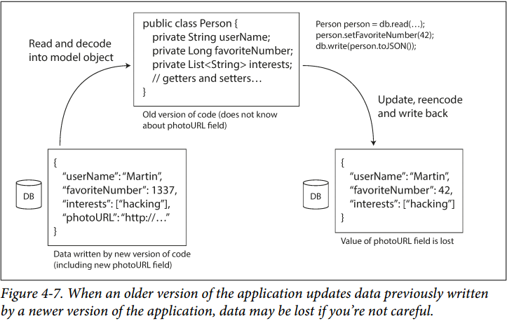

# Chapter 4. Encoding and Evolution

## 数据编码格式 Formats for Encoding Data

- **向后兼容backward compatibility**：新代码能读取旧代码存储的数据
- **向前兼容forward compatibility**：旧代码能读取新代码存储的数据
- **滚动升级rolling update**：整个系统由多个分布的节点组成，每个节点可以单独升级，由此需要考虑新老节点间的数据交互

## 数据流模式 Modes of Dataflow

### 1. 使用数据库的数据流 Dataflow Through Databases

### 2. 使用服务的数据流：REST和RPC Dataflow Through Services: REST and RPC

例如在web浏览器里允许的javascript程序可以使用XMLHttpRequest来变为HTTP客户端（Ajax技术），从而服务端返回编码的数据给js程序处理，**根据功能将一个整体划分成不同的服务，任意一个模块可以通过请求服务来获取数据，这样的架构称为称为SOA（service-oriented architecture）或微服务（microservices architecture）**，而如果一个模块通过中间平台再去获取另一个模块的服务，**支撑这样微服务架构的中间平台就称为中间件（middleware）**

使用RPC请求服务存在的问题：

- **不可预测**：本地调用要么成功要么失败，而RPC由于通过网络，可能调用成功但是返回结果延迟或丢失，也可能调用本身延迟或丢失
- **超时**：同不可预测，当超时之后，RPC发起方无从知晓是已经执行了但返回超时还是没有执行
- **幂等性**：同上，如果超时后发起重试，如何确保这个操作不被重复执行，即幂等性
- **延迟**：本地调用耗时可预测，而RPC的耗时则不可预测
- **引用**：本地调用可以使用引用或指针，而RPC传指针毫无意义
- **异构**：RPC的发起方和执行方可能是不同的语言，而不同的语言之间的数据类型存在不兼容性

### 3. 使用消息传递的数据流Dataflow Through Message-Passing

使用消息队列（消息中间件）从发布者到订阅者持续低延迟推送数据流，相比于RPC，异步消息传递系统有如下特点：

- 当接收方过载或网络不稳定时，消息队列可以充当缓存，由此提高系统整体的可靠性
- 可以重发消息，以避免接收者宕机时的消息丢失
- 单发送者可以向多个接收者发送同一个消息
- 收发解耦，发送者只发送而不关心接收者，接收者只接收而不关心发送者
- 但是消息系统相比于RPC，是单向的（即使在另一条通道中发送返回消息），发送者往往不会等待每一条消息的返回

采用消息队列（例如Kafka等）更详细的分析与设计参考**Making Sense of Stream Processing**
