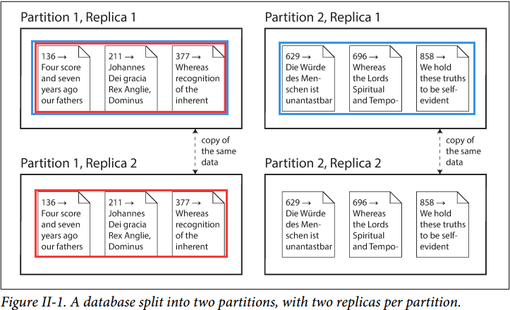

# Part II. Distributed Data

## 扩展来支持更高负载 Scaling to Higher Load

- **无共享架构 Shared-Nothing Architectures**
    每个运行数据库软件的虚拟主机都称为节点，且节点之间不共享任何资源，只通过软件层面的网络进行通信
- **复制对比分区 Replication Versus Partitioning**
    分区亦称分片（sharding）
    
