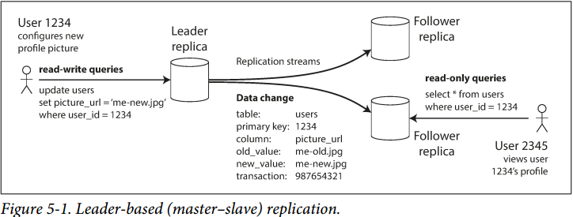

# Chapter 5. Replication

## 主节点与从节点 Leaders and Followers

### 1. 基于主节点的复制 Leader-based Replication

- 某一个节点作为leader，所有用户的读写请求都通过leader执行
- leader处理请求后将数据转发给所有follower，follower也同样应用这些改变
- follower可以处理read-only请求

### 2. 同步复制对比异步复制 Synchronous Versus Asynchronous Replication

- 同步的优点在于确保follower拥有的数据一定与leader一样是最新的，但延迟会高
- 异步的优点在于响应速度快延迟低，但有可能丢失数据，或在follower上读取到旧数据
实践来说，所有follower都同步就会导致很有可能任一follower故障都会将整个系统阻塞，因此往往**少数几个follower同步复制，而大多数follower异步复制**

### 3. 启动新的从节点 Setting Up New Followers

通常采用**快照的方式snapshot**，流程如下：

1. leader进行快照保存节点状态 snapshotting
2. follower收到leader发送的快照，直接应用snapshot
3. follower逐步收到snapshot后的消息直到与leader同步caught up

### 4. 处理节点宕机

- **follower失效**：重启之后接收消息或快照直到与leader同步
- **leader失效**：故障转移failover
  1. 确认leader失效
  2. 选择新的leader，通常拥有最新数据的follower就是candidate
  3. 系统确认新的leader，所有请求re-route到新的leader
  
  **leader切换存在需要仔细处理的环节**：
  - 如果采用了异步复制，则如何处理丢失的数据
  - 宕机的prev-leader重启之后重新加入集群，如何处理leaders冲突
  - **脑裂问题split brain**，当两个节点都认为自己是leader，如何处理冲突
  - 如何确认故障的超时时间，即leader失去响应多久才可以算是宕机

### 5. 复制日志的实现 Implementation of Replication Logs

- 基于语句的复制 Statement-based replication
    每一条执行语句（在关系数据库中即每一条INSERT/UPDATE/DELETE语句）都被推送给follower执行，从而达成复制，存在的问题诸如语句中包含NOW()等函数，导致follower执行时与领导者不一致，或是语句存在副作用side-effect，虽然简单但没有广泛使用
- 传输预写式日志的复制 WAL shipping
    对于SSTables和B树，都存在顺序添加的log，直接传输这个log来达成复制，缺点在于这些log是直接应用到SSTable/B-trees，存在和底层存储引擎的耦合
- **逻辑日志复制 Logical (row-based) log replication**
    使用逻辑日志可以使得与底层存储引擎（SSTables/B-trees）解耦，通常是一系列行级别描述数据修改的日志
- 基于触发器的复制 Trigger-based replication
    前述都是基于数据库的复制，当需要更灵活时，**复制的逻辑就可以提升到应用层来完成**，但是不当设置容易导致问题

## 复制延迟问题 Problems with Replication Lag

对于从follower上读，在leader上写的场景，复制延迟就会导致如下问题：

- **读己之写 Reading Your Own Writes**
    写发生在leader上，而读发生在follower上，由于复制延迟，有可能出现无法看到已经成功提交的请求，己无法读己之写，即不保证**读写一致性read-after-write consistency**，注意读写一致性只保证读己之写，不保证读他之写，部分方法如下：
  - 读可能修改的数据时，从leader读，其他情况从follower读，这需要一种策略来判断读是否读了可能修改的数据
  - 用户可以记录最近写的timestamp，读时带上timestamp，由系统保证读的结果一定不比timestamp旧，否则的话由leader或其他note来服务，timestamp可以是logical time用来标注读的顺序

  

- **单调读 Monotonic Reads**
    即不会时光倒流，已经读到新的数据，再次读确保一样或更新，不会读到旧的数据即保证**单调读一致性monotonic read consistency**，这可能会发生在不同节点上读，先读的节点数据更新，而后读的节点延迟大，出现了非单调读，解决方法是可以通过始终读同一个节点上的副本来确保单调性
  
  

- **一致前缀读Consistent Prefix Reads**
    多个不同的写按某个顺序发生时，任何读也要读到这个顺序，例如先写A再依赖A写B，但是读时从两个不同延迟的节点上分别读A和B，结果先读到B再读到A，但是B依赖A，此时违背**因果一致性casual consistency**

  

**注意：一致性模型有多种，详细归类和解释见此[Consistency model](https://en.wikipedia.org/wiki/Consistency_model)**

## 多主复制 Multi-Leader Replication

### 1. 应用场景 Use Cases for Multi-Leader Replication

- 多个数据中心 Multi-datacenter operation
  - 性能：若是single-leader，则在多个数据中心中，则只有一个数据中心能够执行写任务
  - 数据中心宕机：若是single-leader，则leader所在中心宕机时，需要选举出新的leader，而multi-leader系统正常运行
  - 网络故障：single-leader对网络问题更加敏感，multi-leader则更稳定
  - 冲突：multi-leader必须解决写冲突
- 存在离线操作 Clients with offline operation
    存在离线操作的云端备份本质上也属于多主复制，当离线时本地就是leader，修改被直接接收，重新联网后解决和云端leader的冲突，并备份到云端
- 合作编辑 Collaborative editing
    实时多人合作编辑也属于多主复制，每个人的修改都需要被接收，多人的修改之间解决冲突

### 2. 处理写冲突 Handling Write Conflicts

- 同步冲突检测 vs. 异步冲突检测
    同步冲突检测要求写入成功时再通知所有冲突侧，则不如使用single-leader，而异步冲突检测要求冲突的写入立即被接收，直到检测到冲突时再提醒用户，可能会有延迟
- 冲突避免
    最佳方式就是避免冲突，即涉及到相同数据的修改通过同一个leader，此时天然不会有冲突
- **收敛至一致状态**
    冲突解决要求所有冲突的数据最终在所有副本上都达成一致，方法可以是：
  - 每一个写赋予一个UID（逻辑时间等），冲突时拥有**最大UID的为最终值（last write wins）**，可能有数据丢失
  - 每个副本赋予一个UID，冲突时来自更大UID的副本的修改可以覆盖来自较小UID的副本的修改，可能有数据丢失
  - 不丢弃任何修改，合并冲突值
  - 记录冲突的数据和相关的元信息，由应用层来负责解决冲突
- 自定义冲突解决逻辑
    大多数多主复制都通过调用应用层逻辑来解决冲突，应用层逻辑会在如下时刻调用：
  - **写时**：当数据库修改数据时检测到冲突，即调用冲突解决逻辑
  - **读时**：当数据库修改数据时检测到冲突，记录所有冲突的情况，等下次读到对应的数据时，多个版本的冲突数据都传给应用层冲突解决逻辑，由**应用层解决并保留某一个版本并写回**数据库

### 3. 多主复制拓扑关系 Multi-Leader Replication Topologies

对于**非全连接的结构可能存在单点故障single point of failure, SPOF**，但是对于全连接来说也可能会出现部分连接速度不一致，导致部分节点的修改出现不一致，例如下图出现了非一致前缀读，使用**[版本向量version vectors](https://en.wikipedia.org/wiki/Version_vector)**可以解决，追踪每一个版本的更新从而追踪因果关系

## 无主复制 Leaderless Replication

### 1. 当副本节点宕机时写入数据库

写入时同时在所有replicas上写入，无视失败的节点，半数以上成功（**quorum**）即视为成功，读取时在所有副本上读取，半数以上返回即视为成功，使用版本号（**version number**）来决定最新值，并将最新值再写入到返回过时值得副本中

- **读修复 Read repair**
    当并行从多个副本读时，会自动进行读修复，过时的数据会被重写为最新的数据，但是一直未被读到的数据就可能难以保持多副本和持久性
- **反熵 Anti-entropy**
    后台运行检查进程，不断扫描副本的不一致情况，并通过其他副本对不一致副本进行修复
- **读写的法定人数 Quorums for reading and writing**
    `n-总副本数，r-读成功副本数，w-写成功副本数`
    法定人数quorum即为**w+r>n，通常可以选择n=2k+1，w=k+1，r=k+1**，通过根据系统负载的情况，可以灵活选择w/r来是的系统的综合性能最高，例如读多写少，就可以较大的w配合较小的r

### 2. quorum的限制 Limitation of Quorum Consistency

本质上quorum要求w+r>n是为了确保**读写成功的节点总有至少一个重合，就确保了一致性**，因此只要能够确保读写成功节点有重合，不必要w+r>n也可以确保一致性，但是quorum通常有如下限制：

- 松散的quorum会导致读写的节点没有重合，从而读到过时数据
- 并发写入依然需要解决冲突问题
- 并发读写，写可能只成功了部分节点，读未必能够成功读到写入成功的节点，此时即使随后quorum满足也读到过时数据
- 如果写入在部分节点上失败了，最终不足法定人数，整体失败，但是由于**成功的节点不会回滚**，此后的读也是不确定的
- 如果携带**最新数据的节点宕机数据丢失**，当从其他副本恢复时可能被旧数据覆盖，从而破坏了法定人数前提
- 并且前述的**读写一致性、单调读、前缀一致性读都不能保证**，更强的一致性需要**事务transaction或是共识consensus来解决**

**quorum系统依然有不一致的风险**，假定有`{A, B, C}`三节点，并且`Nw = Nr = 2`：

1. 第一次写入`{A, B}`，从而两个节点上的数据分别是`A: val=5, ver=1`，`B: val=5, ver=1`，写入成功
2. 第二次写入`{B, C}`，从而两个节点上的数据分别是`B: val=10, ver=2`，`C: val=10, ver=1`，写入成功
3. 第三次读取`{A, C}`，返回结果`A: val=5, ver=1`而`C: val=10, ver=1`，读取失败，显然`C`持有最新的数据，并且3次读写操作均满足quorum的要求，但是实际上第三次读取client无法区分`A`和`C`上哪个节点的数据更新

此时可以考虑的做法包括：

- 当读取操作无法判断时，必须**继续读取更多的节点，直到满足某一个版本的数据达成写入副本`w`数量**从而能够保证一定是最新的，如上述过程中继续读取发现`B: val=10, ver=2`，那么返回client的结果应该是`10`并且需要回写`A`和`C`节点使其结果与`B`保持一致，读取必须**确保结果的一致**才能视为读取成功
- 写入数据时同时也会返回写入成功节点先前的数据和版本，即第二次写入当发现旧状态`B: val=5, ver=1`而`C: val=null, ver=0`时，就需要再一次写入确保`B`和`C`中的数据`ver=2`，写入也必须**校验结果的一致性，即版本号的一致**才能视为写入成功
- 不采用服务器端的数据版本号，而是采用**写入操作的版本号，例如时间戳（可以是client-side或server-side）**，此时写入时显然第二次写入的`C`节点会比`A`节点有更大的时间戳，因此读取时不会出现难以区分的情况，额外的担忧在于**分布式系统中时钟的不可靠性**，但个人认为一般可以容忍并使用（Cassandra、Scylla使用经典的Quorum系统均采用了时间戳定序）的原因如下：
  - 分布式系统中通过NTP同步时间，时间出现大范围的漂移概率并不高
  - 若client或授时的server节点宕机，则再一次发起的写入请求通常会在一段时间之后，可以认为这两次写入是无关的
  - 多个不同节点发起的对相同key的写入，其依赖的时间可能存在不同步的情况，但这种多节点写入本身是并发的，顺序并没有要求，只需要保证最终一致性即可

### 3. 松弛quorum与接力 Sloppy Quorums and Hinted Handoff

当出现网络分区，并且client无法联系上符合quorum要求的节点数量时，基于quorum的操作就无法再进行下去，而松弛的quorum要求可以继续提供服务，例如如下场景：

一个大型系统中有多个节点，例如`{A, B, C, D, E}`五个节点，而一次操作涉及的数据拥有三个副本即`N=3`，例如`{A, B, C}`，那么仅需要`Nw = Nr = 2`即可完成一次操作，但由于网络分区，此时client只能联系到`{A, D}`两个节点，quorum的`{A, B, C}`中任意两个节点无法满足，从而仅仅基于quorum的要求来看此client无法完成这一次操作

**Sloppy quorum依然要求满足`Nw = Nr = 2`的限制**，但其**放松了具体节点的要求**，即不必是来自于`{A, B, C}`的两个节点，此时能够联系上的`D`节点就可以替代`B`或`C`写入，并且一旦网络分区被解决，通过**接力hinted handoff**将`D`上的数据再重新迁移回到`B`和`C`节点，从而重新满足quorum的要求

在Sloppy quorum和hinted handoff的设计下，**写入操作的可用性**得到了显著提升，但是需要特别注意的就是**读取操作的不一致性可能更严重**，因为写入成功并不意味着已经在原先设计的quorum中达到了共识，那么按照quorum读取，即满足`Nw + Nr > N`也依然不一定能够读取到最新的写入

**在多个数据中心的quorum操作中，通常可以更灵活的配置quorum**，例如集群的5个节点分别属于2个数据中心，即`{{A, B, C}, {D, E}}`，此时quorum要求3个节点，那么可以要求当前数据中心的3个节点`{A, B, C}`，此时延迟低但无法容忍整个数据中心宕机，或者是2个数据中心的3个节点`{A, B, D}`，此时延迟高但可以容忍整个数据中心的宕机

### 4. 检测并发写入 Detecting Concurrent Writes

- 最后写者获胜，丢弃并发写入 Last write wins, discarding concurrent writes
    给每个写入附带一个timestamp，新写入覆盖旧写入；但是LWW会导致并发写入成功但非最后写入的数据被丢弃，甚至会导致非并发写入的数据也被丢弃，当数据不允许丢弃时，LWW算法并不适用；通常**如果数据只会写入一次，随后视为immutable，那么LWW算法就是合适的**
- **happens-before关系和并发**
    若A依赖B发生，则B happens-before A，若B依赖A发生，则A happens-before B，若相互无依赖，则AB并发（时间上是否同时并不重要，只要**AB互相不依赖就认为AB是并发的**）
- 捕获happens-before关系 Capturing the happens-before relationship
    
    1. client 1首次添加`milk`，由于是首次写，因此server分配了`version 1`并返回给client 1
    2. client 2首次添加`eggs`，由于未带版本号，因此认为是并发写，分配了`version 2`，并把`milk`和`eggs`一同返回给client 2
    3. client 1继续添加`flour`并带有`version 1`且对client 2的`eggs`不知情，因此server发现了并发写入，**分配了`version 3`并覆盖`version 1`的内容**，把`milk, flour`和`eggs`一同返回给client 1，**保留`version 2`**
    4. client 2继续添加`ham`，由于之前收到了`milk`和`eggs`，此时在客户端合并为`milk, eggs, ham`并带有`version 2`，因此server发现了并发写入，**分配了`version 4`并覆盖`version 2`的内容，保留`version 3`**
    5. client 1继续添加`bacon`，由于之前收到了`milk, flour`和`eggs`，此时在客户端合并为`milk, flour, eggs, bacon`并带有`version 3`，因此server发现了并发写入，**分配了version 5覆盖version 3，保留version 4**

    通过**版本号version number**可以控制并发：
    1. 每个key都维护一个单调递增的版本号，存储数据和相应的版本号
    2. 读时，返回所有尚未被覆盖的数据和最新的版本号（**写之前必须先读**）
    3. **写时携带之前获得的版本号，并合并之前获得的所有数据**，随后在此基础上写并获得新的版本号和所有数据
    4. 当服务端收到带有版本号的写时，**覆盖所有版本号<=此版本号的数据，因为server知道client此次写的数据已经合并了该版本号及之前的数据，但是要保存所有>此版本号的数据**（例如上例中的过程3，带有`version 1`的写入使得server覆盖掉`version 1`，保留`version 2`并分配`version 3`）
    5. **当不携带版本号进行写时则与所有其他写并发，不会覆盖任何内容**（类似于上图出现第三条分支）
    
- 合并并发写入 Merging concurrently written values
    版本号算法确保没有数据会被无声丢失，但是**client要做额外的工作，执行数据的合并**，当**删除数据时需要使用墓碑**标记从而后续的client读知道该数据被删除
- **版本向量 Version vectors**
    对于一个副本上的数据用一个版本号，则在多个备份的数据下就是用一系列版本号，即版本向量，每个副本一个版本号
