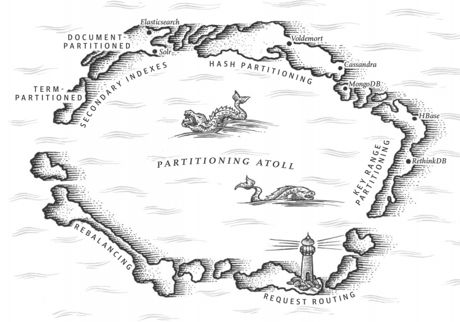

# Chapter 6. Partitioning

## 分区与副本 Partitioning and Replication

分区与副本往往结合使用，**副本用来支持备份和高可用，而分区用来负载均衡、性能以及容纳更多数据**，所有对数据库的备份策略对分区的备份依然有效

## 键值数据的分区 Partitioning of Key-Value Data

分区需要考虑均匀分布数据，不均匀程度称为**倾斜skewed**，尽可能将负载也均匀分配，若某个分区有异常高的负载就称为**热点hot spot**

- **基于key的范围分区** Partitioning by Key Range
    **基于范围需要仔细选择边界来使得所有数据均匀分布，在每个分区内依然可以使所有的key有序**（使用SSTables/LSM-trees）使得范围扫描时有优势，但是范围分区可能导致热点

    例如根据日期分区写入传感器数据，则今天所有数据都写入同一个分区，产生了热点，可以通过每个数据的日期再前缀传感器下标，由此使得数据既根据日期分了区，又使不同传感器分布在不同分区上，避免了热点（类似**二重分区**）
- **基于key的散列分区** Partitioning by Hash of Key
    使用key的散列进行分区，就可以通过设计良好的散列函数，使得数据均匀且避免热点（但要注意在任何节点任何时间下散列函数对同一个key应产生一致的散列值），**散列分区高效支持key的点查询，但是散列分区丢失了数据的局部性，无法支持高效的范围查询**（所有范围查询需要所有节点同时运行并且合并结果）；可以通过**复合key（compound primary key）**，例如多个列组成一个key，根据第一个列进行散列分区，根据余下的部分进行排序，来间接支持范围查询

    例如根据id和timestamp复合，由id来确定分区，由timestamp来排序，则可以高效获取某个id在一段时间内的所有事件
- **负载倾斜与消除热点** Skewed Workloads and Relieving Hot Spots
    极端情况下，即使是散列分区，都会由于例如重度访问同一个key而导致负载倾斜与热点，大部分现有架构都不会自动处理这种负载倾斜，可以通过给**预先知道会出现重度负载的key添加不同的随机数，进一步分区**，查询时就在多个分区上把同样key不同随机数的结果合并，从而进一步分散负载消除热点

## 分区与二级索引 Partitioning and Secondary Indexes

- **基于文档的二级索引** Partitioning Secondary Indexes by Document
    基于文档的二级索引又称为**本地索引（local index，相对应的是全局索引global index），因为每个分区对应的索引只关心本地数据**，数据修改时也只需要修改本地索引，但是依赖二级索引的读取就需要**向所有分区的索引发送查询scatter，并合并结果**

    

- **基于关键词的二级索引**  Partitioning Secondary Indexes by Term
    基于关键词的二级索引又称为**全局索引global index，全局索引覆盖了所有数据，因此本身也要被分区**，而分区方式可以有别于key的分区（可以根据关键词本身进行分区），优点在于比本地索引更加高效，**不存在scatter/gather过程**，缺点在于某个分区的数据更新，其**二级索引可能位于其他分区**，二级索引的更新存在延迟并且实现更加复制

    

## 分区再平衡 Rebalancing Partitions

随着数据增多或是负载增大，需要新增节点并对已有数据进行分区重新平衡，这要求重平衡能够依然保持数据和负载均匀分布，过程中依然持续提供读写服务，并且尽可能少的移动现有数据来提高性能

- **再平衡策略** Strategies for Rebalancing
  - **反面教材：对节点数取模** How not to do it: hash mod N
  - **固定分区数** Fixed number of partitions（每个分区大小与总数据量成正比）
    **创造远多于节点数的分区数，每个节点管理一系列分区（也可称为chunk）**，当新增节点时从原节点处获取一部分分区，实现再平衡，并且再获取过程中原来的分区依然可以对外提供服务，如下图：

    

    进一步，这种策略还允许**异构节点的存在，性能更高的节点存储更多分区**，但是缺点在于**对于未知总量的数据，固定分区数可能导致不同时期分区大小不合适**：一开始数据分区过多（起始数据少）而后期每个分区过大（数据不断增多但总分区数固定）
  - **动态分区** Dynamic partitioning（分区数量与总数据量成正比）
    使用固定分区数的范围分区是很不方便的，一旦初始分区边界设定不良，可能会随着数据进入，部分分区包含数据过多，而另一部分分区始终很空
    动态分区允许当某个**分区数据量超过一定限制时就自动分裂成两个分区，少于一定限制时就自动和相邻分区合并**，类似B树的分裂和合并过程；同时也约定每个节点管理多个分区，当分区分裂时根据当前节点负载决定是否要移动到其他节点上
  - **按节点比例分区** Partitioning proportionally to nodes（分区数量与节点数量成正比）
    **等同于固定每个节点的分区数，当有新节点加入时，现存其他节点的部分分区分裂成两份，其中一份转移到新节点上**
    对于随机挑选分区边界要求使用基于散列的分区，例如原来`[0,10,20,40]`，新增一个节点`[0,10,20,30,40]`，将`[20,40]`分割成两个分区，其他区域数据不移动，这种做法更接近[一致性散列consistent hashing](https://en.wikipedia.org/wiki/Consistent_hashing)

- 运维操作：**自动还是手动再平衡** Operations: Automatic or Manual Rebalancing
    最好是手动再平衡，自动可能会出现一些意想不到的情况

## 请求路由 Request Routing

分区可能变化，而查询请求发起方并不一定实时知晓最新的位置，因此**需要请求路由，也类似于服务发现service discovery**，常见做法：

1. **允许请求发送给任意节点**，若该节点不拥有相关数据，则转发请求给拥有数据的节点，若有数据则直接服务
2. **所有请求发送给负载均衡器load balancer**，由负载均衡器根据分区与节点的信息推送请求给相应节点
3. **要求客户端对所有分区信息感知**，主动发送给拥有数据的节点

大部分分布式数据系统**依赖外部的协调服务**例如ZooKeeper来提供分区信息的查询和更新（即服务发现）：

目前的讨论都针对最简单的KV数据库，也就是大多是分布式NoSQL支持的级别，而例如大规模并发处理（MPP）架构的分析型关系数据库则提供更加复杂的SQL查询支持，例如`join/filtering/grouping/aggregation`，**MPP查询优化器将查询语句分解成针对每个分区的具体查询语句，最后再整合最终结果**，这一部分可以简单参考[cs186 notes]()
